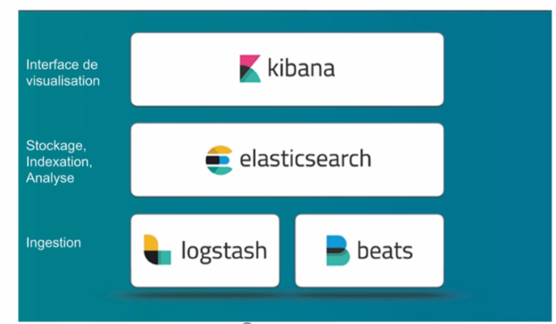

1.0 Introduction
###########################

Ce cours est découpé en différents chapitres et permet un apprentissage progressif des différents concepts Docker et de leur mise en pratique. 
On commencera par donner quelques exemples de ce qu’il est possible de faire avec Docker dans la section **Quick Wins**.
Nous ferons références à des concepts utiles comme les **containers** Linux, les Micro services, le Dev Ops.etc. 

Nous aurons un chapitre sur la **plateforme Docker**, son architecture, son fonctionnement et sa mise en place. 
Nous verrons comment Docker rend très simple la manipulation des **containeurs**. 
Nous parlerons de la notion d’images qui permet de **packager** une application et ses dépendances. 
Dans le chapitre sur le stockage, nous apprendrons à utiliser **Docker** pour que les données puissent persister dans les conteneurs. 

**Thèmes abordé dans ce cours :**

* **Docker Machine** pour créer des hôtes Docker.
*	**Docker compose** qui permet de créer des applications en multi container. 
*	**Docker Swarm**, la solution d’orchestration de **Docker** qui permet de gérer des applications qui tournent dans des containers. 
*	Le **réseau** dans Docker.
*	La **sécurité**. 

1.1 Pour qui ? pourquoi ? 
****************************
Très souvent le premier contact que l’on a avec **Docker** s’effectue via le **Docker Hub** accessible sur https://hub.docker.com.

.. image:: img/docker/image64.png
  :alt: Docker Hub

Il s’agit d’un **registre** (ou **registry**) dans lequel nous retrouvons beaucoup d’applications packagées dans des images **Docker**. 
Cette notion d’image est la base de ce qu’apporte **Docker**. 
Voici un exemple de services qui peuvent être contenu dans une image **Docker** :

.. image:: img/docker/image66.png

Par exemple, grâce à **Docker** nous pouvons lancer un interpréteur interactif (**REPL**) pour des langages de programmation comme le **Python**, le **Ruby On Rail** ou le **Javascript**.

.. image:: img/docker/image65.png

Nous avons alors accès à un environnement **Python** en interactif et c’est le flag ``-ti`` qui permet l’interactivité avec le processus du containeur.  

De la même manière, nous pouvons lancer un environnement **NodeJs**, ici contenant le Tag ``8.12-alpine``.
**8.12** est la version de **NodeJs** et **alpine** est le nom de la distribution Linux utilisée dans le container.

Par exemple si nous avons besoin d’une base de données **MongoDB** dans la version 4.0.Nous n’avons qu’à trouver une image disponible dans le **Docker Hub**.

.. image:: img/docker/image68.png

On peut imaginer avoir besoin de lancer plusieurs containers **MongoDB** avec des versions différentes.
Cela peut être utile pour tester une différence de comportement entre deux versions par exemple.

1.2 Des Stacks complètes
***************************

Une application fonctionne rarement seule et est souvent constituée d’un ensemble de services.
Cet ensemble constitue une **Stack applicative**.
Par exemple, prenons le cas de la Stack **Elastic**, qui est souvent utilisée pour la gestion des log. 
Elle est constituée de **BEATS** et **LOGSTASH** qui est là pour l’ingestion des logs, de **ELASTICSEARCH** pour l’analyse et 
le stockage des logs et **KIBANA** qui permet de visualiser tout cela.

Il existe une multitude d’applications prêtent à être utilisée avec Docker, accessible en ligne de commande. 
Nous verrons rapidement comment Docker permet de créer notre propre package d’application pour faciliter : l’installation, l’utilisation et le déploiement.

1.3 Quelques concepts utiles pour les Développeurs
****************************************************

1.3.1 Un container Linux, c’est quoi ?
==========================================

Un **container** est simplement un **processus** particulier qui tourne sur le système. 
Il est isolé des autres **processus**. Il possède sa **propre vision** du système sur lequel il tourne, on appelle cela les **Namespaces**. 
On peut limiter les ressources utilisées par ce processus en utilisant les **Controls Groups** (ou **Cgroups**). 
Le même système peut exécuter plusieurs containers en même temps, c’est d’ailleurs ce qui constitue l’avantage de cette technologie. 
Le noyau Linux de la machine hôte est **partagé** entre tous ses containeurs.

1.3.2 Containers Linux : Les Namespaces 
==========================================

Les **Namespaces** sont des technologies Linux qui servent à isoler un processus. 
Cela permet de limiter ce qu’un processus peut voir. Il existe **6** NameSpaces différents :

#. **Pid** : Permet de donner à un processus la vision de lui-même et de ses processus enfant.
#. **Net** : Permet de donner au processus son propre réseau privé.
#. **Mount** : Permet de donner au processus un système de fichiers privé.
#. **Uts** : Permet la gestion du nom de l’hôte.
#. **Ipc** : Isole les communications inter processus.
#. **User** : permet de faire un mapping entre les utilisateurs de l’hôte et les containeurs.

1.3.3 Containers Linux : Control Groups (cgroups) 
===================================================

Les **cgroups** sont une autre technologie Linux qui va permettre de limiter les ressources qu’un processus va utiliser. 
Par exemple, pour limiter l’utilisation :

* **RAM**
* **CPU**
* des **I/O** (périphériques d’entrées et de sorties)
* du **Réseau**

1.3.4 Containers Linux : VM/Container
===================================================

.. image:: img/docker/image70.png

On compare souvent les containers à des machines virtuelles, car elles permettent d’exécuter des applications de manière isolée.

Mais la virtualisation nécessite un **hyperviseur** qui s’exécute **sur le système d’exploitation de l’hôte** et nécessite également que **haque machine virtuelle** ait son propre système d’exploitation.
Alors que l’approche du container est **beaucoup plus légère** car chacun partage le **Kernel Linux de la machine hôte**.

La machine virtuelle consomme plus de disque mémoire et de ram que les containers. **Cela implique que beaucoup plus de containers peuvent fonctionner sur une même machine hôte.**

1.3.5 Architecture micro-services
===================================================

Depuis quelques années, les applications sont développées autour d’une architecture appelée **micro-services**. 
Alors qu’avant une application était souvent un gros bloc unique **monolithique**.

Aujourd’hui, une application est constituée de **plusieurs petits composants** qui sont des services qui ont leur propre rôle et fonctionnalité. 
Et c’est l’**interconnexion** de l’ensemble de ces services qui permettent de définir l’application globale.

.. image:: img/docker/image73.png

Dans une **application monolithique**, si l’on veut que plusieurs instances de l’application soient déployées il faut créer plusieurs machines virtuelles contenant l’application dans son entièreté.

.. image:: img/docker/image32.png

Alors que dans le contexte d’une application micro-services chaque service peut être déployé indépendamment des autres services, nous avons plusieurs machines virtuelles sur lesquelles les services des différentes applications sont dispatchées.

**Exemple d’architecture micro-services : l’application UBER**

.. image:: img/docker/image72.png

Chaque processus métier est isolé dans un service :

* **Paiement**
* **Notification**
* **Facturation**

*Avantages de l’architecture micro-services* :

* **Découpage** de l’application en **processus** (services) indépendants.
* Chacun a sa propre **responsabilité métier**.
* **Equipe dédiée** pour chaque service.
* Plus de **liberté** de choix de langage.
* **Mise à jour**.
* Containers très adaptés pour les micro-services.

*Inconvénients* :

* Nécessite des interfaces bien définies.
* Focus sur les tests d’intégration.
* Déplace la complexité dans l’orchestration de l’application globale. (Docker SWARM ou Kubernetes).

**APPLICATION CLOUD NATIVE**

On entend de plus en plus parler d’applications **Cloud Native** définies par plusieurs critères :

* Applications qui suivent une architecture **microservices**.
* Utilisant la **technologie des containers**.
* L’orchestration est faite **dynamiquement**.

Il existe une branche de la **Linux Foundation** : la **CNCF** ( **C** loud **N** ative **C** omputing **F** oundation ) qui porte de nombreux projets **Cloud Native** comme :

* **Kubernetes**
* **Prometheus**
* **Fluentd**
  
  `Site de la cncf <www.cncf.io>`_

1.3.5 Questionnaire de synthèse
===================================================

   #. **Quels sont les éléments permettant la création d'un container sous Linux ?**
      
      * Le kernel Linux et le système de fichiers.
      * Les namespaces et les control groups.
      * Les control groups et le système de fichiers.
   
   #. **Les cgroups permettent :**
     
      * De limiter la vision d'un processus
      * De limiter les ressources que peux utiliser un processus
      * D’isoler le système de fichiers d'un processus
      * De faire un chroot

   #. **Un container c'est**
    
      * Une mini machine virtuelle
      * Un répertoire sur le système de fichiers
      * Un processus qui tourne de manière isolée des autres processus
      * Une technologie créée par Docker
