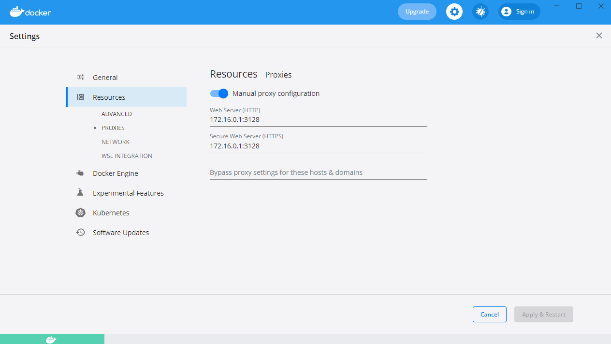

2.0 La plateforme Docker
###########################

**Docker** apporte une facilité de développement, de packaging et de déploiement d’applications **quelque soit le langage de programmation**.
Un développeur peut **tester une application** sur sa machine en **imitant** les conditions de l’environnement de **production** tout en nécessitant une **configuration minimale**.
Si l’application est soumise à un **fort stresse**, **Docker** peut orchestrer l’allocation d’autres containers.
La **scalabilité** s’effectue très rapidement car un container peut être lancé en quelques secondes.

.. note::
  Cherchez la définition du terme **scalabilité**.

**Docker** permet également d' **augmenter** le rythme de **mise à jour** des logiciels.

2.1 Le modèle client/serveur
********************************

.. image:: img/docker/image55.png

**Docker** utilise un modèle **client/serveur**.
D’une part nous avons le client **Docker**, un fichier binaire écrit en **GO**. Et d’autre part nous avons le **Docker Daemon** (appelé **dockerd**), écrit aussi en GO, et qui expose une **API REST** consommée par le client.
Le client envoie des commandes au **Docker Daemon** pour gérer les containers, les images entre autres.

2.1.1 Le serveur : Dockerd
==============================

* **Processus** : dockerd
   * Gestion des images, networks, volumes, cluster, …
   * Délègue la gestion des containers à containerd.
* Expose une **API Rest**.
* Ecoute sur le **socket unix** ``/var/run/docker.sock`` par défaut.
* Peut-être configuré pour écouter sur un socket tcp.

2.1.2 Le client : docker
==============================

* Installé en même temps que **dockerd**.
* Communique avec le **daemon local** par défaut via ``/var/run/docker.sock``.
* Peut être configuré pour communiquer avec un **daemon distant**.

2.1.3 Concepts essentiels
==============================

* **Docker** facilite la manipulation des **containers Linux**. Et cache la complexité sous-jacente.
* Introduction de la **notion d'image** : Format d'un package qui contient une application.
* Une image est un **template** qui sert pour la création d’un container.
* Pour créer une image on utilise un **Dockerfile**. Un fichier texte qui contient une liste d’instructions.
* La distribution de ces images se fait par l’intermédiaire d’un **Registry**.
* Docker permet de lancer des containers sur une machine unique ou sur un ensemble d’hôtes regroupées en un **cluster Swarm**.

Voici un schéma qui montre le **fonctionnement global des composants de base de Docker**.

.. image:: img/docker/image56.png

Quand on installe la plateforme Docker nous avons donc : 
un client et un serveur (ou daemon) qui tourne constamment et qui est responsable de la gestion des containers et des images.

2.1.4 Docker Hub
==============================

Par défaut le **daemon Dockerd** communique avec le **Docker Hub**, qui est le **Registry** officiel de Docker disponible à l’adresse : https://hub.docker.com

Il existe bien entendu beaucoup d’autres Registry que l’on peut utiliser si on le souhaite.

.. image:: img/docker/image57.png

**Les images du Docker Hub peuvent être classées en plusieurs catégories.**

* Les images officielles qui sont validées et que l’on peut utiliser avec confiance.
* Les images publiques à utiliser avec précaution.
* Les images privées dédiées qu’aux utilisateurs autorisés ( partage d’images au sein d’une entreprise par exemple).

2.1.4 Cluster Swarm
==============================

Un Cluster Swarm est un ensemble de **Docker Host**, c’est-à-dire un ensemble de machines sur lesquel le **Docker Démon** est installé.

.. image:: img/docker/image58.png

Ses machines vont communiquer entres elles afin d’orchestrer des applications et d’assurer qu’elles fonctionnent de la manière voulue.

2.2 Installation de Docker
********************************
Nous allons voir ici comment installer **Docker** sur votre environnement.

Rendez-vous tout d'abord dans le `Docker hub <https://hub.docker.com>`_ puis sélectionner l'onglet **Explore**:

Sélectionnez ensuite l'onglet **Docker** dans le sous menu:

.. image:: img/docker/image60.png

Sur la gauche vous verrez alors un menu vous permettant de sélectionner différents éléments :

* plateforme
* système d'exploitation
* architecture

Comme nous pouvons le constater, Docker peut être installé sur des systèmes divers: machine de développement, l'infrastructure d'un cloud provider, et même des devices de type Raspberry PI.

Installation sur un poste élève du Lycée Paul Claudel -LAON (02)
*******************************************************************

Normalement, il faudrait télécharger ``Docker Desktop`` depuis le site officiel. 
Mais pour économiser la bande passante, utilisez le fichier d’installation présent dans le répertoire ``\\COMMUN\BAUER\Docker\``.

Doucle cliquez sur l’installateur et laissez les options d’installation cochées par défaut.
``WSL 2`` est nécessaire pour faire fonctionner **DOCKER**.

Si tout se passe bien vous devriez avoir cet écran vous invitant à redémarrer la machine :

.. image:: img/docker/image8_bis.png

**  Lancer l’application : Docker Desktop**

.. image:: img/docker/image10_bis.png

.. image:: img/docker/image9_bis.png

  
Si vous tentez d’exécuter l’application, il est fort probable que vous ayez un message d’erreur vous indiquant :

.. image:: img/docker/image12_bis.png

Pour résoudre ce problème, nous avons besoin d’ajouter les utilisateurs de la machine au groupe ``docker-users`` nouvellement créé par l’installation.

Ouvrez une session en ``administrateur`` de la machine locale : compte ``INFO/INFO``.
Dans **WINDOWS 10**, tapez dans le champ de recherche situé en bas à gauche :

**« modifier les utilisateurs et les groupes locaux »**

Cette fenêtre devrait s’ouvrir :

.. image:: img/docker/image11_bis.png

 .. image:: img/docker/image2_bis.png 

Double cliquez sur le groupe ``docker-users``.

Et ajoutez un nouvel utilisateur : votre compte issu du domaine ``sio`` 

 .. image:: img/docker/image1_bis.png 

Le système vous demandera de saisir l’identifiant et le mot de passe du compte à intégrer à ce groupe.

Redémarrer la machine et reconnectez-vous maintenant à votre compte WINDOWS standard.

Lancez L’application **Docker Desktop** et validez les conditions d’utilisation.
Vous devriez avoir ce message d’erreur :

 .. image:: img/docker/image4_bis.png 

Fermez alors la fenêtre et rendez-vous sur ce site :

`Étapes d’installation manuelle pour les versions antérieures de WSL | Microsoft Docs <https://docs.microsoft.com/fr-fr/windows/wsl/install-manual#step-4---download-the-linux-kernel-update-package>`_

Suivez les étapes d’installation :

Vous allez installer ``WSL2`` qui est un sous-système **Linux** pour **WINDOWS**.
Cela va permettre d’utiliser des commandes **Linux** dans un terminal Windows.

Tapez  ensuite la commande :

.. code-block:: 

  wsl.exe --set-default-version 2

Nous pouvons en profiter pour installer le nouveau **Terminal de Windows**. 
Cela va apporter plus de confort durant la pratique de ce cours.

`Lien vers la page Terminal Windows <https://docs.microsoft.com/fr-fr/windows/terminal/install>`_

Il faut un compte « **Microsoft** » .

Redémarrez la machine encore une fois pour que **WSL2** soit pris en compte.

**Docker** devrait maintenant pouvoir démarrer :

.. image:: img/docker/image3_bis.png 
  
Il faut maintenant configurer le client en cliquant sur l’engrenage en haut à droite.

Cochez les options comme sur la capture d’écran :

N’oubliez pas de cliquer sur « **Apply & Restart** »

Configurez le PROXY

Si vous allez dans l’onglet **WSL** intégration :

.. image:: img/docker/image6_bis.png

**Vous êtes maintenant prêt !**

**Bienvenue dans le monde de DOCKER.**

Passez directement à la partie : 
**Vérification de l'installation**

Installation pour Windows 10 ou MacOS
***************************************************

Si vous êtes sur **MacOS** ou **Windows 10 (Entreprise ou Pro)** vous pouvez installer **Docker Desktop**, un environnement compatible pour chacune de ces plateformes:
   * `Docker Desktop for Windows <https://hub.docker.com/editions/community/docker-ce-desktop-windows>`_ 
   * `Docker Desktop for Mac <https://hub.docker.com/editions/community/docker-ce-desktop-mac>`_ 

Installation pour Linux
***************************************************

Si vous êtes sur **Linux**, vous pouvez sélectionner la distribution que vous utilisez (**Fedora**, **CentOS**, **Ubuntu**, **Debian**) et vous obtiendrez alors un lien vers la documentation à suivre pour installer **Docker** sur la distribution en question.

Pour aller un peu plus vite, vous pouvez également lancer la commande suivante (compatible avec les principales distribution **Linux**) :

.. code-block:: language

   curl -sSL https://get.docker.com | sh

En quelques dizaines de secondes, cela installera **la plateforme Docker** sur votre distribution.
Il sera ensuite nécessaire d'**ajouter votre utilisateur** dans le **groupe docker** afin de pouvoir intéragir avec le **daemon** sans avoir à utiliser **sudo** (il faudra cependant lancer un nouveau **shell** afin que ce changement de groupe soit pris en compte.)

.. code-block:: language

   sudo usermod -aG docker <UTILISATEUR>

.. note::

  Il est également possible d'installer **Docker** sur d'autres types d'**architecture infrastructure**.

Vérification de l'installation
***************************************************

Une fois installé, lancez la commande suivante afin de vérifier que tout est fonctionnel :

.. code-block:: language

   docker info

.. image:: img/docker/image61.png