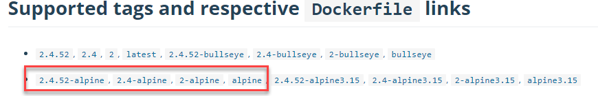
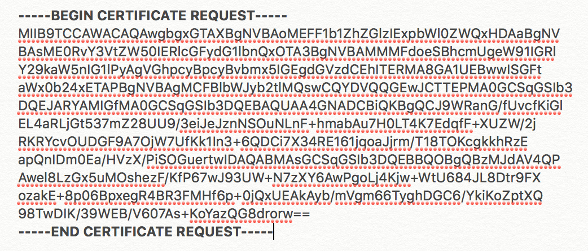
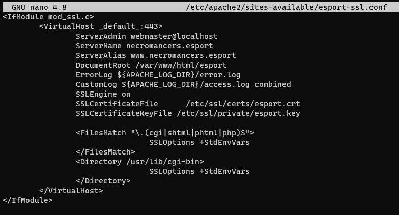

5.0 Travaux pratiques
#################################

Cette série de travaux reprend les concepts de base de Docker et vous guides dans leur mise en pratique. 

5.1 Serveur HTTP avec Docker
***************************************************

.. image:: img/docker/image76.png
    :align: center

Nous allons vous guider à chaque étape de la mise en place d’un serveur **WEB APACHE** sous **DOCKER**. 

Une équipe d’**ESPORT** : **NECROMANCERS**, a confié la création de son site web à une agence de communication dont la maquette HTML est disponible dans fichier ``esport.zip``.

* **Créez** un dossier « **docker** » dans « **mes documents** » et créez un autre dossier à l’intérieur nommé « **www** ».
* **Téléchargez** ce fichier sur votre disque dur, et **dézippez** l’archive. Vous obtenez un dossier qui se nomme : « **esport** ».
* **Déplacez** le dossier « **esport** » dans le dossier.

Votre première mission sera de mettre en place un serveur **WEB** sous **Apache** avec **Docker**.

* Nous avons plusieurs possibilités qui s’offrent à nous : 
  * Soit nous téléchargeons une image d’une distribution Linux puis nous installons et configurons nous-même Apache.
  * Soit nous trouvons une image contenant déjà Apache. 

La force de Docker est de posséder une sorte de « **AppStore** », un « **Hub** » appelé le « **dockerHub** » qui regroupe des images officielles et non officielles utilisables. 
Recherchons donc une image correspondant à notre besoin : 
`Docker Hub <https://hub.docker.com/>`_

.. image:: img/docker/image77.png
    :align: center

Examinons les distributions **Linux** qui accompagnent **Apache** en cliquant dessus. 
Nous constatons qu'**Alpine** est la distribution par défaut. C'est un bon choix, car c’est une distribution **Linux Légère**. 

En parcourant la page dédiée de l'image `Apache  <https://hub.docker.com/_/httpd>`_  nous trouvons le sous-titre « **How to use this image** » qui nous permettra de comprendre comment utiliser ce container. 

Nous l'installerons grâce au nom de l’image : ``httpd``.

Nous allons avoir besoin de dire au container **Apache** où trouver les fichiers de la maquette pour les interpréter. 
Nous savons qu’ils sont stockés sur notre machine ,appelée la **machine hôte**, au chemin suivant dans mon cas : ``C:\Users\baptiste\Documents\docker\td\www\esport``.
Le container Apache, (*lire la documentation*) est configuré pour aller lire les fichiers Web dans son dossier interne : ``/usr/local/apache2/htdocs/``.

Il faut donc **monter** notre répertoire de la **machine hôte** dans le dossier **htdocs** de Apache2.
Cela est possible grâce à l’option : ``-v <HOST_PATH>:<CONTAINER_PATH>``

Apache, le serveur Web, écoute par défaut sur le **port 80** du container.  Il faut donc lier un port de la machine hôte avec le port 80 du container. Nous décidons arbitrairement de publier le **port 80 du container** sur le **port 2000 de notre machine hôte**.  Grâce à l’option ``-p HOST_PORT:CONTAINER_PORT``.

Une fois que notre container est lancé, nous voulons continuer à avoir la main sur notre terminal. Par conséquent il faudra donc utiliser l’option ``-d`` pour lancer le container en **background** (tâche de fond).

Nous nommerons ce container avec l’option : ``--name serveur_http``.

Au final, la commande pour installer et lancer notre container sera :

.. code-block::

    docker container run -d --name serveur_http -v $PWD/Documents/docker/td/www/esport:/usr/local/apache2/htdocs -p 2000:80 httpd

.. image:: img/docker/image79.png
    :align: center

Pour tester, ouvrez votre navigateur et saisissez l’adresse : `http://localhost:2000/ <http://localhost:2000/>`_

.. image:: img/docker/image80.png
    :align: center

Nous allons ouvrir un **shell** dans le container pour consulter le contenu du dossier : ``/usr/local/apache2/htdocs``

Tapez la commande : 

.. code-block::

    docker container exec -ti serveur_http sh

``docker container exec`` permet de donner l'ordre à notre container de lancer une commande et l'option ``-ti`` permet de garder la main sur le **shell**.

À partir du shell, plaçons-nous donc dans le répertoire ``htdocs``.
.. code-block::

    cd /usr/local/apache2/htdocs

et listons les fichiers le contenant : 

.. code-block::

    ls

.. image:: img/docker/image81.png
    :align: center

Nous voyons que le dossier **HTDOCS** de notre container contient les fichiers de notre application provenant de notre dossier **esport**.

Avec un éditeur de code comme **Visual Studio Code**, ouvrez le fichier ``/www/esport/index.html`` à partir de la machine hôte.

Ajoutez le code suivant entre les lignes 250 et 251 et actualisé le navigateur :

.. code-block:: html

    <h4 class="text-white landing-title">mode dev</h4>

.. note::

    Nous constatons que les fichiers de notre application ne sont pas réellement dans le container. 
    Nous l'avons prouvé en modifiant le fichier à partir de la machine hôte et en observant que la modification a été prise en compte par le navigateur 
    Nous n’avons créé qu’un **lien symbolique** de nos fichiers locaux dans le container.

**Notre site, est accessible !!!
Nous avons rempli notre première mission !**

5.2 Serveur HTTPS avec Docker
***************************************************

Dans la partie 5.1, nous avons mis en place un container Apache permettant d’accéder à notre site web par l'intermédiaire de l'adresse : `http://localhost:2000 <http://localhost:2000>`_
Mais la connexion ``http`` n'est pas sécurisée. Pour cela, il faut que le protocole soit ``https``.

**Rappel : Création des certificats SSL**

Les applications Web utilisent le protocole ``HTTPS`` pour s'assurer que les communications entre les clients et le serveur soient cryptées et ne puissent pas être interceptées.  
De plus, **Google** pénalise le contenu des sites web qui utilisent le protocole ``HTTP`` seul dans le référencement. 
Il est donc obligatoire de configurer notre serveur pour lui permettre d’être accessible via le protocole ``HTTPS``.

Pendant le développement local, les développeurs utilisent : 

* Soit le protocole **HTTP**.
  
  Cela signifie alors que les versions du projet en local ou en production sont développées dans un environnement différent. Cela peut être plus difficile pour repérer les problèmes.

* Soit un (faux) certificat **SSL Autosigné**.
  
  L’environnement de développement est alors proche de l’environnement de production, mais le navigateur continue de traiter les requêtes différemment. Par exemple, les fausses requêtes SSL ne sont pas mis en cache.

Toutes les communications clients/serveurs ont besoin d’être sécurisés avec un protocole. Nous utiliserons SSL (Secure Socket Layer).

Les communications sécurisées entre des applications se font grâce à des certificats (CERT) distribués par une autorité certifiante (CA) qui est mutuellement agréé par le client et le serveur. 

**Le format CERT**

La plupart des certificats ont pour extension ``.pem``, ``.cer``, ``.crt``, ``.key``.  
Les clients (navigateurs) communiquant avec le serveur vont garder le fichier ``*.pem`` (PRIVACY ENHANCED MAIL) ou ``*.CER`` (extension pour les certificats SSL) pour établir une connexion sécurisée. 

L’algorithme RSA (*Rivest Shamir Adleman*) est utilisé pour crypter et décrypter les messages dans une communication où une clé est gardée publique et l’autre clé est privée. C’est le concept de chiffrage asymétrique. 

#. Le client demande une ressource protégée au serveur.
#. Le client présente les informations cryptées avec sa clé publique au serveur. 
#. Le serveur évalue la requête avec sa clé privée (disponible seulement coté serveur) et répond en retour en rapport avec la ressource demandée par le client. 

Cela fonctionnerait de la même manière pour l'authentification mutuelle où le client et le serveur fournissent tous deux leurs clés publiques et déchiffrent leurs messages avec leurs propres clés privées disponibles de leur côté.

.. note::
  Nous avons déjà configuré ``HTTPS`` sur un serveur ``apache`` sous ``Ubuntu`` lors de d'exercices précédents avec des machines virtuelles.
  Aujourd'hui nous allons donc travailler sur cette distribution, revoir les étapes de création d'un certificat SSL auto-signé et l'intégration dans une image Docker.
  Bien entendu, il existe déjà des images toutes prêtes sur **Docker Hub** ... mais nous n'apprendrons rien de nouveau aujourd'hui si nous nous contenterions d'utiliser un existant. 

Maintenant, construisons notre container.

Comme nous sommes en local, il nous faudra **autosigner** nos certificats **SSL**. 

Stoppons d’abord le container ``serveur_http`` précédent qui utilise le port ``2000`` : 

.. code-block::

    docker container stop serveur_http

Nous allons installer un container avec une image ``Ubuntu`` et mapper les ``ports 80`` et ``443`` de la machine hôte avec les même ports du container. 

.. code-block::

    docker run -it -p 80:80 -p 443:443 --name serveur_https ubuntu /bin/sh;

Installons un éditeur de texte ``nano`` ,  ``apache2`` notre serveur http et ``opennss`` qui permettra de générer des certificats.

.. code-block::

    apt update
    apt install nano apache2 openssl –y

Il faut maintenant démarrer le serveur **Apache**:

.. code-block::

    service apache2 start 

Testons dans le navigateur : `http://localhost <http://localhost>`_

Nous voulons un site pour notre équipe de **Esport** : Les *Necromancers* !

Créons donc un dossier spécialement pour eux!

.. code-block::

    mkdir /var/www/html/esport

Et créons dedans un fichier ``index.html`` qui contiendra le code suivant :

.. code-block:: html

    <h1>Page de test des NECROMANCERS !!</h1>

Pour cela nous utiliserons notre éditeur de texte ``nano`` :

.. code-block::

    nano  /var/www/html/esport/index.html

Rappel : Pour sauvegarder, tapez au clavier sur les touches ``CTRL`` + ``O`` et ``Entrée`` et pour quitter ``CTRL`` + ``X``

Nous allons maintenant modifier notre fichier HOSTS sur la machine hôte afin de forcer la redirection du domaine `necromancers.esport <http://necromancers.esport>`_ sur notre serveur local en cours de conception.

Ouvrez Visual Studio Code ou un autre éditeur comme NotePad++ avec des droits d'administrateur, et éditez le fichier : 

.. code-block::

    C:\Windows\System32\drivers\etc\hosts

Ajoutez la ligne suivante : 

.. code-block::

    127.0.0.1 necromancers.esport

Puis modifiez les paramètres du proxy comme suit :

.. image:: img/docker/image91.png
    :align: center

Ainsi, nous ne passerons pas par le proxy, ni par le DNS pour accéder à notre site avec l'url `necromancers.esport <http://necromancers.esport>`_ , mais sur le serveur local d'addresse IP directement: ``127.0.0.1``.

Maintenant, il faut configurer **Apache** dans notre container pour que notre URL pointe vers le dossiers WEB du serveur.

``Apache`` permet de faire des redirections de connexions entrantes sur un de ses ports vers un dossier de notre choix. 
Cela se fait grâce aux ``VirtualHost``. Copions le fichier ``VirtualHost`` de base nommé ``000-default.conf`` et appelons cette copie ``esport.conf``.

.. code-block::

    cp /etc/apache2/sites-available/000-default.conf /etc/apache2/sites-available/esport.conf

Modifions maintenant ce nouveau fichier : 

.. code-block::

    nano /etc/apache2/sites-available/esport.conf

.. image:: img/docker/image84.png
    :align: center

Profitons-en aussi pour modifier le fichier ``/etc/apache2/apache2.conf``.
Et lui rajouter une ligne : ``ServerName localhost``.
Cela va permettre de nommer notre serveur local, et d'éviter d'avoir des avertissements au redémarrage.

Le fichier ``esport.conf`` est prêt ! Il faut le charger dans la configuration du serveur **Apache2**.

.. code-block::

    a2ensite esport

Pour que les modifications soient prise en compte, redémarrons le serveur. 

.. code-block::

    service apache2 restart

Maintenant que notre serveur **Apache** est configuré pour que l'adresse : `necromancers.esport <http://necromancers.esport>`_ pointe vers notre dossier web. ( Testez ! )

Il nous faut installer un certificat pour obtenir une connexion sécurisée en ``HTTPS``.

.. code-block::

    openssl req -x509 -nodes -days 365 -newkey rsa:2048 -keyout /etc/ssl/private/esport.key -out /etc/ssl/certs/esport.crt

Cette commande va créer 2 certificats dans les emplacements : ``/etc/ssl/private/esport.key`` et ``/etc/ssl/certs/esport.crt``.

Il faut maintenant installer les certificats sur le serveur et les associés à notre domaine.

Copions le fichier de base ``default-ssl.conf`` et renommons le en ``esport-ssl.conf``.

.. code-block::

    cp /etc/apache2/sites-available/default-ssl.conf /etc/apache2/sites-available/esport-ssl.conf

Il s'agit simplement d'un ``VirtualHost`` qui est chargé de rediriger les connexions entrantes provenant du port 443, le port dédié au protocole ``HTTPS``.

Editons ce fichier : 

.. code-block::

    nano /etc/apache2/sites-available/esport-ssl.conf

Pour tester notre configuration, il faut executer la commande : 

.. code-block::

    apachectl configtest

Et si tout ce passe bien, la réponse devrait être : 

.. code-block::

    # apachectl configtest
    Syntax OK

Chargeons le module SSL dans apache pour qu'il puisse prendre en compte les connexions HTTPS et les certificats.

.. code-block::

    a2enmod ssl

Chargeons aussi le nouveau ``VirtualHost`` : 

.. code-block::

    a2ensite esport-ssl

En test l'adresse `https://necromancers.esport <https://necromancers.esport>` depuis votre navigateur,
Vous devriez avoir cela : 

.. image:: img/docker/image86.png
    :align: center

Il faut autoriser la connexion au site : 

.. image:: img/docker/image87.png
    :align: center

.. note::

    Pourquoi nous avons ce message d'alerte ?

    Tout simplement parce que le navigateur a détecté que nous sommes connecté avec le protocole ``HTTPS``. Notre serveur lui a fourni un certificat ... qui est ... **autosigné** ! **Cela alerte donc le navigateur**.

Nous voulons que si l'utilisateur tape ``HTTP`` dans l'adresse au lieu de ``HTTPS`` le serveur puisse le rediriger automatiquement.

Activons le mode ``rewrite`` de Apache qui permet à Apache de réécrire/reformater les URL captées : 

.. code-block::

    a2enmod rewrite

Et éditons le fichier 

.. code-block::

    nano /etc/apache2/sites-available/esport.conf

Ajoutons cette régle de réécriture d'url : 

.. code-block::

    RewriteEngine On
    RewriteRule ^(.*)$ https://%{HTTP_HOST}$1 [R=301,L]

Redémarrons Apache : 

.. code-block::

    service apache2 restart

Notre serveur est maintenant correctement configuré !

.. note::

    Vous pouvez être fier du travail accompli jusqu'alors ! Et pourquoi ne pas créer une image basée sur cette configuration ? Afin de pouvoir créer une infinité de container avec les même caractéristiques. Cela évitera de recommencer toutes les étapes que nous avons suivies jusqu'alors.

**Création d'une image Docker**

    En cours de rédaction ...

