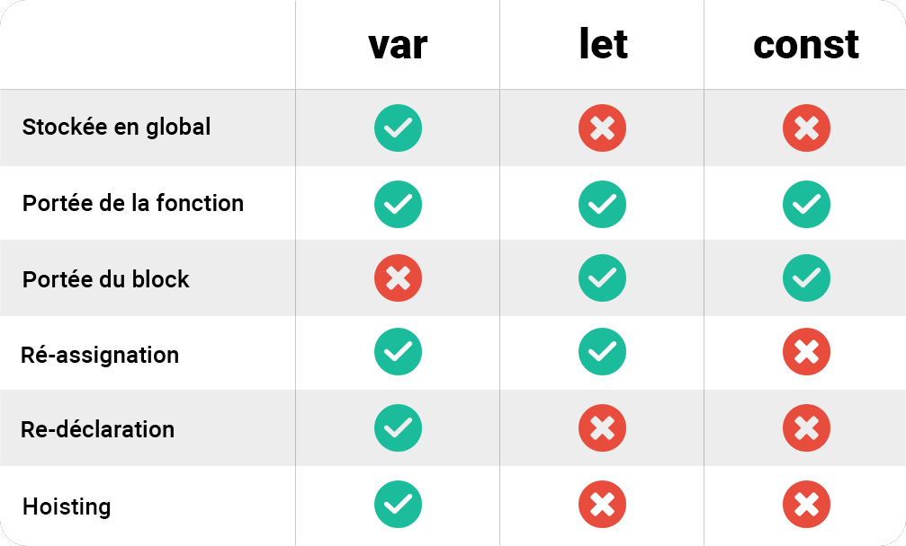

Le Scope ou la portée des variables 
#######################################

Définition d'un scope
************************************

Le scope est un des concepts clés de Javascript. 

La **portée** ou **scope**, désigne l'accessibilité des variables, autrement dit : Où et quand une variable peut être utilisée par votre programme. 

Nous désignons 3 types de ``scope`` :

* Le ``Global Scope``

.. code-block:: javascript
  :caption: **Global Scope**
  :linenos:
  :emphasize-lines: 0
   
  // GLOBAL SCOPE
  var animal = "Elephant";
  var population = 10;

Les variables sont déclarées dans le script en dehors d'un bloc d'instruction ou d'une fonction. 

* Le ``Local Scope``

.. code-block:: javascript
  :caption: **Function (local) Scope**
  :linenos:
  :emphasize-lines: 0

  // FUNCTION SCOPE
  function zoo() {
    var animal = "Tigre";
    var population = 5;
    console.log(animal, population);
  }

Les variables sont déclarées dans le corps de la fonction ``zoo``.

* Le ``Block Scope``, dans un bloc d'instruction(``if``, ``else``, ``while``, ``for`` .. ). 

.. code-block:: javascript
  :caption: **Block scope**
  :linenos:
  :emphasize-lines: 0

  // BLOCK SCOPE
  for(var population = 0; population <10 ; population++) {
    console.log(animal, population);
  }

La variable ``population`` est déclarée dans le block déclaratif de la boucle ``for``.

Etude de la portée des variables ``var``
*******************************************

Lisez le code suivant : 

.. code-block:: javascript
  :linenos:
  :emphasize-lines: 1

  var var1 = 10;
  console.log(var1);

``var1`` est déclaré dans le **global scope**. Nous pouvons afficher sa valeur sans problème avec un ``console.log``.

Ajoutons maintenant un block conditionnel et tentons d'accèder depuis ce block à notre variable ``var1``.

.. code-block:: javascript
  :linenos:
  :emphasize-lines: 0
   
  var var1 = 10;
  console.log(`Global Scope 1 : ${var1}`);
  if(true) {
    console.log(`Block Scope 1 : ${var1}`);
    var1++;
    console.log(`Block Scope 2 : ${var1}`);
  }  
  console.log(`Global Scope 2 : ${var1}`);

La console retourne : 

.. code:: 

  "Global Scope 1 : 10"
  "Block Scope 1 : 10"
  "Block Scope 2 : 11"
  "Global Scope 2 : 11"

.. admonition:: Observation 1

  Une variable déclarée dans le **Global Scope** peut être lue et modifiée dans le **Block Scope**.

Déclarons maintenant une variable ``var2`` dans le **Block** et tentons d'y accèder depuis l'extérieur. 

.. code-block:: javascript
  :linenos:
  :emphasize-lines: 2
   
  if(true) {
    var var1 = 10;
  }  
  console.log(`Global Scope 1 : ${var1}`);

La console retourne : 

.. code::

  "Global Scope 1 : 10"

.. admonition:: Observation 2

  Une variable déclarée dans le **Block Scope** peut être lue et modifiée dans le **Global Scope**.

Maintenant déclarons une fonction ``increment``: 

.. code-block:: javascript
  :linenos:
  :emphasize-lines: 0

  var var1 = 10;
  function increment() {
    var1++;
  }
  increment();
  console.log(`Global Scope 1 : ${var1}`);

La console retourne : 

.. code:: 

  "Global Scope 1 : 11"

.. admonition:: Observation 3

  Une variable déclarée dans le **Global Scope** peut être lue et modifiée dans le **Function Scope**. C'est ce que l'on appelle un **effet de bord** ou **side effect**. 

.. warning:: 

  **Attention** aux effets de bord des fonctions que vous écrivez dans vos scripts. Ils peuvent complexifier leur lecture et leur débogage. Car une variable déclarée dans le **Global Scope** pourrait être modifiée par de nombreuses fonctions à **effets de bord** rendant difficile la prévision des valeurs durant le cycle de vie de votre script.  

Déclarons une nouvelle variable dans le corps de la fonction.

.. code-block:: javascript
  :linenos:
  :emphasize-lines: 3

  var var1 = 10;
  function increment() {
    var var2 = 20;
    var1++;
  }
  increment();
  console.log(`Global Scope 1 : ${var2}`);

La console retourne : 

.. code:: 

  "Uncaught ReferenceError: var2 is not defined"

.. admonition:: Observation 4

  Une variable déclarée dans le **Function Scope** ne peut être lue et modifiée dans le **Global Scope**. 

Prenons un nouveau cas de figure : 

Nous déclarons ``var1`` dans le **Global Scope** puis nous déclarons une nouvelle variable avec le même nom ``var1`` dans un **Block Scope**.

.. code-block:: javascript
  :linenos:
  :emphasize-lines: 1, 4

  var var1 = 10;
  console.log(`Global Scope 1 : ${var1}`);
  if(true) {
    var var1 = 100;
    console.log(`Function Scope 1 : ${var1}`);
  }
  console.log(`Global Scope 2 : ${var1}`);

La console retourne : 

.. code:: 

  "Global Scope 1 : 10"
  "Function Scope 1 : 100"
  "Global Scope 2 : 100"

.. admonition:: Observation 5

  Il n'existe pas de portée de Block pour les variables ``var``.

La version **ECMAScript2015** a introduit dans Javascript deux nouveaux mots clés : ``let`` et ``const``.
``let`` permet de pallier au problème soulevé dans l'**Observation 5**. Reprenons le code précédent et remplaçons maintenant ``var`` par ``let``. 

.. code-block:: javascript
  :linenos:
  :emphasize-lines: 1, 4

  let var1 = 10;
  console.log(`Global Scope 1 : ${var1}`);
  if(true) {
    let var1 = 100;
    console.log(`Function Scope 1 : ${var1}`);
  }
  console.log(`Global Scope 2 : ${var1}`);

La console retourne : 

.. code:: 

    "Global Scope 1 : 10"
    "Function Scope 1 : 100"
    "Global Scope 2 : 10"

.. admonition:: Observation 6

  Les variables créées avec le mot clé ``let`` appartiennent au scope dans lequel elles ont été définies. Toutefois, elles restent accessible et modifiable dans les blocks enfants.

    .. code::

      let var1 = 10;
      console.log(`Global Scope 1 : ${var1}`);
      if(true) {
        var1 = 100;
        console.log(`Function Scope 1 : ${var1}`);
      }
      console.log(`Global Scope 2 : ${var1}`);

.. note:: 

  Il faut donc privilégier l'utilisation du mot clé ``let`` au lieu de ``var`` afin d'éviter des désagréments. 

Le mot clé ``const`` sert à déclarer une référence constante.
**Attention**, une référence **constante** ne veut pas dire que la valeur derrière la référence est "**immutable**", mais  que la référence elle-même est **immutable**.

.. code-block:: javascript
  :linenos:
  :emphasize-lines: 0

  const a = 10;
  a++;

Nous essayons de modifier la valeur de ``a`` déclaré pourtant comme étant une constante ``const``. Cela est interdit. 

Toutefois : 

.. code-block:: javascript
  :linenos:
  :emphasize-lines: 0
   
  const a = {txt: "hello"}; //Référence r0 vers l'objet
  const b = a; //Référence r0 vers le même objet
  a.txt += " world" //Adresse 0x0002
  console.log(a); //"hello world";
  console.log(b); //"hello world";

Ici, ``a`` est de type complexe, c'est un objet. Ce n'est pas sa valeur qui est stockée dans la variable mais une référence de l'objet, l'adresse mémoire qu'il occupe. 
Ainsi, un objet peut être déclaré avec le mot clé ``const`` et se voir ajouter, modifier, supprimer des éléments. 

Nous n'allons pas tester toutes les scopes avec ``const``. 

Voici un tableau comparatif : 

Exercice
**************

.. code-block:: javascript
  :caption: Exercice 1 : Modifier le script pour que la console retourne la valeur 10.
  :linenos:
  :emphasize-lines: 0

  var i = 10;
  for(var i =0;i<=5;i++) {
    // Do Stuff
  }
  console.log(i)