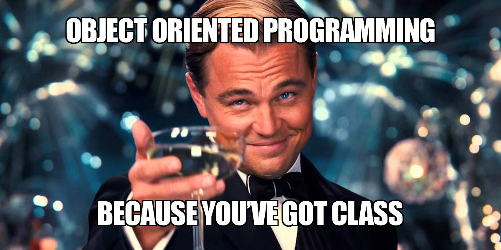
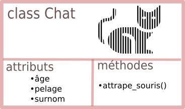
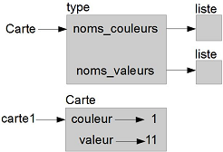

6.0 Initiation à la programmation Orientée Objet
######################################################

6.1 Introduction
***************************

La POO est un **paradigme** de programmation, au même titre que la programmation impérative (que nous pratiquons déjà) ou la programmation fonctionnelle, ou encore d'autres paradigmes (la liste est longue).
Un paradigme de programmation pourrait se définir comme une philosophie dans la manière de programmer : c'est un parti-pris revendiqué dans la manière d'aborder le problème à résoudre. Une fois cette décision prise, des outils spécifiques au paradigme choisi sont utilisés.

**Métaphore :**
Imaginons 3 menuisiers qui ont pour mission de fabriquer chacun un meuble.

* Le premier pourra décider d'utiliser du collé-pointé : il assemblera les morceaux de bois en les collant puis utilisera des pointes. Ses outils seront le marteau et le pistolet à colle.
* Le deuxième pourra décider de visser les morceaux de bois entre eux : son outil principal sera une visseuse.
* Le troisième pourra décider de faire de l'assemblage par tenons et mortaises : son outil principal sera une défonceuse.
  
Pour la réalisation de sa mission, chaque menuisier utilise un paradigme différent. Qui utilise la meilleure méthode ? Cette question n'a pas vraiment de réponse : certaines méthodes sont plus rapides que d'autres, d'autres plus robustes, d'autres plus esthétiques...

Et pourquoi ne pas mélanger les paradigmes ? Rien n'interdit d'utiliser des pointes ET des vis dans la fabrication d'un meuble.

La Programmation Orientée Objet sera (surtout à notre niveau) mélangée avec de la programmation impérative, de la programmation fonctionnelle... d'ailleurs vous avez déjà manipulé des objets sans le savoir :

**Des objets déjà autour de nous**

Essayez le code suivant :

.. code-block:: 

  m = [4,5,2]
  type(m)

  Cela retourne : list

``m`` est une liste, ou plus précisément un **objet** de type ``list``. Et en tant qu'objet de type ``list``, il est possible de lui appliquer certaines fonctions prédéfinies (qu'on appellera méthodes) :
``m.reverse()``

La syntaxe utilisée (le ``.`` après le nom de l'objet) est spécifique à la POO. Chaque fois que vous voyez cela, c'est que vous êtes en train de manipuler des objets.
Mais qu'a donc fait cette méthode ``reverse()`` ?

.. code-block:: 

  m
  Cela retourne : [2, 5, 4]

Nous ne sommes pas surpris par ce résultat car la personne qui a programmé la méthode ``reverse()`` lui a donné un nom explicite.
Comment a-t-elle programmé cette inversion des valeurs de la liste ? Nous n'en savons rien et cela ne nous intéresse pas. 
Nous sommes juste utilisateur de cette méthode. 

L'objet de type ``list`` nous a été livré avec sa méthode ``reverse()`` (et bien d'autres choses) et nous n'avons pas à démonter la boîte pour en observer les engrenages : on parle de principe d'**encapsulation**.

On peut obtenir la liste de toutes les fonctions disponibles pour un objet de type ``list``, par la fonction ``dir`` :

.. code-block:: 

  dir(m)

  Nous obtenons : 
  ['__add__',
  '__class__',
  '__contains__',
  '__delattr__',
  '__delitem__',
  '__dir__',
  '__doc__',
  '__eq__',
  '__format__',
  '__ge__',
  '__getattribute__',
  '__getitem__',
  '__gt__',
  '__hash__',
  '__iadd__',
  '__imul__',
  '__init__',
  '__init_subclass__',
  '__iter__',
  '__le__',
  '__len__',
  '__lt__',
  '__mul__',
  '__ne__',
  '__new__',
  '__reduce__',
  '__reduce_ex__',
  '__repr__',
  '__reversed__',
  '__rmul__',
  '__setattr__',
  '__setitem__',
  '__sizeof__',
  '__str__',
  '__subclasshook__',
  'append',
  'clear',
  'copy',
  'count',
  'extend',
  'index',
  'insert',
  'pop',
  'remove',
  'reverse',
  'sort']

Les méthodes encadrées par un double **underscore** ``__`` sont des méthodes privées, a priori non destinées à l'utilisateur. Les méthodes publiques, utilisables pour chaque objet de type ``list``, sont donc ``append``, ``clear``, ...
Comment savoir ce que font les méthodes ? Si elles ont été correctement codées (et elles l'ont été), elles possèdent une ``docstring``, accessible par :

>>> m.append.__doc__
Retourne :'Append object to the end of the list.'

>>> m.reverse.__doc__
Retourne : 'Reverse *IN PLACE*.'

6.2 Créer son propre objet, sa propre classe
*********************************************

**Vocabulaire : classe, objet, instance de classe**

Jusqu'ici nous avons employé uniquement le mot «objet». Il convient maintenant d'être plus précis.
On désignera par **classe** la structure de données définissant une catégorie générique d'objets. 
Dans le monde animal, ``chat`` est une **classe** (nommée en réalité ``félidé``).

Chaque élément de la classe chat va se distinguer par des caractéristiques :
* Un âge
* Une couleur de pelage
* Un surnom... (on appellera ces caractéristiques des **attributs**)
* Des fonctionnalités, comme la **méthode** ``attrape_souris()``.

Lorsqu'on désigne un chat en particulier, on désigne alors un **objet** (bien réel) qui est une **instance** de la **classe** (abstraite) chat.
Par exemple, l'**objet** ``Larry`` est une **instance** de la **classe** ``chat`` .

D'après Wikipedia,
Exemple : 

.. code-block:: 

  larry.pelage = "blanc et tabby"
  larry.surnom = "Chief Mouser to the Cabinet Office"

Toujours d'après Wikipedia, la méthode ``larry.attrape_souris()`` est plutôt efficace.

**Création d'une classe(Mauvaise), manière minimale**

Créons une classe ``voiture``. Il suffit d'écrire :

.. code-block:: 

  class Voiture :
    pass   #pass, car pour l'instant il n'y a rien dans la déclaration de la classe (et c'est mal)

La classe ``Voiture`` est créée.
Notez que par convention, le nom d'une classe commence toujours par une majuscule.
Pour créer une instance de cette classe, on écrit :
``titine = Voiture()``

``titine`` est un objet, instance de la **classe** ``Voiture``.
Si l’on regarde le type de l’objet : 

``type(titine)``

retour:
``__main__.Voiture``

On peut alors donner des attributs à cette instance :

.. code-block:: 

  titine.annee = 2018
  titine.couleur = "verte"
  titine.vitesse_max = 162

Mais arrêtons-là cette mauvaise méthode. Si on désire créer une classe ``voiture``, c'est pour créer un concept générique de ``voiture`` et d'en spécifier des caractéristiques communes : l'année, la couleur, la vitesse maximale...
L'idée est donc qu'à la création (on dira plutôt à la **construction**) de chaque objet ``voiture``, on va lui spécifier directement ses attributs :

**(Bonne) manière : la méthode constructeur ★★★**

La méthode constructeur, toujours appelée ``__init__()``, est une méthode (une ``def``) qui sera automatiquement appelée à la création de l'objet. Elle va donc le doter de tous les attributs de sa classe.

.. code-block:: python

  class Voiture :
    def __init__(self, annee, coul, vmax) :
        self.annee = annee
        self.couleur = coul
        self.vitesse_max = vmax
        self.age = 2020 - self.annee

* Le mot-clé ``self``, omniprésent en POO (d'autres langages utilisent ``this``), fait référence à l'objet lui-même, qui est en train d'être construit.
* Pour construire l'objet, 3 paramètres seront nécessaires : ``annee``, ``coul`` et ``vmax``. Ils donneront respectivement leur valeur aux attributs ``annee``, ``couleur`` et ``vitesse_max``.
* Dans cet exemple, les noms ``coul`` et ``vmax`` ont été utilisés pour abréger ``couleur`` et ``vitesse_max``, mais il est recommandé de garder les mêmes noms, même si ce n'est pas du tout obligatoire.

Construisons donc notre première voiture !

.. code-block:: 

  mon_bolide = Voiture(2012, "rouge", 190)

``mon_bolide`` possède 4 attributs :

* ``annee``, ``couleur`` et ``vitesse_max`` ont été donnés par l'utilisateur lors de la création.
* ``age`` s'est créé «tout seul» par l'instruction ``self.age = 2020 - self.annee``.

.. code-block:: Python 

  print(mon_bolide.annee) 
  print(mon_bolide.couleur) 
  print(mon_bolide.vitesse_max) 
  print(mon_bolide.age)

Retour : 

.. code-block:: Python 

  2012 
  rouge 
  190 
  8

Bien sûr, on peut créer une autre voiture en suivant le même principe :

batmobile = Voiture(2036, "noire", 325)

6.3 TD : Jeu de cartes
***************************

La fonctionnalité la plus emblématique de la programmation orientée objet est l'héritage. L'héritage est la possibilité de définir une nouvelle classe, qui est une version modifiée d'une classe existante.

Objets carte de jeu
===============================

Il y a cinquante-deux cartes dans un paquet, dont chacune appartient à une des quatre couleurs (ou enseignes) et à l'une des treize valeurs (ou rangs). Les couleurs sont pique, cœur, carreau, et trèfle (dans l'ordre décroissant au jeu de bridge). Les valeurs sont as, 2, 3, 4, 5, 6, 7, 8, 9, 10, valet, dame (ou reine) et roi. Selon le jeu auquel vous jouez, un as peut être plus fort que le roi ou plus faible que le 2.

Si nous voulons définir un nouvel objet pour représenter une carte à jouer, il est évident que les attributs doivent être la ``couleur`` et la ``valeur``. Le type des attributs n'est pas si évident. Une possibilité est d'utiliser des chaînes contenant des mots comme '**pique**' pour les couleurs et '**dame**' pour les valeurs. Un problème avec cette modélisation est qu'il ne serait pas facile de comparer les cartes pour voir laquelle a une valeur ou une couleur supérieure.

Une autre possibilité est d'utiliser des entiers pour **encoder** les valeurs et les couleurs. Dans ce contexte, « **encoder** » signifie que nous allons définir une correspondance entre nombres et couleurs, ou entre nombres et valeurs. Ce type d'encodage n'est pas censé être secret (ce serait du « cryptage » ou du chiffrement).

Par exemple, ce tableau montre les couleurs et les valeurs entières correspondantes :

.. list-table:: title
  :widths: 50,50
  :header-rows: 0
   
  * - Pique ->
    - 3
  * - Cœur ->
    - 2
  * - Carreau -> 
    - 1
  * - Trèfle ->
    - 0

Ce code facilite la comparaison des cartes ; parce que les couleurs les plus élevées correspondent aux nombres plus élevés, nous pouvons comparer les couleurs en comparant leurs codes.
Le codage des valeurs est assez évident ; chacune des valeurs numériques des cartes correspond à l'entier correspondant, et pour les honneurs :

.. list-table:: title
  :widths: 50,50
  :header-rows: 0
   
  * - Valet ->
    - 11
  * - Dame ->
    - 12
  * - Roi -> 
    - 13

J'utilise le symbole ``↦`` pour qu'il soit clair que ces correspondances ne font pas partie du programme **Python**. Elles font partie de la conception du programme, mais elles n'apparaissent pas explicitement dans le code.
La définition de la classe ``Carte`` ressemble à ceci :

.. code-block:: Python

  class Carte:
    """Représente une carte à jouer standard."""

    def __init__(self, couleur = 0, valeur = 2):
        self.couleur = couleur
        self.valeur = valeur

Comme d'habitude, la méthode ``init`` prend un paramètre optionnel pour chaque attribut. La carte par défaut est le 2 de trèfle.
Pour créer une carte, vous appelez ``Carte`` avec la couleur et la valeur de la carte souhaitée.

``dame_de_carreau = Carte(1, 12)``

Attributs de classe
===============================

Pour afficher des objets de type ``Carte`` d'une manière lisible facilement pour les humains, nous avons besoin d'une correspondance entre les codes nombres entiers et les couleurs et les valeurs correspondantes. Une façon naturelle de le faire est d'utiliser des listes de chaînes de caractères. Nous attribuons ces listes aux **attributs de classe**:

.. code-block:: Python 

  # à l'intérieur de la classe Carte :

    noms_couleurs = ['trèfle', 'carreau', 'cœur', 'pique']
    noms_valeurs = [None, 'as', '2', '3', '4', '5', '6', '7', 
              '8', '9', '10', 'valet', 'dame', 'roi']

    def __str__(self):
        return '%s de %s' % (Carte.noms_valeurs[self.valeur],
                             Carte.noms_couleurs[self.couleur])

Les variables comme ``noms_couleurs`` et ``noms_valeurs``, qui sont définies dans une classe, mais en dehors de toute méthode, s'appellent attributs de classe parce qu'elles sont associées à l'objet classe ``Carte``.

Ce terme les distingue des variables telles que couleur et valeur, qui s'appellent **attributs** d'instance parce qu'elles sont associées à une instance particulière.

Les deux types d'attributs sont accessibles en utilisant la notation pointée. Par exemple, à l'intérieur de ``__str__``, ``self`` est un objet ``Carte`` et ``self.couleur`` est sa couleur. De même, ``Carte`` est un objet classe, et ``Carte.noms_valeurs`` est une liste de chaînes de caractères associée à la classe.

Chaque carte a sa propre ``couleur`` et sa propre ``valeur``, mais il n'y a qu'une seule copie de ``noms_couleurs`` et ``noms_valeurs``.

En mettant le tout ensemble, l'expression ``Carte.noms_valeurs[self.valeur]`` signifie « utilise l'attribut ``valeur`` de l'objet ``self`` comme un index de la liste ``noms_valeurs`` de la classe ``Carte``, et sélectionne la chaîne de caractères appropriée. »

Le premier élément de ``noms_valeurs`` est ``None``, car il n'y existe aucune carte de rang zéro. En incluant ``None`` comme un espace réservé, nous obtenons une correspondance ayant comme belle propriété le fait que l'indice 2 corresponde à la chaîne de caractères ``2``, et ainsi de suite. Pour éviter de devoir faire cet ajustement, nous aurions pu utiliser un dictionnaire à la place d'une liste.

Avec les méthodes que nous avons jusqu'ici, nous pouvons créer et afficher des cartes :

.. code-block:: Python
  :linenos:
  :emphasize-lines: 0
  
  carte1 = Carte(2, 11)
  print(carte1)
  >>>valet de cœur

  
La figure est un diagramme de l'objet classe ``Carte`` et d'une instance de ``Carte``. ``Carte`` est un objet classe ; son type est ``type``. L'objet ``carte1`` est une instance de ``Carte``, donc son type est ``Carte``. Pour économiser l'espace, je n'ai pas dessiné le contenu de ``noms_couleurs`` et ``noms_valeurs``.

Comparer des cartes
===============================

Pour les types internes, il existe des opérateurs relationnels (``<``, ``>``, ``==`` , etc.) qui comparent des valeurs et déterminent si l'un est supérieur, inférieur ou égal à un autre. Pour les types définis par le programmeur, nous pouvons remplacer le comportement des opérateurs internes en fournissant une méthode nommée ``__lt__``, qui signifie **less than**, « inférieur à ».
``__lt__`` prend deux paramètres, ``self`` et ``other``, et renvoie ``True`` si ``self`` est strictement inférieur à ``other``.

L'ordre correct des cartes n'est pas évident. Par exemple, qu'est-ce qui est mieux, le 3 de trèfle ou le 2 de carreau ? L'une a une valeur plus élevée, mais l'autre a une couleur plus élevée. Afin de comparer les cartes, vous devez décider si la valeur ou la couleur est plus importante.

La réponse pourrait dépendre du jeu auquel vous jouez, mais pour ne pas compliquer les choses, nous faisons le choix arbitraire que c'est la couleur qui primera, donc tous les piques surclassent tous les carreaux, et ainsi de suite.

Une fois cette décision prise, nous pouvons écrire ``__lt__`` :

.. code-block:: Python
  :linenos:
  :emphasize-lines: 0

  # à l'intérieur de la classe Carte :

  def __lt__(self, other):
      # vérifier les couleurs
      if self.couleur < other.couleur: return True
      if self.couleur > other.couleur: return False

      # les couleurs sont identiques... vérifier les valeurs
      return self.valeur < other.valeur

Vous pouvez réécrire cela d'une façon plus concise, en utilisant la comparaison de tuple :

.. code-block:: Python
  :linenos:
  :emphasize-lines: 0

  # à l'intérieur de la classe Carte :

  def __lt__(self, other):
      t1 = self.couleur, self.valeur
      t2 = other.couleur, other.valeur
      return t1 < t2

À titre d'exercice, écrivez une méthode ``__lt__`` pour des objets de type ``Temps``. Vous pouvez utiliser la comparaison de tuple, mais vous pourriez aussi envisager la comparaison des entiers.

Paquets de cartes
===============================

Maintenant que nous avons les cartes, la prochaine étape est de définir les Paquets de cartes. Comme un paquet est composé de cartes, il est naturel que chaque Paquet contienne comme attribut une liste de cartes.
Ce qui suit est une définition de classe pour Paquet. La méthode ``init`` crée l'attribut ``cartes`` et génère l'ensemble standard de cinquante-deux cartes :

.. code-block:: Python
  :linenos:
  :emphasize-lines: 0

  class Paquet:
    def __init__(self):
      self.cartes = []
      for couleur in range(4):
        for valeur in range(1, 14):
          carte = Card(couleur, valeur)
          self.cartes.append(carte)

La meilleure façon de constituer le paquet est avec une boucle imbriquée. La boucle externe énumère les couleurs de 0 à 3. La boucle interne énumère les valeurs de 1 à 13. Chaque itération crée une nouvelle carte ayant la couleur et la valeur courantes, et l'ajoute à ``self.cartes``.

Afficher le paquet
===============================

Voici une méthode ``__str__`` pour Paquet :

.. code-block:: Python
  :linenos:
  :emphasize-lines: 0

  # à l'intérieur de la classe Paquet :

    def __str__(self):
      res = []
      for carte in self.cartes:
        res.append(str(carte))
        return '\n'.join(res)

Cette méthode montre un moyen efficace d'accumuler une longue chaîne de caractères : en construisant une liste de chaînes de caractères, puis en utilisant la méthode de chaîne de caractères ``join``. La fonction interne ``str`` invoque la méthode ``__str__`` sur chaque carte et renvoie sa représentation sous forme de chaîne de caractères.
Comme nous invoquons ``join`` sur un caractère de fin de ligne, les cartes sont séparées par des caractères de fin de ligne. Voici à quoi ressemble le résultat :

.. code-block:: 

  >>> paquet = Paquet()
  >>> print(paquet)
  as de trèfle
  2 de trèfle
  3 de trèfle
  ...
  10 de pique
  valet de pique
  dame de pique
  roi de pique

Même si le résultat apparaît sur 52 lignes, c'est une longue chaîne qui contient des caractères de fin de ligne.

Ajouter, enlever, mélanger et trier
===============================================

Pour distribuer des cartes, nous voudrions une méthode qui enlève une carte du paquet et la renvoie. La méthode de liste pop offre un moyen pratique de le faire :

.. code-block:: Python
  :linenos:
  :emphasize-lines: 0

    # à l'intérieur de la classe Paquet :

        def pop_carte(self):
            return self.cartes.pop()

Comme ``pop`` retire la ``dernière`` carte dans la liste, nous distribuons les cartes à partir de la fin du paquet.
Pour ajouter une carte, nous pouvons utiliser la méthode de liste ``append`` :

.. code-block:: Python
  :linenos:
  :emphasize-lines: 0

  # à l'intérieur de la classe Paquet :

    def ajouter_carte(self, carte):
        self.cartes.append(carte)

Une méthode comme celle-ci, qui utilise une autre méthode sans faire beaucoup de travail s'appelle parfois un placage. La métaphore vient du travail en bois, où un **placage** est une mince couche de bois d'essence noble collée à la surface d'une pièce en bois moins cher, pour améliorer l'apparence.

Dans ce cas, ``ajouter_carte`` est une méthode « mince » qui exprime une opération de liste en termes appropriés pour les paquets. Elle améliore l'apparence, ou l'interface, de la mise en œuvre.

Nous pouvons également écrire une méthode de ``Paquet`` nommée ``battre`` en utilisant la fonction ``shuffle`` du module ``random`` :

.. code-block:: Python
  :linenos:
  :emphasize-lines: 0

  # à l'intérieur de la classe Paquet :
            
    def battre(self):
        random.shuffle(self.cartes)

N'oubliez pas d'importer ``random``.

À titre d'exercice, écrivez une méthode de ``Paquet`` appelée ``trier``, qui utilise la méthode de liste ``sort`` pour trier les cartes d'un Paquet. La méthode trier utilise la méthode ``__lt__`` que nous avons définie pour déterminer l'ordre.

Héritage
===============================

L'héritage est la capacité de définir une nouvelle classe qui est une version modifiée d'une classe existante. À titre d'exemple, disons que nous voulons une classe pour représenter une « main », c'est-à-dire les cartes détenues par un seul joueur. Une main est semblable à un paquet : les deux sont constitués d'une collection de cartes, et les deux nécessitent des opérations comme l'ajout et le retrait de cartes.

En même temps, une main est différente d'un paquet ; il existe des opérations que nous voulons pour les « mains » qui n'ont pas de sens pour un paquet. Par exemple, au poker, nous pourrions comparer deux mains pour voir qui gagne. Au bridge, nous pourrions calculer le nombre de points d'une main afin de faire une enchère.

Cette relation entre classes - similaires, mais différentes - se prête bien à l'héritage. Pour définir une nouvelle classe qui hérite d'une classe existante en Python, vous mettez le nom de la classe existante entre parenthèses :

.. code-block:: Python
  :linenos:
  :emphasize-lines: 0
    
  class Main(Paquet):
      """Représente une main au jeu de cartes."""

Cette définition indique que ``Main`` hérite de ``Paquet`` ; cela signifie que nous pouvons utiliser des méthodes comme ``pop_carte`` et ``ajouter_carte`` tant pour les Mains que pour les Paquets.

Lorsqu'une nouvelle classe hérite d'une classe existante, la classe existante est appelée **classe mère** ou **classe parente** et la nouvelle classe est appelée **classe fille** ou **classe enfant**.

Dans cet exemple, ``Main`` hérite ``__init__`` de ``Paquet``, mais celle-ci ne fait pas vraiment ce que nous voulons : au lieu d'alimenter la main avec 52 nouvelles cartes, la méthode ``init`` pour Mains doit initialiser ``cartes`` à une liste vide.

Si nous fournissons une méthode d'initialisation à la classe ``Main``, elle remplace celle de la classe ``Paquet`` :

.. code-block:: Python
  :linenos:
  :emphasize-lines: 0

  # à l'intérieur de la classe Main :

      def __init__(self, etiquette = ''):
          self.cartes = []
          self.etiquette = etiquette

Lorsque vous créez une Main, Python appelle cette méthode init, pas celle de Paquet.

.. code-block:: Python
  :linenos:
  :emphasize-lines: 0

  >>> main = Main('nouvelle main')
  >>> main.cartes
  []
  >>> main.etiquette
  'nouvelle main'

Les autres méthodes sont héritées de ``Paquet``, donc nous pouvons utiliser ``pop_carte`` et ``ajouter_carte`` pour distribuer une carte :

.. code-block:: Python
  :linenos:
  :emphasize-lines: 0

  >>> paquet = Paquet()
  >>> carte = paquet.pop_carte()
  >>> main.add_carte(carte)
  >>> print(main)
  roi de pique

Une prochaine étape naturelle consiste à encapsuler ce code dans une méthode appelée ``deplacer_cartes`` :

.. code-block:: Python
  :linenos:
  :emphasize-lines: 0

  # à l'intérieur de la classe Paquet :

      def deplacer_cartes(self, main, nombre):
          for i in range(nombre):
              main.ajouter_carte(self.pop_carte())

``deplacer_cartes`` prend deux arguments, un objet ``Main`` et le nombre de cartes à distribuer. Elle modifie tant ``self`` (le ``paquet``) que ``main``, et renvoie ``None``.

Dans certains jeux, les cartes sont déplacées d'une main à l'autre, ou remises d'une main vers le paquet. Vous pouvez utiliser ``deplacer_cartes`` pour les deux opérations : ``self`` peut être soit un Paquet, soit une Main, et ``main``, malgré le nom, peut aussi être un ``Paquet``.

L'héritage est une fonctionnalité utile. Certains programmes qui seraient répétitifs sans héritage peuvent être écrits plus élégamment en l'utilisant. L'héritage peut faciliter la réutilisation du code, puisque vous pouvez personnaliser le comportement des classes parentes sans devoir les modifier. Dans certains cas, la structure de l'héritage reflète la structure naturelle du problème, ce qui rend la conception plus facile à comprendre.

D'un autre côté, l'héritage peut rendre les programmes difficiles à lire. Quand une méthode est invoquée, parfois on ne sait pas trop où trouver sa définition. Le code en question peut être réparti sur plusieurs modules. De plus, beaucoup de choses qui peuvent être faites en utilisant l'héritage peuvent être faites aussi bien ou mieux sans lui.

