8.0 Docker Compose
#################################

Docker Compose permet de gérer des applications complexes, c'est à dire par exemple des applications qui dialoguent les unes avec les autres. 
Très simplement nous pouvons utiliser Docker Compose : Grâce à une configuration sous forme de fichier `YAML` dont le nom par défaut est `docker-compose.yml` par défaut. 

8.1 Structure du fichier ``docker.compose.yml``
####################################################

Dans ce fichier nous définirons l'ensemble des éléments d'une apllication : 

* Les services.
* Les volumes.
* Les Networks qui permettent d'isoler les services. 
* Les secrets (données sensibles nécessaires au fonctionnement de l'application, pris en compte seulement dans un cluster Swarm).
* Les configs (configuration sensibles nécessaires au fonctionnement de l'application, pris en compte seulement dans un cluster Swarm).


Examinons maintenant une application web branchée à une API configurée dans le fichier ``docker-compose.yml`` :

.. code-block:: 
  :caption: Exemple d'application web
  :linenos:
  :emphasize-lines: 0
   
    version: '3.9'
    volumes:
      data:
    networks:
      frontend:
      backend:
    services:
      web:
        images: org/web:2.3
        networks:
          - frontend
        ports:
          - 80:80
      api:
        image: org/api 
        networks:
          - backend
          - frontend
      db: 
        image: mongo 
        volumes: 
          - data:/data/db 
        networks:
          - backend 

Analysons les principales clées de notre fichier : 

* ``Version`` correspond à la version du format Compose à mettre en relation avec la version du **Docker Daemon** de la machine hôte qui va être utilisée pour déployer notre application. Si on utilise la fernière version de compose avec un Daemon plus ancien, il y a certaines options écrites dans le ``docker-compose.yml`` qui ne seront pas prises en compte. 

* ``Volumes`` permet de définir un volume, que l'on appelle ici, **data** et qui sera utilisé dans un service par la suite. Par défaut, ce volume utilise le driver local, qui va donc créer un répertoire sur la machine hôte. 

* ``Networks`` permet de créer des réseaux qui serviront à isoler des groupes de services. 

* ``Services`` contient la définition des services nécessaires au fonctionnement de notre application. Ici, nous avons nos 3 services : ``WEB``, ``API``, ``DB``.

Pour chaque service on spécifie l'image utilisée, les volumes pour la persistance des données.Le service ``DB`` est le seul a persister les données et montera le volume ``data`` dans le répertoire ``/data/db`` du container qui sera lancé. 

Pour chaque service, on définit aussi les réseaux attachés avec la clé ``Networks``. 
Dans notre exemple : le service ``API```doit pouvoir communiquer avec le service ``WEB`` et ``DB``. Donc il faut lui donner accès aux deux réseaux attachés à ces services : ``backend`` et ``frontend``.

En isolant ainsi les services, on s'assure qu'ils ne puissent pas avoir accès à des services dont ils n'ont pas besoin d'avoir accès directement. 
Comme le service ``WEB``, qui ne doit pas pouvoir accès au service ``DB`` directement. Cela ajoute un niveau de sécurité au cas où l'un des services serait compromis. 

La clé ``ports`` publie les ports nommés vers l'extérieur pour le service qui a besoin d'être joins, comme le serveur ``Web`` et son port 80.

De nombreuses options sont encore disponibles pour la définition d'un service dans le format ``compose``. 

Voici une liste des plus utilisées : 

* Image utilisée par le container du service. 
* Nombre de réplicas, c'est à dire le nombre de container identique qui sera lancé pour le service. En augmentant le nombre de container, on pourra traiter les piques de charge par exemple. 
* Les ports publiés à l'extérieur par les services qui ont besoin d'être accessible par l'extérieur.
* La définition d'un Health check pour vérifier l'état de santé d'un service. 
* Les stratégies de redémarrage de façon à définir que faire si un container a planté par exemple.
* Contraintes de déploiement (dans un contexte de SWARM uniquement), par exemple pour imposer qu'un container doit tourner sur une machine contenant un disque SSD.
* Contraintes des mises à jour (dans un contexte de SWARM uniquement).

Un des avantages qu'il y a à déployer une application à travers le fichier docker-compose.yml, c'est qu'elle peut être déployer sur n'importe quel environnement. 
En utilisant le binaire ``compose``, un développeur peut installer sur une machine son application, avec son environnement de développement complet. 

8.2 Le binaire ``docker-compose``
####################################################

Le binaire ``docker-compose`` est utilisé pour gérer une application qui est gérée selon le format ``docker-compose.yml``.
Cet outil est indépendant du **docker daemon** qui est souvent livré en même temps (Docker for Mac, Docker for Windows).

.. code-block:: 
  :caption: Utilisation de ``docker-compose``
  :linenos:
  :emphasize-lines: 0

  docker-compose [-f <arg>...] [options] [COMMAND] [ARGS...]

Il y a plusieurs éléments qui peuvent être fourni au binaire : 

* Le chemin d'accès aux fichiers dans lequel est défini l'application. ( par défault il s'agit du fichier : ``docker-compose.yml`` du répertoire courant)
* Des options, comme des chemins d'accès à des certificats et clés TLS ou l'adresse de l'hôte à contacter. 
* Une commande pour gérer l'application.
* Des arguments pour cette commande.

On peut avoir plusieurs fichiers pour spécifier une configuration différente par environnement de développement.

.. list-table:: title
  :widths: 25 25
  :header-rows: 1

  * - Commande 
    - Utilisation  
  * - up / down 
    - Création / Suppression d'une application (services, volumes, réseaux)
  * - start / stop
    - Démarrage / arrête d'une application  
  * - build
    - Build des images des services (si instruction build utilisée)
  * - pull
    - Téléchargement d'une image 
  * - logs 
    - Visualisation des logs de l'application 
  * - scale
    - Modification du nombre de container pour un service 
  * - ps 
    - Liste les containers de l'application 
  
8.3 Service discovery
####################################################

Une application définie par docker-compose est en général constituée de plusieurs services dont certain communique avec d'autres. Nous sommes souvent dans un environnement microservice. 

Pour permettre la résolution du service, le **dns** intégré dans le **docker daemon** est utilisé.Ainsi nous pouvons résoudre l'IP d'un service à partir de son nom.

Voyons un exemple : 

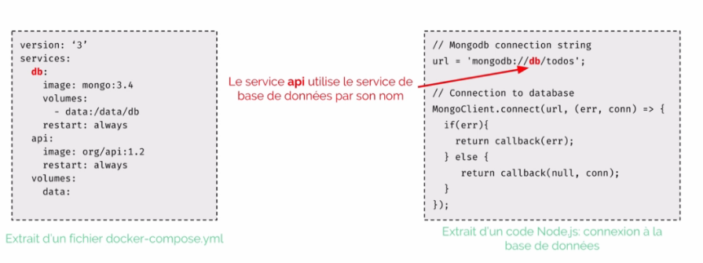

Sur la gauche, nous avons un extrait d'une application ``docker-compose`` composée de deux services. 

Un service est utilisé pour la base de données, ``db`` et un pour l'``api`` qui utilise ce service ``db```.

Nous voyons aussi qu'il y a un volume qui se nomme ``data`` et qui est monté dans le service ``db``.

A droite, nous avons une partie du code **nodeJs** de l'**api** qui montre comment la connexion à la base de données est réalisée. Il suffit juste de donner le nom du service de base de données dans la chaine de connexion. 

C'est quelque chose de très pratique. Toutefois,  il faudra ajouter un mécanisme qui permette d'attendre que la ``db`` soit disponible ou éventuellement renouveller la tentative de connexion. 
``Docker-compose`` permet d'indiquer les dépendances entre les services mais il ne permet pas de savoir qu'un service est disponible avant de lancer un service qui en dépend. 


8.4 Mise en oeuvre d'une application microservice : Voting App. 
#####################################################################

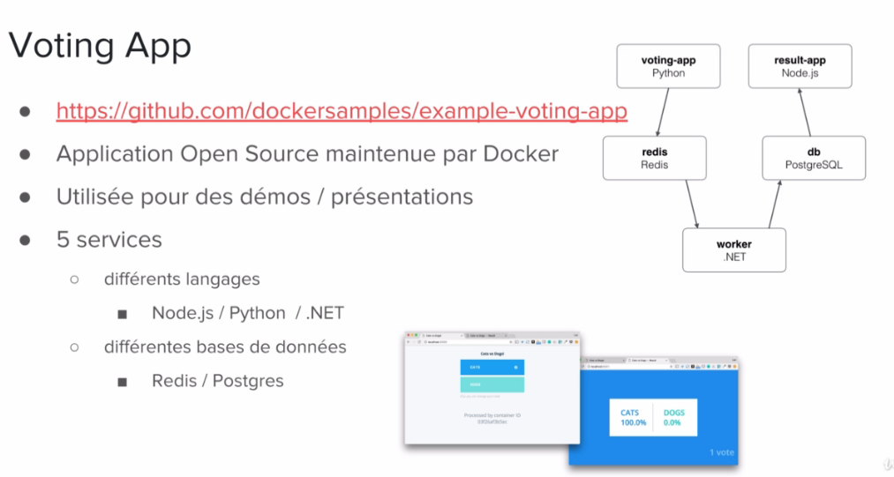


L'application **Voting App** est développée et maintenue par **Docker**.
Elle est beaucoup utilisée pour des présentations ou des démos.Nous pouvons la récupérer en local en clonant  
`le répository GitHub <https://github.com/dockersamples/example-voting-app>`_ .
   
C'est une application très pratique pour illustrer le concept de microservices. 

Elle est composée de : 

* 5 services :

  * 2 bases de données : **redis** et **postgres**
  * 3 services développés chacun dans un environnement différent : **Python**, **NodeJs** et **.NET**


Un utilise vote depuis l'interface web, par défaut l'utilisateur doit choisir entre "cat" et "dog". Le vote est stocké dans la base de données **Redis**. 

Le service **Worker**, va récupérer le vote depuis **Redis** et va l'enregister dans la base de données **PostGres** et les utilisateurs pourront consulter les résultats via l'interface **Web** fournie par le service **Result**.

Si nous visitons le dépôt **GitHub** de l'application, nous constatons qu'il existe plusieurs fichiers **docker-compose** qui illistrent différentes utilisation de l'application : 

Pour la production on aura le fichier ``docker-stack`` alors que pour le développement nous aurons plutôt ``docker-compose``.
Il est possible de choisir différents langages comme ``java`` ou ``.NET`` pour le **worker**. Ainsi que différents ``OS`` : **Linux** ou **Windows**. 


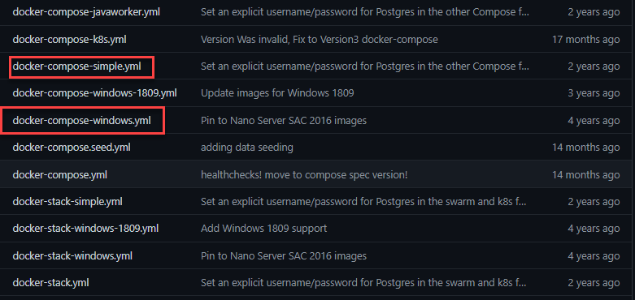


Ouvrons le fichier ``docker-compose-simple.yml`` 

.. code-block::
  :caption: Fichier docker-compose-simple.yml
  :linenos:
  :emphasize-lines: 0
   
  version: "3"

  services:
    vote:
      build: ./vote
      command: python app.py
      volumes:
      - ./vote:/app
      ports:
        - "5000:80"

    redis:
      image: redis:alpine
      ports: ["6379"]

    worker:
      build: ./worker

    db:
      image: postgres:9.4
      environment:
        POSTGRES_USER: "postgres"
        POSTGRES_PASSWORD: "postgres"

    result:
      build: ./result
      command: nodemon server.js
      volumes:
        - ./result:/app
      ports:
        - "5001:80"
        - "5858:5858"

L'instruction ``build`` sert à définir l'emplacement du contexte de construction du service : le ``dockerfile`` ainsi que les autres fichiers nécessaire à la construction de l'image. 

Pour le service **vote**, nous voyons que nous avons bien les fichiers de l'application et le ``Dockerfile`` dans le dossier ``vote``. 

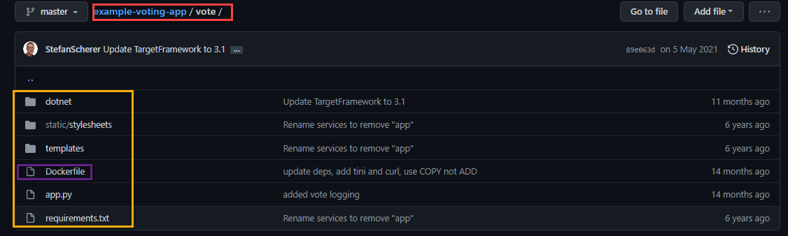


Pour les services **vote** et **result**, nous définissons dans l'instruction ``volume`` le ``bindmount`` du code applicatif depuis la machine hôte vers le répertoire ``/app`` dans le container. 
Cela permet de rendre le code source présent sur la machine de développement directement accessible dans le container. 

Et une approche qui est souvent utilisée avec ``Docker-compose`` en développement est de redéfinir la commande qui est normalement lancée dans le container. 

On utilise pour cela le mot clé ``command`` comme nous pouvons le voir dans les services **vote** et **result**.


Par contre si nous ouvrons le fichier ``docker-stack.yml``, nous avons une définition de l'application prête à être déployer sur un cluster **Swarm** de production.

.. code-block:: 
  :caption: Fichier docker-stack.yml
  :linenos:
  :emphasize-lines: 0
   
    version: "3"
    services:

      redis:
        image: redis:alpine
        networks:
          - frontend
        deploy:
          replicas: 1
          update_config:
            parallelism: 2
            delay: 10s
          restart_policy:
            condition: on-failure
      db:
        image: postgres:9.4
        environment:
          POSTGRES_USER: "postgres"
          POSTGRES_PASSWORD: "postgres"
        volumes:
          - db-data:/var/lib/postgresql/data
        networks:
          - backend
        deploy:
          placement:
            constraints: [node.role == manager]
      vote:
        image: dockersamples/examplevotingapp_vote:before
        ports:
          - 5000:80
        networks:
          - frontend
        depends_on:
          - redis
        deploy:
          replicas: 2
          update_config:
            parallelism: 2
          restart_policy:
            condition: on-failure
      result:
        image: dockersamples/examplevotingapp_result:before
        ports:
          - 5001:80
        networks:
          - backend
        depends_on:
          - db
        deploy:
          replicas: 1
          update_config:
            parallelism: 2
            delay: 10s
          restart_policy:
            condition: on-failure

      worker:
        image: dockersamples/examplevotingapp_worker
        networks:
          - frontend
          - backend
        depends_on:
          - db
          - redis
        deploy:
          mode: replicated
          replicas: 1
          labels: [APP=VOTING]
          restart_policy:
            condition: on-failure
            delay: 10s
            max_attempts: 3
            window: 120s
          placement:
            constraints: [node.role == manager]

      visualizer:
        image: dockersamples/visualizer:stable
        ports:
          - "8080:8080"
        stop_grace_period: 1m30s
        volumes:
          - "/var/run/docker.sock:/var/run/docker.sock"
        deploy:
          placement:
            constraints: [node.role == manager]

    networks:
      frontend:
      backend:

    volumes:
      db-data:
  
Si l'on regarde dans le service **vote** par exemple. On peut voir que contrairement au fichier ``docker-compose-simple``, nous n'avons pas l'instruction ``build`` mais ``image``. Ce qui est logique puisqu'en production nous déployons les images des services et non pas les codes applicatifs dans les containers. 

Nous trouvons également l'instruction ``deploy`` qui permet de spécifier un ensemble de propriétés dans le cadre d'un déploiement sur un cluster **Swarm** comme le nombre de ``replicas``, c'est à dire le nombre de container identique qui seront lancés par le service. Des contraintes de ``placement``, qui indique le type de machine du cluster sur lequel le service sera déployé. On peut également spécifier des conditions de redémarrage, ``restart_policy``  ou la façon dont la mise à jour d'un service sera effectué avec ``update_config``. Par exemple,si un service a deux réplicas, on peut vouloir mettre à jour le premier, se donner quelques secondes pour être certain qu'il fonctionne correctement avant de faire la mise à jour du second. C'est le mécanisme de **rolling update** que l'on verra dans le chapitre sur Swarm. 

Dans un contexte de production, on s'assurera également d'isoler des groupes de services par l'intermédiaire de ``networks``. Ici , tout en bas du fichier nous voyons que deux ``networks`` sont définis : ``frontend`` et ``backend``. 


8.5 Voting App Installation sur ``Play Docker``. 
###################################################################

Nous allons installer l'application dans un environnement temporaire dans un premier temps : `Play With Docker <https://labs.play-with-docker.com/>`_ 

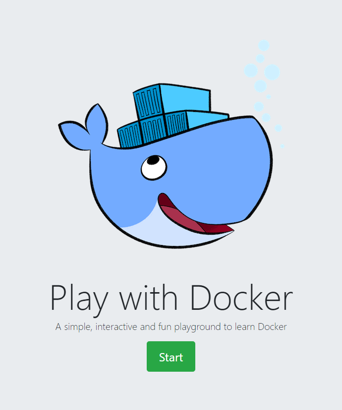

Cela permet de créer une session Docker dans un environment de test en ligne.  

Cliquez sur : **Add New Instance**

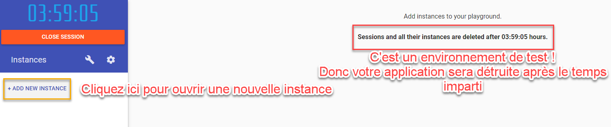

Clonez le dépôt ``git`` : `https://github.com/dockersamples/example-voting-app.git <https://github.com/dockersamples/example-voting-app.git>`_ 

.. code-block:: 
  :linenos:
  :emphasize-lines: 0
   
  git clone https://github.com/dockersamples/example-voting-app.git


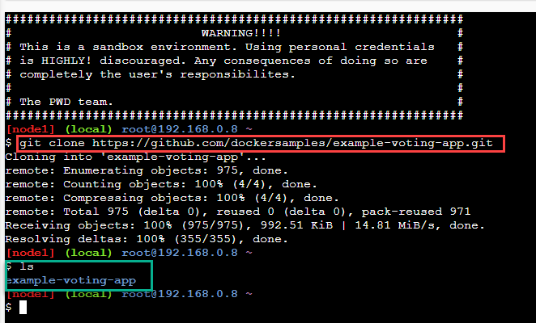

Naviguez dans le dossier ``example-voting-app``.

.. code-block:: 
  :linenos:
  :emphasize-lines: 0
   
  cd example-voting-app

Et lançons maintenant l'application avec ``Docker-compose``.
Nous lui indiquons le nom du fichier avec l'option ``-f``. 
Le paramètre ``up`` indique qu'il faut monter l'application et ``-d`` qu'il faut rendre la main de la console une fois monté. 

.. code-block:: 
  :linenos:
  :emphasize-lines: 0

  docker-compose -f docker-compose-simple.yml up -d

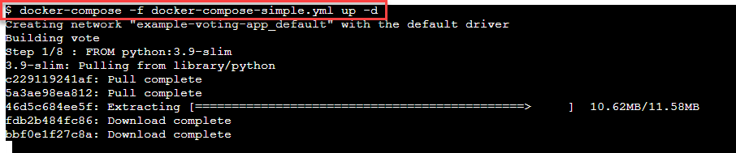
  
Après le déploiement de l'application, il apparait dans **Play with Docker** des boutons portant les numéros des ports des applications. 

Si l'on regarde le contenu du fichier ``docker-compose-simple``, nous lisons que : 

Le service vote publie son port 80  sur le port 5000 de la machine hôte. 
Et que le service result publie son port 80 sur le port 5001 de la machine hôte. 

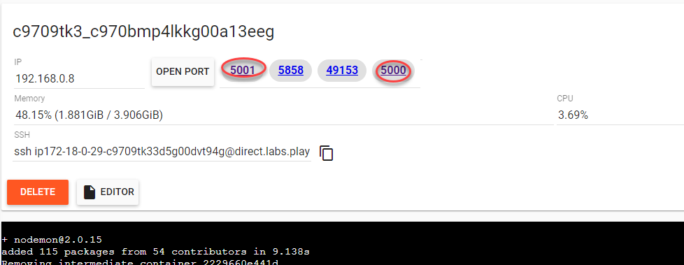

Si l'on clique dessus, nous pourrons avoir accès aux applications ciblées : 

**Service de vote :** 

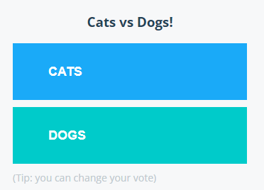

|

**Résultats des votes :**

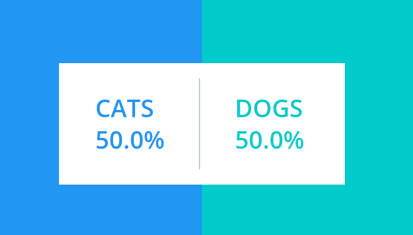


|

.. admonition:: Essayez en local !
   
  Essayez d'installer cette application en local sur votre propre machine ! 


8.6 Voting App Installation en ``local``. 
###################################################################

Nous allons illustrer l’utilisation de ``Docker Compose`` et lancer l’application **Voting App**. Cette application est très utilisée pour des présentations et démos, c'est un bon exemple d'application micro-services simple.

8.6.1 Vue d’ensemble
***************************

L’application ``Voting App`` est composée de plusieurs micro-services, ceux utilisés pour la version 2 sont les suivants:

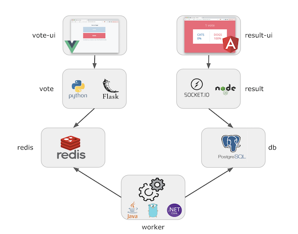

* **vote-ui**: front-end permettant à un utilisateur de voter entre 2 options
* **vote**: back-end réceptionnant les votes
* **result-ui**: front-end permettant de visualiser les résultats
* **result**: back-end mettant à disposition les résultats
* **redis**: database redis dans laquelle sont stockés les votes
* **worker**: service qui récupère les votes depuis redis et consolide les résultats dans une database postgres
* **db**: database postgres dans laquelle sont stockés les résultats

8.6.2 Récupération des repos
*********************************
.. code-block::
  :caption: Commandes à taper dans un dossier
  :linenos:
  :emphasize-lines: 0
   
  mkdir VotingApp && cd VotingApp
  git clone https://gitlab.com/voting-application/$project

8.6.3 Installation du binaire ``docker-compose``
****************************************************

* Si vous utilisez **Docker for Mac** ou **Docker for Windows**, le binaire ``docker-compose`` est déjà installé.

8.6.4 Le format de fichier ``docker-compose.yml``
****************************************************

Plusieurs fichiers, au format Docker Compose, sont disponibles dans ``config/compose``. Ils décrivent l’application  pour différents environnements.
Le fichier qui sera utilisé par défaut est le fichier ``docker-compose.yml`` dont le contenu est le suivant:

.. code-block::
  :caption: docker-compose.yml
  :linenos:
  :emphasize-lines: 0
   
    services:
    vote:
      build: ../../vote
      # use python rather than gunicorn for local dev
      command: python app.py
      depends_on:
        redis:
          condition: service_healthy
      ports:
        - "5002:80"
      volumes:
        - ../../vote:/app
      networks:
        - front-tier
        - back-tier

    vote-ui:
      build: ../../vote-ui
      depends_on:
        vote:
          condition: service_started
      volumes:
        - ../../vote-ui:/usr/share/nginx/html
      ports:
        - "5000:80"
      networks:
        - front-tier
      restart: unless-stopped

    result:
      build: ../../result
      # use nodemon rather than node for local dev
      command: nodemon server.js
      depends_on:
        db:
          condition: service_healthy
      volumes:
        - ../../result:/app
      ports:
        - "5858:5858"
      networks:
        - front-tier
        - back-tier

    result-ui:
      build: ../../result-ui
      depends_on:
        result:
          condition: service_started
      ports:
        - "5001:80"
      networks:
        - front-tier
      restart: unless-stopped

    worker:
      build:
        context: ../../worker
        dockerfile: Dockerfile.${LANGUAGE:-dotnet}
      depends_on:
        redis:
          condition: service_healthy
        db:
          condition: service_healthy
      networks:
        - back-tier

    redis:
      image: redis:6.2-alpine3.13
      healthcheck:
        test: ["CMD", "redis-cli", "ping"]
        interval: "5s"
      ports:
        - 6379:6379
      networks:
        - back-tier

    db:
      image: postgres:13.2-alpine
      environment:
        POSTGRES_USER: "postgres"
        POSTGRES_PASSWORD: "postgres"
      volumes:
        - "db-data:/var/lib/postgresql/data"
      healthcheck:
        test: ["CMD", "pg_isready", "-U", "postgres"]
        interval: "5s"
      ports:
        - 5432:5432
      networks:
        - back-tier

  volumes:
    db-data:

  networks:
    front-tier:
    back-tier:

Ce fichier est très intéressant car il définit également des ``volumes`` et ``networks`` en plus des **services**.
Ce n’est cependant pas un fichier destiné à être lancé en production notamment **parce qu'il utilise le code local et ne fait pas référence à des images existantes pour les services** ``vote-ui``, ``vote``, ``result-ui``, ``result`` et ``worker``.

8.6.5 Lancement de l’application
*************************************

Depuis le répertoire ``config/compose``, lancez l’application à l'aide de la commande suivante (le fichier ``docker-compose.yml`` sera utilisé par défaut):

>>> docker-compose up -d

Les étapes réalisées lors du lancement de l’application sont les suivantes:

* création des networks front-tier et back-tier
* création du volume db-data
* construction des images pour les services *vote-ui*, *vote*, *result-ui*, *result*, *worker* et récupération des images *redis* et *postgres*
* lancement des containers pour chaque service

8.6.6 Les containers lancés
*********************************

Avec la commande suivante, listez les containers qui ont été lancés.

>>> docker-compose ps

.. code-block:: 
  :caption: Liste des containers lancés
  :linenos:
  :emphasize-lines: 0
   
    Name                      Command                  State                            Ports
  ----------------------------------------------------------------------------------------------------------------------
  compose_db_1          docker-entrypoint.sh postgres    Up (healthy)   0.0.0.0:5432->5432/tcp,:::5432->5432/tcp
  compose_redis_1       docker-entrypoint.sh redis ...   Up (healthy)   0.0.0.0:6379->6379/tcp,:::6379->6379/tcp
  compose_result-ui_1   /docker-entrypoint.sh ngin ...   Up             0.0.0.0:5001->80/tcp,:::5001->80/tcp
  compose_result_1      docker-entrypoint.sh nodem ...   Up             0.0.0.0:5858->5858/tcp,:::5858->5858/tcp, 80/tcp
  compose_vote-ui_1     /docker-entrypoint.sh ngin ...   Up             0.0.0.0:5000->80/tcp,:::5000->80/tcp
  compose_vote_1        python app.py                    Up             0.0.0.0:5002->80/tcp,:::5002->80/tcp
  compose_worker_1      dotnet Worker.dll                Up

8.6.7 Les volumes créés
*********************************

Listez les volumes avec la CLI, et vérifiez que le volume défini dans le fichier docker-compose.yml est présent.

>>> docker volume ls

Le nom du volume est prefixé par le nom du répertoire dans lequel l’application a été lancée.

.. code-block:: 
  :linenos:
  :emphasize-lines: 0

  DRIVER    VOLUME NAME
  local     compose_db-data

Par défaut ce volume correspond à un répertoire créé sur la machine hôte.

8.6.8 Les networks créés
*********************************

Listez les networks avec la CLI. Les deux networks définis dans le fichier ``docker-compose.yml`` sont présents.

>>> docker network ls

De même que pour le volume, leur nom est préfixé par le nom du répertoire.

.. code-block:: 
  :linenos:
  :emphasize-lines: 0

  NETWORK ID     NAME                 DRIVER    SCOPE
  71d0f64882d5   bridge               bridge    local
  409bc6998857   compose_back-tier    bridge    local
  b3858656638b   compose_front-tier   bridge    local
  2f00536eb085   host                 host      local
  54dee0283ab4   none                 null      local

.. admonition:: Note
   
 Comme nous sommes dans le contexte d’un hôte unique (et non dans le contexte d’un cluster Swarm), le driver utilisé pour la création de ces networks est du type bridge. Il permet la communication entre les containers tournant sur une même machine.

8.6.9 Utilisation de l’application
******************************************

Nous pouvons maintenant accéder à l’application:
nous effectuons un choix entre les 2 options depuis l'interface de vote à l'adresse http://localhost:5000.
Si vous avez lancé cette application sur un autre hôte que votre machine, vous aurez accès à cette interface à l'adresse http://HOST:5000


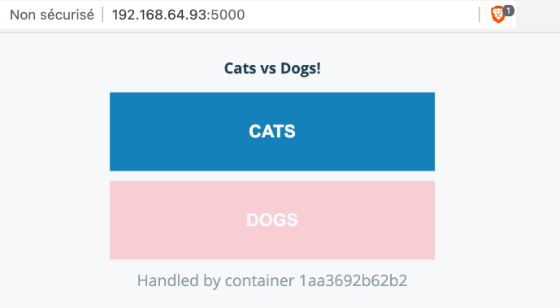


nous visualisons le résultat depuis l'interface de résultats à l'adresse http://localhost:5001
Si vous avez lancé cette application sur un autre hôte que votre machine, vous aurez accès à cette interface à l'adresse http://HOST:5001

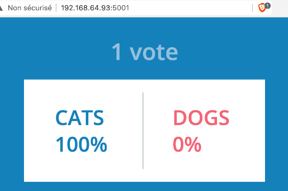

8.6.10 Scaling du service worker
******************************************

Par défaut, un container est lancé pour chaque service. Il est possible, avec l'option ``--scale``, de changer ce comportement et de scaler un service une fois qu’il est lancé.
Avec la commande suivante, augmenter le nombre de worker à 2.

.. code:: 

  $ docker-compose up -d --scale worker=2
  compose_db_1 is up-to-date
  compose_redis_1 is up-to-date
  compose_result_1 is up-to-date
  compose_vote_1 is up-to-date
  compose_result-ui_1 is up-to-date
  compose_vote-ui_1 is up-to-date
  Creating compose_worker_2 ... done


Les 2 containers relatifs au service worker sont présents:

.. code:: 

  $ docker-compose ps
    Name                      Command                  State                            Ports
    ----------------------------------------------------------------------------------------------------------------------
    compose_db_1          docker-entrypoint.sh postgres    Up (healthy)   0.0.0.0:5432->5432/tcp,:::5432->5432/tcp
    compose_redis_1       docker-entrypoint.sh redis ...   Up (healthy)   0.0.0.0:6379->6379/tcp,:::6379->6379/tcp
    compose_result-ui_1   /docker-entrypoint.sh ngin ...   Up             0.0.0.0:5001->80/tcp,:::5001->80/tcp
    compose_result_1      docker-entrypoint.sh nodem ...   Up             0.0.0.0:5858->5858/tcp,:::5858->5858/tcp, 80/tcp
    compose_vote-ui_1     /docker-entrypoint.sh ngin ...   Up             0.0.0.0:5000->80/tcp,:::5000->80/tcp
    compose_vote_1        python app.py                    Up             0.0.0.0:5002->80/tcp,:::5002->80/tcp
    compose_worker_1      dotnet Worker.dll                Up
    compose_worker_2      dotnet Worker.dll                Up


**Notes:** il n’est pas possible de scaler les services ``vote-ui`` et ``result-ui`` car ils spécifient tous les 2 un port, plusieurs containers ne peuvent pas utiliser le même port de la machine hôte

.. code:: 

  $ docker-compose up -d --scale vote-ui=3
  ...
  ERROR: for vote-ui  Cannot start service vote-ui: driver failed programming external connectivity on endpoint compose_vote-ui_2 (6274094570a329e3a4d9bdcdf4d31b7e3a8e3e7e78d3cc362ad56e14341913da): Bind for 0.0.0.0:5000 failed: port is already allocated


8.6.11 Suppression de l’application
******************************************

Avec la commande suivante, stoppez l’application. Cette commande supprime l’ensemble des éléments créés précédemment à l'exception des volumes (afin de ne pas perdre de données)

.. code:: 

  $ docker-compose down
  Stopping compose_result-ui_1 ... done
  Stopping compose_vote-ui_1   ... done
  Stopping compose_result_1    ... done
  Stopping compose_vote_1      ... done
  Stopping compose_worker_1    ... done
  Stopping compose_redis_1     ... done
  Stopping compose_db_1        ... done
  Removing compose_vote-ui_3   ... done
  Removing compose_vote-ui_2   ... done
  Removing compose_result-ui_1 ... done
  Removing compose_vote-ui_1   ... done
  Removing compose_result_1    ... done
  Removing compose_vote_1      ... done
  Removing compose_worker_1    ... done
  Removing compose_redis_1     ... done
  Removing compose_db_1        ... done
  Removing network compose_back-tier
  Removing network compose_front-tier

Afin de supprimer également les volumes utilisés, il faut ajouter le flag ``-v``:


>>> docker-compose down -v


Cet exemple illustre l’utilisation de **Docker Compose** sur l’exemple bien connu de la **Voting App** dans le cadre d’un hôte unique. Pour déployer cette application sur un environnement de production, il faudrait effectuer des modifications dans le fichier **docker-compose**, par exemple:

* utilisation d’images pour les services
* ajout de service supplémentaires (aggrégateur de logs, terminaison ssl, ...)
* contraintes de déploiement
* ...