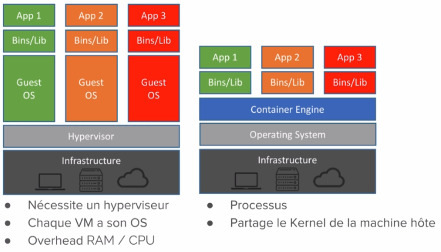
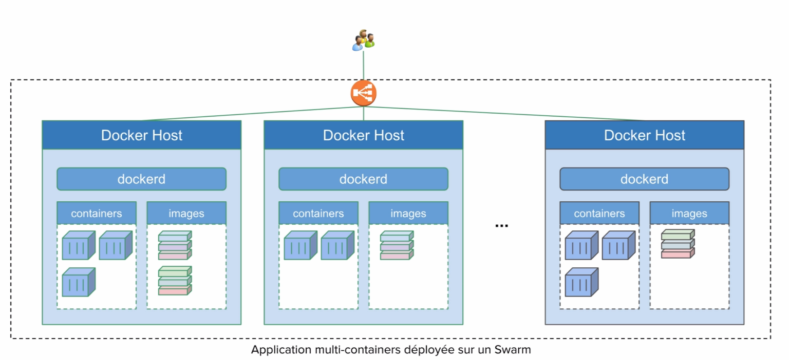
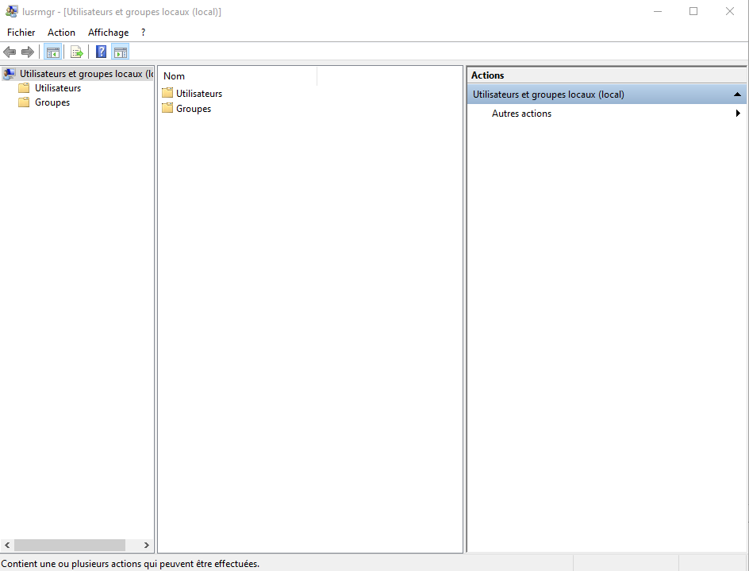
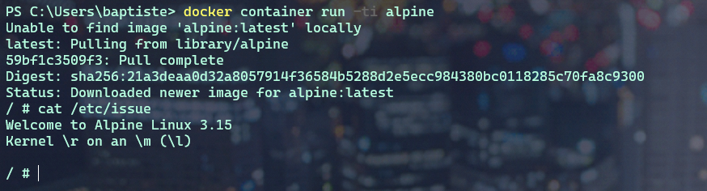
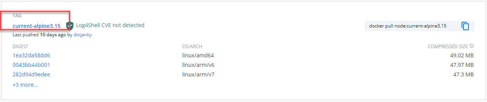
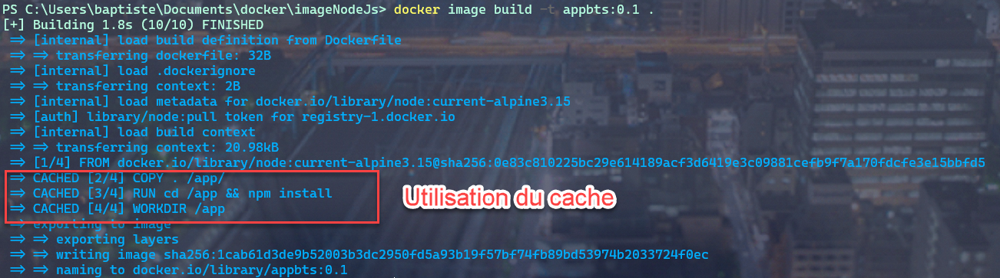

1.0 Introduction
###########################

Ce cours est découpé en différents chapitres et permet un apprentissage progressif des différents concepts Docker et de leur mise en pratique. 
On commencera par donner quelques exemples de ce qu’il est possible de faire avec Docker dans la section **Quick Wins**.
Nous ferons références à des concepts utiles comme les **containers** Linux, les Micro services, le Dev Ops.etc. 

Nous aurons un chapitre sur la **plateforme Docker**, son architecture, son fonctionnement et sa mise en place. 
Nous verrons comment Docker rend très simple la manipulation des **containeurs**. 
Nous parlerons de la notion d’images qui permet de **packager** une application et ses dépendances. 
Dans le chapitre sur le stockage, nous apprendrons à utiliser **Docker** pour que les données puissent persister dans les conteneurs. 

**Thèmes abordé dans ce cours :**

* **Docker Machine** pour créer des hôtes Docker.
*	**Docker compose** qui permet de créer des applications en multi container. 
*	**Docker Swarm**, la solution d’orchestration de **Docker** qui permet de gérer des applications qui tournent dans des containers. 
*	Le **réseau** dans Docker.
*	La **sécurité**. 

.. note::
  **Prérequis :** Installation de **WSL 2** sur **windows 10**.
  Afin de pouvoir utiliser des commandes linux dans une console **POWERSHELL**.
   
    .. code-block:: language

      wsl –install -d ubuntu
      wsl --set-version ubuntu 2

  Dans la console, tapez : ``ubuntu`` pour basculer dans un environnement **Ubuntu**.

1.1 Quick Wins
******************
Très souvent le premier contact que l’on a avec **Docker** s’effectue via le **Docker Hub** accessible sur https://hub.docker.com.

.. image:: img/docker/image64.png
  :alt: Docker Hub

Il s’agit d’un **registre** (ou **registry**) dans lequel nous retrouvons beaucoup d’applications packagées dans des images **Docker**. 
Cette notion d’image est la base de ce qu’apporte **Docker**. 
Voici un exemple de services qui peuvent être contenu dans une image **Docker** :

.. image:: img/docker/image66.png

Par exemple, grâce à **Docker** nous pouvons lancer un interpréteur interactif (**REPL**) pour des langages de programmation comme le **Python**, le **Ruby On Rail** ou le **Javascript**.

.. image:: img/docker/image65.png

Nous avons alors accès à un environnement **Python** en interactif et c’est le flag ``-ti`` qui permet l’interactivité avec le processus du containeur.  

De la même manière, nous pouvons lancer un environnement **NodeJs**, ici contenant le Tag ``8.12-alpine``.
**8.12** est la version de **NodeJs** et **alpine** est le nom de la distribution Linux utilisée dans le container.

Par exemple si nous avons besoin d’une base de données **MongoDB** dans la version 4.0.Nous n’avons qu’à trouver une image disponible dans le **Docker Hub**.

.. image:: img/docker/image68.png

On peut imaginer avoir besoin de lancer plusieurs containers **MongoDB** avec des versions différentes.
Cela peut être utile pour tester une différence de comportement entre deux versions par exemple.

1.2 Des Stacks complètes
***************************

Une application fonctionne rarement seule et est souvent constituée d’un ensemble de services.
Cet ensemble constitue une **Stack applicative**.
Par exemple, prenons le cas de la Stack **Elastic**, qui est souvent utilisée pour la gestion des log. 
Elle est constituée de **BEATS** et **LOGSTASH** qui est là pour l’ingestion des logs, de **ELASTICSEARCH** pour l’analyse et 
le stockage des logs et **KIBANA** qui permet de visualiser tout cela.

.. image:: img/docker/image67.png

Il existe une multitude d’applications prêtent à être utilisée avec Docker, accessible en ligne de commande. 
Nous verrons rapidement comment Docker permet de créer notre propre package d’application pour faciliter : l’installation, l’utilisation et le déploiement.

1.3 Quelques concepts utiles pour les Développeurs
****************************************************

1.3.1 Un container Linux, c’est quoi ?
==========================================

Un **container** est simplement un **processus** particulier qui tourne sur le système. 
Il est isolé des autres **processus**. Il possède sa **propre vision** du système sur lequel il tourne, on appelle cela les **Namespaces**. 
On peut limiter les ressources utilisées par ce processus en utilisant les **Controls Groups** (ou **Cgroups**). 
Le même système peut exécuter plusieurs containers en même temps, c’est d’ailleurs ce qui constitue l’avantage de cette technologie. 
Le noyau Linux de la machine hôte est **partagé** entre tous ses containeurs.

1.3.2 Containers Linux : Les Namespaces 
==========================================

Les **Namespaces** sont des technologies Linux qui servent à isoler un processus. 
Cela permet de limiter ce qu’un processus peut voir. Il existe **6** NameSpaces différents :

#. **Pid** : Permet de donner à un processus la vision de lui-même et de ses processus enfant.
#. **Net** : Permet de donner au processus son propre réseau privé.
#. **Mount** : Permet de donner au processus un système de fichiers privé.
#. **Uts** : Permet la gestion du nom de l’hôte.
#. **Ipc** : Isole les communications inter processus.
#. **User** : permet de faire un mapping entre les utilisateurs de l’hôte et les containeurs.

1.3.3 Containers Linux : Control Groups (cgroups) 
===================================================

Les **cgroups** sont une autre technologie Linux qui va permettre de limiter les ressources qu’un processus va utiliser. 
Par exemple, pour limiter l’utilisation :

* **RAM**
* **CPU**
* des **I/O** (périphériques d’entrées et de sorties)
* du **Réseau**

1.3.4 Containers Linux : VM/Container
===================================================

On compare souvent les containers à des machines virtuelles, car elles permettent d’exécuter des applications de manière isolée.

Mais la virtualisation nécessite un **hyperviseur** qui s’exécute **sur le système d’exploitation de l’hôte** et nécessite également que **haque machine virtuelle** ait son propre système d’exploitation.
Alors que l’approche du container est **beaucoup plus légère** car chacun partage le **Kernel Linux de la machine hôte**.

La machine virtuelle consomme plus de disque mémoire et de ram que les containers. **Cela implique que beaucoup plus de containers peuvent fonctionner sur une même machine hôte.**

1.3.5 Architecture micro-services
===================================================

Depuis quelques années, les applications sont développées autour d’une architecture appelée **micro-services**. 
Alors qu’avant une application était souvent un gros bloc unique **monolithique**.

.. image:: img/docker/image69.png

Aujourd’hui, une application est constituée de **plusieurs petits composants** qui sont des services qui ont leur propre rôle et fonctionnalité. 
Et c’est l’**interconnexion** de l’ensemble de ces services qui permettent de définir l’application globale.

.. image:: img/docker/image73.png

Dans une **application monolithique**, si l’on veut que plusieurs instances de l’application soient déployées il faut créer plusieurs machines virtuelles contenant l’application dans son entièreté.

.. image:: img/docker/image32.png

Alors que dans le contexte d’une application micro-services chaque service peut être déployé indépendamment des autres services, nous avons plusieurs machines virtuelles sur lesquelles les services des différentes applications sont dispatchées.

**Exemple d’architecture micro-services : l’application UBER**

.. image:: img/docker/image72.png

Chaque processus métier est isolé dans un service :

* **Paiement**
* **Notification**
* **Facturation**

*Avantages de l’architecture micro-services* :

* **Découpage** de l’application en **processus** (services) indépendants.
* Chacun a sa propre **responsabilité métier**.
* **Equipe dédiée** pour chaque service.
* Plus de **liberté** de choix de langage.
* **Mise à jour**.
* Containers très adaptés pour les micro-services.

*Inconvénients* :

* Nécessite des interfaces bien définies.
* Focus sur les tests d’intégration.
* Déplace la complexité dans l’orchestration de l’application globale. (Docker SWARM ou Kubernetes).

**APPLICATION CLOUD NATIVE**

On entend de plus en plus parler d’applications **Cloud Native** définies par plusieurs critères :

* Applications qui suivent une architecture **microservices**.
* Utilisant la **technologie des containers**.
* L’orchestration est faite **dynamiquement**.

Il existe une branche de la **Linux Foundation** : la **CNCF** ( **C** loud **N** ative **C** omputing **F** oundation ) qui porte de nombreux projets **Cloud Native** comme :

* **Kubernetes**
* **Prometheus**
* **Fluentd**
  
  `Site de la cncf <www.cncf.io>`_

1.3.5 Questionnaire de synthèse
===================================================

   #. **Quels sont les éléments permettant la création d'un container sous Linux ?**
      
      * Le kernel Linux et le système de fichiers.
      * Les namespaces et les control groups.
      * Les control groups et le système de fichiers.
   
   #. **Les cgroups permettent :**
     
      * De limiter la vision d'un processus
      * De limiter les ressources que peux utiliser un processus
      * D’isoler le système de fichiers d'un processus
      * De faire un chroot

   #. **Un container c'est**
    
      * Une mini machine virtuelle
      * Un répertoire sur le système de fichiers
      * Un processus qui tourne de manière isolée des autres processus
      * Une technologie créée par Docker

2.0 La plateforme Docker
###########################

**Docker** apporte une facilité de développement, de packaging et de déploiement d’applications **quelque soit le langage de programmation**.
Un développeur peut **tester une application** sur sa machine en **imitant** les conditions de l’environnement de **production** tout en nécessitant une **configuration minimale**.
Si l’application est soumise à un **fort stresse**, **Docker** peut orchestrer l’allocation d’autres containers.
La **scalabilité** s’effectue très rapidement car un container peut être lancé en quelques secondes.

.. note::
  Cherchez la définition du terme **scalabilité**.

**Docker** permet également d' **augmenter** le rythme de **mise à jour** des logiciels.

2.1 Le modèle client/serveur
********************************

.. image:: img/docker/image55.png

**Docker** utilise un modèle **client/serveur**.
D’une part nous avons le client **Docker**, un fichier binaire écrit en **GO**. Et d’autre part nous avons le **Docker Daemon** (appelé **dockerd**), écrit aussi en GO, et qui expose une **API REST** consommée par le client.
Le client envoie des commandes au **Docker Daemon** pour gérer les containers, les images entre autres.

2.1.1 Le serveur : Dockerd
==============================

* **Processus** : dockerd
   * Gestion des images, networks, volumes, cluster, …
   * Délègue la gestion des containers à containerd.
* Expose une **API Rest**.
* Ecoute sur le **socket unix** ``/var/run/docker.sock`` par défaut.
* Peut-être configuré pour écouter sur un socket tcp.

2.1.2 Le client : docker
==============================

* Installé en même temps que **dockerd**.
* Communique avec le **daemon local** par défaut via ``/var/run/docker.sock``.
* Peut être configuré pour communiquer avec un **daemon distant**.

2.1.3 Concepts essentiels
==============================

* **Docker** facilite la manipulation des **containers Linux**. Et cache la complexité sous-jacente.
* Introduction de la **notion d'image** : Format d'un package qui contient une application.
* Une image est un **template** qui sert pour la création d’un container.
* Pour créer une image on utilise un **Dockerfile**. Un fichier texte qui contient une liste d’instructions.
* La distribution de ces images se fait par l’intermédiaire d’un **Registry**.
* Docker permet de lancer des containers sur une machine unique ou sur un ensemble d’hôtes regroupées en un **cluster Swarm**.

Voici un schéma qui montre le **fonctionnement global des composants de base de Docker**.

.. image:: img/docker/image56.png

Quand on installe la plateforme Docker nous avons donc : 
un client et un serveur (ou daemon) qui tourne constamment et qui est responsable de la gestion des containers et des images.

2.1.4 Docker Hub
==============================

Par défaut le **daemon Dockerd** communique avec le **Docker Hub**, qui est le **Registry** officiel de Docker disponible à l’adresse : https://hub.docker.com

Il existe bien entendu beaucoup d’autres Registry que l’on peut utiliser si on le souhaite.

.. image:: img/docker/image57.png

**Les images du Docker Hub peuvent être classées en plusieurs catégories.**

* Les images officielles qui sont validées et que l’on peut utiliser avec confiance.
* Les images publiques à utiliser avec précaution.
* Les images privées dédiées qu’aux utilisateurs autorisés ( partage d’images au sein d’une entreprise par exemple).

2.1.4 Cluster Swarm
==============================

Un Cluster Swarm est un ensemble de **Docker Host**, c’est-à-dire un ensemble de machines sur lesquel le **Docker Démon** est installé.

Ses machines vont communiquer entres elles afin d’orchestrer des applications et d’assurer qu’elles fonctionnent de la manière voulue.

2.2 Installation de Docker
********************************
Nous allons voir ici comment installer **Docker** sur votre environnement.

Rendez-vous tout d'abord dans le `Docker hub <https://hub.docker.com>`_ puis sélectionner l'onglet **Explore**:

.. image:: img/docker/image59.png

Sélectionnez ensuite l'onglet **Docker** dans le sous menu:

.. image:: img/docker/image60.png

Sur la gauche vous verrez alors un menu vous permettant de sélectionner différents éléments :

* plateforme
* système d'exploitation
* architecture

Comme nous pouvons le constater, Docker peut être installé sur des systèmes divers: machine de développement, l'infrastructure d'un cloud provider, et même des devices de type Raspberry PI.

Installation sur un poste élève du Lycée Paul Claudel -LAON (02)
*******************************************************************

Normalement, il faudrait télécharger ``Docker Desktop`` depuis le site officiel. 
Mais pour économiser la bande passante, utilisez le fichier d’installation présent dans le répertoire ``\\COMMUN\BAUER\Docker\``.

Doucle cliquez sur l’installateur et laissez les options d’installation cochées par défaut.
``WSL 2`` est nécessaire pour faire fonctionner **DOCKER**.

Si tout se passe bien vous devriez avoir cet écran vous invitant à redémarrer la machine :

**  Lancer l’application : Docker Desktop**

.. image:: img/docker/image10_bis.png

  
Si vous tentez d’exécuter l’application, il est fort probable que vous ayez un message d’erreur vous indiquant :

Pour résoudre ce problème, nous avons besoin d’ajouter les utilisateurs de la machine au groupe ``docker-users`` nouvellement créé par l’installation.

Ouvrez une session en ``administrateur`` de la machine locale : compte ``INFO/INFO``.
Dans **WINDOWS 10**, tapez dans le champ de recherche situé en bas à gauche :

**« modifier les utilisateurs et les groupes locaux »**

Cette fenêtre devrait s’ouvrir :

 .. image:: img/docker/image2_bis.png 

Double cliquez sur le groupe ``docker-users``.

Et ajoutez un nouvel utilisateur : votre compte issu du domaine ``sio`` 

 .. image:: img/docker/image1_bis.png 

Le système vous demandera de saisir l’identifiant et le mot de passe du compte à intégrer à ce groupe.

Redémarrer la machine et reconnectez-vous maintenant à votre compte WINDOWS standard.

Lancez L’application **Docker Desktop** et validez les conditions d’utilisation.
Vous devriez avoir ce message d’erreur :

 .. image:: img/docker/image4_bis.png 

Fermez alors la fenêtre et rendez-vous sur ce site :

`Étapes d’installation manuelle pour les versions antérieures de WSL | Microsoft Docs <https://docs.microsoft.com/fr-fr/windows/wsl/install-manual#step-4---download-the-linux-kernel-update-package>`_

Suivez les étapes d’installation :

Vous allez installer ``WSL2`` qui est un sous-système **Linux** pour **WINDOWS**.
Cela va permettre d’utiliser des commandes **Linux** dans un terminal Windows.

Tapez  ensuite la commande :

.. code-block:: 

  wsl.exe --set-default-version 2

Nous pouvons en profiter pour installer le nouveau **Terminal de Windows**. 
Cela va apporter plus de confort durant la pratique de ce cours.

`Lien vers la page Terminal Windows <https://docs.microsoft.com/fr-fr/windows/terminal/install>`_

Il faut un compte « **Microsoft** » .

Redémarrez la machine encore une fois pour que **WSL2** soit pris en compte.

**Docker** devrait maintenant pouvoir démarrer :

.. image:: img/docker/image3_bis.png 
  
Il faut maintenant configurer le client en cliquant sur l’engrenage en haut à droite.

Cochez les options comme sur la capture d’écran :

.. image:: img/docker/image7_bis.png

N’oubliez pas de cliquer sur « **Apply & Restart** »

Configurez le PROXY

.. image:: img/docker/image5_bis.png

Si vous allez dans l’onglet **WSL** intégration :

**Vous êtes maintenant prêt !**

**Bienvenue dans le monde de DOCKER.**

Passez directement à la partie : 
**Vérification de l'installation**

Installation pour Windows 10 ou MacOS
***************************************************

Si vous êtes sur **MacOS** ou **Windows 10 (Entreprise ou Pro)** vous pouvez installer **Docker Desktop**, un environnement compatible pour chacune de ces plateformes:
   * `Docker Desktop for Windows <https://hub.docker.com/editions/community/docker-ce-desktop-windows>`_ 
   * `Docker Desktop for Mac <https://hub.docker.com/editions/community/docker-ce-desktop-mac>`_ 

Installation pour Linux
***************************************************

Si vous êtes sur **Linux**, vous pouvez sélectionner la distribution que vous utilisez (**Fedora**, **CentOS**, **Ubuntu**, **Debian**) et vous obtiendrez alors un lien vers la documentation à suivre pour installer **Docker** sur la distribution en question.

Pour aller un peu plus vite, vous pouvez également lancer la commande suivante (compatible avec les principales distribution **Linux**) :

.. code-block:: language

   curl -sSL https://get.docker.com | sh

En quelques dizaines de secondes, cela installera **la plateforme Docker** sur votre distribution.
Il sera ensuite nécessaire d'**ajouter votre utilisateur** dans le **groupe docker** afin de pouvoir intéragir avec le **daemon** sans avoir à utiliser **sudo** (il faudra cependant lancer un nouveau **shell** afin que ce changement de groupe soit pris en compte.)

.. code-block:: language

   sudo usermod -aG docker <UTILISATEUR>

.. note::

  Il est également possible d'installer **Docker** sur d'autres types d'**architecture infrastructure**.

Vérification de l'installation
***************************************************

Une fois installé, lancez la commande suivante afin de vérifier que tout est fonctionnel :

.. code-block:: language

   docker info

.. image:: img/docker/image61.png

3.0 Les containers avec Docker
#################################

Après avoir présenté la plateforme Docker, nous allons voir comment créer des **containers** en ligne de commande pour lancer des services en tâche de fond et/ou pour rendre disponible dans un container des repertoires de la **machine hôte**. 

Nous verrons comment lancer un container dans un mode d’**accès privilégié**, ainsi que les commandes de bases pour la gestion du cycle de vie des containers. 

Avant la 1.13, lancer un **container** s’effectuait avec la commande : ``Docker Run`` sans le mot clé ``container``. 
Il est toujours possible de le faire. 
Mais maintenant les commandes ont été regroupé aux composant auquel elles se rapportent. C’est la raison pour laquelle le mot clé ``container`` a été rajouté pour les commandes relatifs à la gestion des containers. 
``docker container run [OPTIONS] IMAGE [COMMAND] [ARG]``
D’autres groupes de commande existent et nous les étudierons plus tard. 

3.1 Hello World
******************
Lançons notre premier container **Hello-World**.

.. image:: img/docker/image62.png

Ouvrez un **terminal** et tapez :

.. code-block:: language

  docker container run hello-world

.. image:: img/docker/image63.png

Le client demande au **daemon** (processus) de lancer un **container** basé sur l’image **Hello-World** .
Cette image ,n’étant pas disponible en local, est téléchargée et le **processus** présent dans cette image est automatiquement exécuté.

Et dans le cas de notre **Hello-world**, il s’agit seulement d’écrire du texte sur la sortie standard : **Hello from Docker** suivi d’un texte.

Cet exemple est simple mais il met en avant le mécanisme sous-jacent. 
A la fin du texte on nous demande d’essayer un exemple plus ambitieux, c’est ce que nous allons faire par la suite.

Expérimentez la commande : ``docker container run hello-world`` sur votre machine

3.2 Ubuntu sous docker
************************

Nous pouvons lancer un autre container basé sur l’image de **Ubuntu** et lui demander d’afficher ``Hello`` dans  le contexte de cette image.

.. code-block:: language

  docker container run ubuntu echo hello

.. image:: img/docker/image11.png

Analyser le contenu des cadres ci-dessus.
A quelles actions correspondent-ils ?  

3.2 Un container dans un mode Interactif
************************************************

Le mode **interactif** permet d’avoir accès à un ``shell`` depuis le client local  qui tourne dans le **contexte du container**.

Pour cela il faut rajouter deux options à notre commande :

``-t`` qui permet d’allouer un pseudo terminal à notre container.

``-i`` qui va permettre de laisser l’entrée standard du container ouverte.

Nous allons utiliser l’image **Ubuntu** qui contient les binaires et les bibliothèques du système d’exploitation Ubuntu. Le processus du **container** s’exécutera donc dans cette environnement, c’est-à-dire dans le **système de fichier** qui est amené par le système Ubuntu.

.. code-block:: 

  docker container run -t -i ubuntu bash

ou 

.. code-block:: 

  docker container run -ti ubuntu bash

.. image:: img/docker/image12.png

Nous voyons que nous avons accès à un ``shell`` ( *coquille en anglais, interface système*). 
Nous reconnaissons sans peine le prompt **Ubuntu/Linux** dans lequel nous pouvons écrire par exemple une commande Linux : ``ls``

Tapez dans le ``shell``, la commande : ``cat /etc/issue``.

  Quelle information obtenez-vous ?

Pour sortir du container on va tuer le processus avec la commande : ``exit``

Nous aurions pu faire la même chose en utilisant une autre image que celle d’Ubuntu.
Par exemple :
Nous souhaitons lancer un container basé sur la distribution **Linux Alpine**.
C’est une distribution légère et sécurisée.

.. code-block::

  docker container run -t -i alpine

ou 

.. code-block::

  docker container run -ti alpine

Vous savez maintenant lancer un ``shell`` interactif dans un container.

Quand on lance un **container** avec seulement la commande ``docker container run`` 
par défaut le container est exécuté en **foreground**, mais si l’on veut l’exécuter en **background**, c’est-à-dire en tâche de fond, il faudra utiliser l’option ``-d`` et la commande retournera alors l’ **identifiant** du conteneur que l’on pourra utiliser par la suite pour effectuer différentes actions.

Par exemple nous pouvons lancer un container basé sur l’image ``nginx``, un **serveur http**.

Container NGINX en **foreground**
======================================

Création du **conteneur** en **foreground**, cela signifie que l’on ne récupère pas la main

.. code-block::

  docker container run nginx

.. image:: img/docker/image14.png

Le conteneur est lancé et occupe notre console. Nous n'avons pas la main.

Container NGINX en **background**
======================================

.. code-block::

  docker container run -d nginx

.. image:: img/docker/image15.png

Nous voyons ici que nous avons **NGINX** qui tourne en tâche de fond et nous pouvons accéder à ce container par la suite grâce à son **identifiant**.

Nous pourrions aussi accéder à ce serveur web depuis un **navigateur**.
Cela n'est actuellement pas possible car nous n’avons pas publié de **port**.

3.3 Publication de port.
**************************
La publication d'un port est utilisée pour qu’un **container** puisse être accessible depuis l’extérieur.
Afin de publier un port nous utilisons l’option ``-p HOST_PORT:CONTAINER_PORT``.

Cela permet de publier un **port du conteneur** sur un **port de la machine hôte**.

L’option ``-P`` quant à elle laisse le choix du port au ``docker démon``.

Reprenons notre container **NGINX** qui est un serveur **http**.
Par défaut, **NGINX** est un processus qui se lance sur le **port 80** dans le container.
Si nous souhaitons accéder à notre container depuis **un navigateur de la machine hôte** sur le **port 8080** de la machine hôte, 
nous lançerons le container **nginx** avec la commande suivante :

.. code-block::
  
  docker container run -d -p 8080:80 nginx

.. image:: img/docker/image16.png

Maintenant, nous pouvons ouvrir notre navigateur sur l'adresse : http://localhost:8080

.. image:: img/docker/image17.png

3.4 Bind-mount
**************************

Nous allons maintenant voir comment **monter un répertoire de la machine hôte** dans un container.

Cela s’effectue grâce à l’option ``-v <HOST_PATH>:<CONTAINER_PATH>``

Il existe une autre notation avec l’option ``--mount type=bind, src=<HOST_PATH>,dst=<CONTAINER_PATH>``

Cela permet de partager,par exemple,le code source d’un programme présent sur une **machine hôte** avec des **containers** 
ou de monter la **socket Unix** du **daemon Docker** (``/var/run/docker.sock``) pour permettre à un container de dialoguer avec le **daemon**.

3.4.1 Exemple 1 : monter un dossier 'www'
================================================

Quand vous développez une application et que vous modifiez le code source, il peut être intéressant que cela soit pris en compte dans le conteneur.
C’est le cas lors du développement d’une **application web**.
Nos **fichiers sources** sont sur une **machine locale**, et dans **un conteneur** nous avons un serveur **WEB** avec **NGINX** par exemple.
Nous allons alors monter le dossier ``www`` local dans le **container**.

.. code-block::

  docker container run -v $PWD/www:/usr/share/nginx/html -d -p 80:80 nginx

Ou

.. code-block::

  docker container run –mount type=bind,src=$PWD/www,dst=/usr/share/nginx/html -d -p 80:80 nginx

``$PWD`` est une variable d’environnement qui va être créé par le **SHELL** et prendra comme valeur le **chemin du répertoire courant** dans lequel la commande a été lancé.

.. image:: img/docker/image18.png

3.4.2 Exemple 2 : Intéragir avec le Docker Daemom
========================================================

Dans cet exemple nous allons voir comment lier(bind) ``/var/run/docker.sock``.
Ce qui nous permettra d’interagir avec le ``Docker Daemon`` directement depuis le container et cela nous donnera accès à l’ **API du Daemon**.

.. image:: img/docker/image19.png

Pour LINUX UNIQUEMENT
-------------------------

Créons donc un simple container : avec l’image d' **Alpine**.

.. code-block::
  
  docker container run --rm -it --name admin -v /var/run/docker.sock:/var/run/docker.sock alpine

Maintenant que le container est monté, et branché au ``Docker Daemon``, nous pouvons lui envoyer des requêtes.

**Depuis le Shell**:
Installons **CURL** : 

``apk add curl`` pour ajouter l’utilitaire ``CURL``.

Nous allons lancer une requête **http POST** sur le ``Docker DAEMON`` :

.. code-block::

    curl -X POST –unix-socket /var/run/docker.sock -d '{"Image":"nginx:1.12.2"}' -H 'Content-Type: application/json' http://localhost/containers/create

Cela aura pour effet de demander au **Docker Daemon** de créer un nouveau container avec l’image **NGINX version 1.12.2**.

Le paramètre ``-X POST`` permet d’effectuer quel type de requête ``http`` ?
Sous quel format sont envoyés les instructions de configuration de l’image **Docker** à créer ?

Pour lancer le container depuis le container **ADMIN** :

.. code-block::

  curl -XPOST –unix-socket /var/run/docker.sock http://localhost/containers/6b24...283b/start

Dans cette commande, à votre avis à quoi corresponde la chaine de caractère : ``6b24...283b`` ?

Pour WINDOWS UNIQUEMENT
-------------------------

Bientôt disponible ....

3.4.3 Exemple 3 : Ecouter les actions demandées au Docker Daemon
===================================================================

Nous allons lancer un autre dans laquel le **socket** est monté.
Et nous allons écouter les actions demandées sur le **Docker Daemon**. **Même ceux provenant d’autres containers**.

.. code-block::

  docker container run –name admin -ti -v /var/run/docker.sock:/var/run/docker.sock alpine

.. code-block::

  curl –unix-socket /var/run/docker.sock http://localhost/events

3.5 Limitation des ressources
********************************

Nous avons dit que le lancement d’un **containeur** revient en fait à exécuter un **processeur** , et par défaut, il n’y a pas de limite de consommation des ressources matériels.
Par exemple, Un container pourra utiliser toute la RAM  et impacter tout les autres containeurs qui tournent sur la même machine hôte.

Nous pouvons toutefois imposer des limites à un containeur.

Lançons un containeur avec l’image ``estesp/hogit`` qui a pour objectif de consommer de la ram.

.. code-block::

  docker container run --memory 32m estesp/hogit

Avec ``--memory 32m``, nous avons fixé une limite : quand le processus aura atteint la limite de ``32M`` de **RAM** consomméecho, il sera tué par **Docker**.

Nous pouvons limiter l’utilisation du **CPU** également.
Lançons un containeur avec l’image ``progrium/stress`` qui va se charger de stresser les cœurs du **CPU**.

.. code-block::

  docker container run -it –rm progrium/stress -–cpu 4

Ici les **4** cœurs du **CPU** serons utilisés car nous n’avons pas imposé de limite.

Maintenant lançons la même commande avec le flag ``--cpus 0.5`` pour limiter l’utilisation du **CPU à la moitié d’un cœur**. (**12%** d’utilisation)

.. code-block::

  docker container run -it --rm progrium/stress -–cpu 4 –-cpus 0.5

En utilisant la valeur du flag : ``--cpus 2`` , nous limitons l’utilisation à 2 cœurs seulement. (**50%** d'utilisation)

3.6 Les droits dans un container
************************************

Dans un containeur, s’il n’est pas précisé explicitement, l’utilisateur ``root`` sera utilisé comme propriétaire.
L’utilisateur ``root`` du containeur correspond à l’utilisateur ``root`` de la machine hôte.

Une bonne pratique est d’utiliser un autre utilisateur pour lancer le containeur.

Il y a plusieurs façons de le définir : soit à la création de l’image, soit en utilisant l’option ``–user``, soit en changeant l’utilisateur dans le processus du container (``gosu``).

Lançons un container basé sur l’image **Alpine** et exécutons l'instruction sleep 10000.

.. code-block::

  docker container run -d alpine sleep 10000

Nous allons vérifier le ``owner`` du processus depuis la machine hôte :

**Pour LINUX :**

.. code-block::

  ps aux | grep sleep

**pour WINDOWS :**

Sous Windows, nous n'avons pas accès aux commandes LINUX nativement.
Il faut utiliser les commandes Docker natives pour avoir accès aux informations liées aux processus des containeurs par l'intermédiaire de leur identifiant ou nom et
via la commande ``top``.

Récupérez l'identifiant ou le nom du container obtenue avec la commande précédente puis : 

.. code-block::

  docker container top <identifiant ou nom du container>

.. image:: img/docker/image74.png

Faisons la même manipulation, mais cette fois avec l'image officielle de **MongoDB**

.. code-block::

  docker container run -d mongo

.. image:: img/docker/image75.png

On constate que le processus est la propriété d'un ``owner`` qui posséde un ``UID`` de **999**.
Nous verrons par la suite comme il est possible de configurer le ``owner`` d'un processus lors du montage de **container**. 

3.6 Des options utiles
************************************

.. note::

  * ``--name`` qui permet de donner un nom au container.
  * ``--rm`` pour supprimer le container quand il est stoppé.
  * ``--restart=on-failure`` pour relancer le container en cas d’erreur.

3.7 Les commandes de base avec Docker
****************************************

.. code-block::

  docker container <command>

.. list-table:: Les commandes de base de docker container
   :widths: 50 50
   :header-rows: 1

   * - Commande
     - Description
   * - run
     - Création d’un container
   * - ls
     - Liste des containers
   * - inspect
     - Détails d’un container
   * - logs
     - Visualisation des logs
   * - exec
     - Lancement d’un processus dans un container existant
   * - stop
     - Arrêt d’un container
   * - rm
     - Suppression d’un container

* La commande ``ls`` :

La commande ``docker container ls`` montre les containers qui sont en cours d’execution.

.. image:: img/docker/image20.png

Pour lister tout les containers actifs et stoppés : ``docker container ls -a``.

.. image:: img/docker/image1.png

Pour lister les identifiants des containers actifs et stoppés : ``docker container ls -a -q``.

.. image:: img/docker/image2.png

A partir d’un nom ou identifiant d’un container on peut l’inspecter :

.. image:: img/docker/image3.png

La commande renvoie une multitude d’information de configuration du container.
On peut utiliser des templates (**Go Template**) pour formater les données reçues et même extraire seulement des informations nécessaires :
par exemple : **Obtenir l’IP**

.. code-block::

  docker container inspect --format '{{ .NetworkSettings.IPAddress }}' clever_kilby

* La commande ``logs`` :

Cette commande,nous permets de visualiser les logs d’un container , l’option ``-f`` permet de les lire en temps réel.

Créons un container sous une image **alpine** qui exécutera une commande ``ping 8.8.8.8`` et qui sera nommé : **ping**

.. code-block::

  docker container run --name ping -d alpine ping 8.8.8.8

Puis, écoutons en temps réel les **logs** du container nommé **ping**

.. code-block::

  docker container logs -f ping

.. image:: img/docker/image4.png

* La commande ``exec`` :

Cette commande permet de lancer un processus dans un container existant pour faire du débug par exemple.
Dans ce cas nous utiliserons les options ``-t`` et ``-i`` pour obtenir un  ``shell`` intéractif.

**Exemple** : lançons un container qui attend 100000 secondes, et demandons ensuite d’ouvrir un shell pour lister les processus de ce container.

.. code-block::

  docker container run -d --name debug alpine sleep 100000

On lance le container avec l'option ``-d`` pour le mettre en tâche de fond et récupérer la main sur le terminal et on lui donne le nom ``debug`` pour le manipuler facilement.

Ensuite nous utilisons la commande ``exec`` qui injectera dans notre container une commande, à savoir ici, la demande d'ouverture d'un ``shell``.

.. code-block::

  docker container exec -ti debug sh

.. image:: img/docker/image5.png

Sur la capture d'écran : 
Dans le shell, nous avons exécuté la commande ``ps aux``. Qui permet de lister les processus et leur ``owner``.
On constact que le processus de **PID 1** , correspond à la commande ``sleep``.
Et le processus de PID 15 correspond à notre ``ps aux``.

.. warning::

  Si l'on ``kill`` le processus de **PID 1**, le container s’arrêtera, car un container n’est actif que tant que son processus de **PID 1** spécifié au lancement est en cours d’exécution.

* La commande ``stop`` :

Cette commande permet de stopper un ou plusieurs containers.

.. code-block::

 docker container stop <ID>

.. code-block::

 docker container stop <NAME>

Nous pouvons combiner des commandes !

**Rappel :**  Obtenir la liste des containers en cours d’exécution :

.. code-block::

  docker container ls -q

Donc pour stopper les containers en cours d’exécution :

.. code-block::

  docker container stop $(docker container ls -q)

Les containers stoppés existent toujours :

.. code-block::

  docker container ls -a

* La commande ``rm`` :

Pour supprimer un container.

.. code-block::

  docker container rm <ID>
  docker container rm <NAME>

Donc, par combinaison de commande, nous pouvons supprimer définitivement un ou plusieurs containers qui sont déjà stoppé.

.. code-block::

  docker container rm $(docker container ls -aq)

Avec l’option ``-f`` nous pouvons forcer l’arrêt d’un container et le supprimer dans la foulée.

3.8 En pratique : 
*******************

Lançons quelques containers pour pratiquer, vous devez être en mesure de comprendre maintenant la finalité de ces 3 commandes : 

.. code-block::

  docker container run -d -p 80:80 --name www nginx

.. code-block::

  docker container run -d --name ping alpine ping 8.8.8.8

.. code-block::

  docker container run hello-world

Listons les containers :

.. image:: img/docker/image6.png

Nous voyons les 2 premiers containers avec le statut **UP**.
Nous ne voyons pas le 3 ieme container pour la simple raison qu’une fois qu’il a effectué son action : ``echo hello world`` , il s’est arrêté automatiquement.
Par contre avec un :
``docker container ls -a`` celui-ci est visible.

.. image:: img/docker/image7.png

Son statut est **exited**, indiquant qu’il n’est pas démarré.

Nous pouvons inspecter les containers et en particulier extraire une information comme l'**adresse IP** de notre serveur web **NGINX** :

.. code-block::

  docker container inspect --format '{{ .NetworkSettings.IPAddress }}' www

.. image:: img/docker/image8.png

Nous pouvons lancer une commande dans un container en cours : par exemple nous voulons lister la liste des processus en cours dans le container **ping** :

.. code-block::

  docker container exec -ti ping sh

Un ``shell`` est alors disponible, et dedans nous pouvons taper la commande : ``ps aux``

.. image:: img/docker/image9.png

Tapez : ``exit`` pour sortir du ``shell``.

Stoppons les containers : **ping** et **www**

.. code-block::

  docker container stop ping www

faites ensuite : ``docker container ls``

  Que constatez vous ?  Pourquoi ?

Même question avec : ``docker container ls -a``

Supprimons maintenant les containers créés :

``docker container rm $(docker container ls -a -q)``

3.9 Exercices : 
*******************

3.9.1 Exercice 1 : Hello From Alpine
========================================

Le but de ce premier exercice est de lancer des containers basés sur l'image **alpine**.

#. Lancez un container basé sur alpine en lui fournissant la command echo hello
#. Quelles sont les étapes effectuées par le docker daemon ?
#. Lancez un container basé sur alpine sans lui spécifier de commande. Qu’observez-vous ?

3.9.2 Exercice 2 : Shell intéractif
========================================

Le but de cet exercice est lancer des containers en mode **intéractif**.

#. Lancez un container basé sur alpine en mode **interactif** sans lui spécifier de commande
#. Que s’est-il passé ?
#. Quelle est la commande par défaut d’un container basé sur **alpine** ?
#. Naviguez dans le **système de fichiers**
#. Utilisez le gestionnaire de package d’alpine (``apk``) pour ajouter un package :  ``apk update`` et ``apk add curl``.

3.9.3 Exercice 3 : foreground / background
===============================================

Le but de cet exercice est de créer des containers en **foreground** et en **background**.

#. Lancez un container basé sur alpine en lui spécifiant la commande ``ping 8.8.8.8``.
#. Arrêter le container avec ``CTRL-C``

Le container est t-il toujours en cours d’exécution ?

.. note::
  
  Vous pouvez utiliser la commande ``docker ps`` que nous détaillerons prochainement, et qui permet de lister les containers qui tournent sur la machine.

#. Lancez un container en mode interactif en lui spécifiant la commande ``ping 8.8.8.8``.
#. Arrêter le container avec ``CTRL-P CTRL-Q``

Le container est t-il toujours en cours d’exécution ?

#. Lancez un container en **background**, toujours en lui spécifiant la commande ``ping 8.8.8.8``.

Le container est t-il toujours en cours d’exécution ?

3.9.4 Exercice 4 : Publication de port
===============================================

Le but de cet exercice est de créer un container **en exposant un port** sur la machine **hôte**.

#. Lancez un container basé sur ``nginx`` et publiez le ``port 80`` du container sur le ``port 8080`` de l’hôte.
#. Vérifiez depuis votre navigateur que la page par défaut de ``nginx`` est servie sur ``http://localhost:8080``.
#. Lancez un second container en publiant le même port.

Qu’observez-vous ?

3.9.5 Exercice 5 : Liste des containers
===============================================

Le but de cet exercice est de montrer les différentes options pour lister les containers du système.

#. Listez les containers en cours d’exécution.

Est ce que tous les containers que vous avez créés sont listés ?

#. Utilisez l’option ``-a`` pour voir également les containers qui ont été stoppés.
#. Utilisez l’option ``-q`` pour ne lister que les IDs des containers (en cours d’exécution ou stoppés).

3.9.6 Exercice 6 : Inspection d'un container
===============================================

Le but de cet exercice est l'inspection d’un container.

#. Lancez, en **background**, un nouveau container basé sur **nginx** en publiant le **port 80** du container sur le **port 3000** de la machine host.

Notez l'identifiant du container retourné par la commande précédente.

#. Inspectez le container en utilisant son identifiant.
#. En utilisant le **format Go template**, récupérez le nom et l'**IP** du container.
#. Manipuler les **Go template** pour récupérer d'autres information.

3.9.7 Exercice 7 : exec dans un container
===============================================

Le but de cet exercice est de montrer comment lancer un processus dans un container existant.

#. Lancez un container en background, basé sur l'image alpine. Spécifiez la commande ``ping 8.8.8.8`` et le nom ping avec l’option ``--name``.
#. Observez les logs du container en utilisant l'ID retourné par la commande précédente ou bien le nom du container.

Quittez la commande de logs avec ``CTRL-C``.

#. Lancez un shell ``sh``, en mode **interactif**, dans le container précédent.
#. Listez les processus du container.

Qu'observez vous par rapport aux identifiants des processus ?

3.9.8 Exercice 8 : cleanup
===============================================

Le but de cet exercice est de stopper et de supprimer les containers existants.

#. Listez tous les containers (**actifs** et **inactifs**)
#. Stoppez tous les containers encore actifs en fournissant la liste des IDs à la commande ``stop``.
#. Vérifiez qu’il n’y a plus de containers actifs.
#. Listez les containers arrêtés.
#. Supprimez tous les containers.
#. Vérifiez qu’il n’y a plus de containers.

3.10 En résumé
******************************

Nous avons commencé à jouer avec les containers et vu les commandes les plus utilisées pour la gestion du cycle de vie des containers 
(``run``, ``exec``, ``ls``, ``rm``, ``inspect``). Nous les utiliserons souvent dans la suite du cours.

C'est parfois utile d’avoir un ``Shell`` directement sur la machine hôte.
C'est-à-dire la machine sur laquelle le ``Docker Daemon`` tourne.
Si l'on est sur ``linux``, le client et le ``daemon`` tournent sur la **même machine.**
Par contre le ``docker daemon`` va tourner sur une **machine virtuelle** sous Windows alors que le client sera lui sur une machine locale.

4.0 Les images Docker
#################################

Nous allons parler des images **Docker**.
Une image est un système de fichier qui contient une application et l’ensemble des éléments nécessaires pour la faire tourner.
On peut voir une image comme étant un **template** permettant la création d’un container.
L’image est portable sur n’importe quel environnement où tourne **Docker** et est composée de **couches** (**layers**) qui peuvent être réutilisé par d’autres images.
On distribue une image via un **registry** ( ex : Docker Hub)

Contenu d’une image :

.. image:: img/docker/image10.png

La construction du fichier image, se fait dans l’ordre inverse du contenu d’une image que l’on vient de lister.

On part d’un OS de base qui va ajouter une ou plusieurs couches comme le système de fichiers.
A cet OS on va ajouter une ou plusieurs couches liées à l’environnement de notre application puis de la même façon les dépendances et le code applicatifs.

Et l’ensemble de ses couches forment l’image.

4.1 Union Filesystem
************************

Une image est donc constituée d’un ensemble de **layers** ou **couches** et chacune d’elles est en **lectures seules**. Et c’est le rôle du **storage/graph driver** de constituer le système de fichier global de l’instance du container.

Le **Graph driver** ajoute en plus une couche qui est en **lecture/écriture** pour permettre au processus de modifier le filesystem sans que les modifications ne soient persistées dans les layers de l’image.
Il existe plusieurs **filesystem** et le choix du système dépend principalement du **filesystem hôte**.
Par default, toutes les layers sont installées dans le répertoire ``/var/lib/docker`` sur la machine hôte et c’est à cette endroit que sont stockées toutes les layers des images.

.. warning::

  Sur windows 10, docker s’exécute sur une VM.
  Ressources à consulter pour comprendre comment Docker fonction sous Windows :

  #. https://docs.docker.com/desktop/windows/
  #. https://forums.docker.com/t/the-location-of-images-in-docker-for-windows/19647

Pour accèder à ce dossier sous Windows, il faut alors créer un container et le lier avec Docker :

.. code-block::

  docker run -it --privileged --pid=host debian nsenter -t 1 -m -u -i sh

Nous pouvons alors lister le dossier ``/var/lib/docker`` dans le shell.

.. code-block::

  ls /var/lib/docker

Il est possible de modifier des fichiers qui sont apportés par une layer ; cela s’appelle : **copy-On-Write**.
Le fichier original est alors copier dans la layer qui est en **lecture / écriture** et la modification peut être **persistée**.

4.2 Exercices
************************
4.2.1 Exercice 1 : Container's layer
===============================================

La layer d’un container, est la layer **read-write** créé lorsqu’un container est lancé.
C’est la layer dans laquelle tous les changements effectués dans le container sont sauvegardés. 
Cette layer est supprimée avec le container et ne doit donc pas être utilisée comme un stockage persistant.

**Lancement d'un container**

Utilisez la commande suivante pour lancer un **shell intéractif** dans un container basé sur l’image ``ubuntu``.

.. code-block::

  docker container run -ti ubuntu

**Installation d'un package**

**figlet** est un package qui prend un texte en entrée et le formatte de façon amusante. 
Par défaut ce package n’est pas disponible dans l’image ubuntu. 

Vérifiez le avec la commande suivante:

.. code-block::

  figlet

La commande devrait donner le résultat suivant :

.. code-block::

  bash: figlet: command not found

Installez le package **figlet** avec les commandes suivantes:

.. code-block::

  apt-get update -y
  apt-get install figlet

Vérifiez que le binaire fonctionne :

.. code-block::

  figlet Hola

Ce qui devrait donner le résultat suivant

.. code-block::

  | | | | ___ | | __ _
  | |_| |/ _ \| |/ _` |
  |  _  | (_) | | (_| |
  |_| |_|\___/|_|\__,_|

Sortez du container.

.. code-block::

  exit

**Lancement d'un nouveau container**

Lancez un nouveau container basé sur ``ubuntu``.

.. code-block::

  docker container run -ti ubuntu

Vérifiez si le package figlet est présent :

.. code-block::

  figlet

Vous devriez obtenir l’erreur suivante:

.. code-block::

  bash: figlet: command not found

Comment expliquez-vous ce résultat ?
Chaque container lancé à partir de l’image **ubuntu** est différent des autres. 
Le second container est différent de celui dans lequel **figlet** a été installé. 
Chacun correspond à une instance de l’image ubuntu et a sa propre **layer**, ajoutée au dessus des layers de l’image, et dans laquelle tous les changements effectués dans le container sont sauvegardés.

Sortez du container.

.. code-block::

  exit

**Redémarrage du container**

Listez les containers (en exécution ou non) sur la machine hôte.

.. code-block::

  docker container ls -a

Depuis cette liste, récuperez l’ID du container dans lequel le package figlet a été installé et redémarrez le avec la commande suivante. 

**Note:** la commande ``start`` permet de démarrer un container se trouvant dans l'état ``Exited``.

.. code-block::

  docker container start <CONTAINER_ID>

Lancez un **shell intéractif** dans ce container en utilisant la commande ``exec``.

.. code-block::

  docker container exec -ti <CONTAINER_ID> bash

Vérifez que **figlet** est présent dans ce container.

.. code-block::

  figlet Hola

Résultat : 

.. code-block::

  | | | | ___ | | __ _
  | |_| |/ _ \| |/ _` |
  |  _  | (_) | | (_| |
  |_| |_|\___/|_|\__,_|

Vous pouvez maintenant sortir du container.

.. code-block::

  exit

**Nettoyage**

Listez les containers (en exécution ou non) sur la machine hôte

.. code-block::

  docker container ls -a

Pour supprimer tous les containers, nous pouvons utiliser les commandes ``rm`` et ``ls -aq`` conjointement. Nous ajoutons l’option ``-f`` afin de forcer la suppression des containers encore en exécution. Il faudrait sinon arrêter les containers et les supprimer.

.. code-block::

  docker container rm -f $(docker container ls -aq)

Tous les containers ont été supprimés, vérifiez le une nouvelle fois avec la commande suivante:

.. code-block::

  docker container ls -a

4.3 DockerFile
************************

Le **DockerFile** est un fichier texte qui est utilisé pour la construction d’**une image DOCKER**. 
Il contient des instructions pour la construction du système de fichier d’une image.
Nous allons partir d’un fichier de base qui sera enrichie par notre application et l’ensemble de ses dépendances.

* Exemple d’un **Docker File** dans laquelle est packagée une application **NODEJS**.

Avec l’instruction **FROM** nous définissons une image de base dans laquelle l’application **NODEJS** sera packagée.

* **COPY** qui permet d’ajouter la liste des dépendances.
* **RUN** permet de définir la commande d’installation des dépendances.
* **EXPOSE** défini le port utilisé par l’application.
* **WORKDIR** nous positionnes dans le répertoire de travail.
* **CMD** défini la commande à lancer lorsqu’un container sera lancer à partir de cette image.

Voici la liste des principales instructions à utiliser dans un **DockerFile**.

.. image:: img/docker/image37.png

**L’instruction FROM.**

Il s’agit de la première instruction dans un DOckerFile. Elle permet de spécifier l’image à partir de laquelle nous allons créer une nouvelle image.
On peut partir d’une image d’un OS, ou d’une image contenant déjà des applications comme un serveur web, ou un environnement d’exécution enveloppé dans une image contenant un OS de base.

Nous pouvons utiliser également une image particulière qui s’appelle **SCRATCH**, c’est une image au sens **DOCKER** même si elle est vide, et peut etre utilisé par example dans une application écrite en langage GO qui n’a pas besoin d’être packagé dans un système de fichier.

**L’instruction ENV.**

Cette instruction nous permet de définir des variables d’environnement. Et pourront être utilisée dans les instructions suivantes lors de la construction de l’image. On les retrouvera dans l’environnement des containers lancés à partir de cette image.

Dans cet exemple, nous construisons une image basée sur NGINX et on défini une variable ``path`` que l’on pourra utiliser dans les instructions suivantes : **WORKDIR** et **COPY**.

**L’instruction COPY / ADD.**

Permet de copier des ressources locales vers le système de fichier de l’image que l’on créé.

Et cela engendre la création d’une nouvelle layer pour l’image.

Avec l’option ``–chown`` on peut définir les droits sur ces fichiers qu’auront les utilisateurs de l’image.

ADD permet des actions supplémentaires comme récupérer des ressources à partir d’une URL.
Ou de Dézipper des fichiers.

Il est préférable d’utiliser **COPY** par rapport à **ADD** car l’on maitrise davantage comment la copie est faite.

**L’instruction RUN.**

**RUN** est une instruction qui va engendrer la construction d’une nouvelle **layer** pour l’image.

Elle permet d’exécuter une commande dans le système de fichier de l’image comme l’installation d’un package.
Il y a 2 formats pour définir la commande.
Le format **SHELL** qui va lancer la commande dans le contexte d’un **shell**.
Et le format **Exec** qui va définir la commande comme une liste de **string** et qui n’est pas lancée dans le contexte d’un **shell**.

.. image:: img/docker/image39.png

**L’instruction EXPOSE.**

Permet de spécifier les ports sur lesquels l’application écoute au lancement du container. Mais cela peut être modifié par l’option : ``-p`` lors de la création du container.
Nous pouvons utiliser aussi un mapping comme vu précédemment : ``-p HOST_PORT:CONTAINER_PORT``.

On peut aussi utiliser l’option ``P`` dans ce cas le démon **DOCKER** va publier l’ensemble des ports en attribuant à chacun un port de la machine hôte.

**L’instruction VOLUME.**

Permet de définir un répertoire dont les données sont découplées du cycle de vie du container.
Les fichiers ne seront pas stockés dans la layer **lecture/écriture** du container mais dans le système de fichier de la machine hôte. Et si le container est supprimé, les données de ce répertoire seront toujours là.

Si on reprend l’exemple du **dockerfile** de **MongoDB**.

.. image:: img/docker/image41.png

L’instruction *VOLUME* est utilisée pour créer 2 volumes. Au lancement de cette image, deux répertoires seront créés sur la machine hôte.

**L’instruction USER.**

Si on ne définit pas l’utilisateur, par défaut se sera ``ROOT`` qui sera utilisé. Ce qui pose des problèmes de sécurité évident.

**L’instruction HEALTHCHECK.**

Vérifie l’état de santé du processus qui tourne dans un container. On peut définir des options comme la fréquence d’inspection.

.. image:: img/docker/image42.png

**L’instruction ENTRYPOINT / CMD.**

Spécifie la commande qui sera exécuté lorsque l’on lancera un container basé sur cette image.
Les instruction **CMD** et **ENTRYPOINT** sont les dernières instructions du fichier **DOCKERFILE**.

On précise souvent le binaire de l’application dans **ENTRYPOINT** et les paramètres dans CMD.

La commande alors exécuté correspondra à la concaténation de **ENTRYPOINT** et **CMD**.

On peut modifier ses paramètres au lancement du container si besoin avec l’annotation **Shell** ou **Exec** vu précédemment.

4.3 Création d’images
************************

Il est temps maintenant de créer notre image.
Dans un premier temps il faut : créer un fichier **DockerFile** qui contiendra les instructions nécessaires.
Ensuite il faut utiliser la commande :

.. code-block::

  docker image builde [OPTIONS] PATH | URL | -

Des options courantes :

* ``-f`` : spécifie le fichier à utiliser pour la construction (**DockerFile** par défaut)
* ``--tag / -t`` : spécifie le nom de l’image ([registry/]user/repository :tag)
* ``--label`` : ajout de métadonnées à l’image.

4.4 Mise en pratique
************************

Nous allons créer une simple application **NODEJS** qui renverra la date et l’heure.
Tout l’environnement nécessaire à l’exécution de ce script sera intégré dans une image que nous allons créer.

Dans un dossier, créez le fichier ``index.js``:

.. code-block:: javascript

  var express = require('express');
  var util = require('util');
  var app = express();

  app.get('/', function(req, res) {
    res.setHeader('Content-Type', 'text/plain');
    res.end(util.format('%s - %s\n', new Date(), 'Got Request'));
  });
  app.listen(process.env.PORT || 8080);

Puis créez le fichier ``package.js`` dans le même dossier :

.. code-block:: JSON

  {
    "name": "testnode",
    "version": "0.0.1",
    "main": "index.js",
    "scripts": {
      "start": "node index.js"
    },
    "dependencies": {
      "express": "^4.14.0"
    }
  }

Dans une console, placez vous dans le dossier dans lequel vous avez déposé les fichiers et tapez :

.. code-block::

  npm install

puis

.. code-block::

  npm start

Ouvrez un navigateur à l’adresse : `http://localhost:8080 <http://localhost:8080>`_ 

Si tout se passe comme prévu alors vous dévriez avoir ceci :

.. image:: img/docker/image33.png

Notre application fonctionne, mais cela est lourd pour l’utilisateur :

#. Il doit avoir NODEJS d’installé sur sa machine.
#. Il doit installer les dépendances du projet, ici ``express``.
#. Il doit lancer le serveur Nodejs.

Il faudrait donc créer une image réalisant ces étapes !!

Nous allons créer un **DockerFile**.

Il nous faut trouver une image de base sur : `Docker Hub <https://hub.docker.com/search?type=image>`_

**Cochez** : « **Official Images** » pour n’avoir que des images officielles.
Nous voyons que nous avons une multitude de possibilité pour concevoir notre image.

.. image:: img/docker/image23.png

Nous pouvons partir sur une image **LINUX** : **UBUNTU**, **ALPINE** …Etc mais aussi une image où le runtime **NODEJS** est déjà packagé.
C’est ce que nous allons choisir.

En cliquant dessus, sélectionnez l’onglet **TAGS**.

Et dans la liste, nous allons nous intéresser à une version de **NODEJS** sous Alpine3.15.

Et conservons en mémoire le tag de cette version de node : current-alpine3.15

Maintenant dans le dossier contenant notre application, créons un fichier : **Dockerfile**. Sans extension.

**Fichier : Dockerfile**

.. code-block::

  # Nous renseignons dans l'instruction FROM le Tag de notre image qui servira de base à notre application
  FROM node:current-alpine3.15

  # Nous allons copier nos fichiers sources du répertoire courant du fichier Dockerfile dans le repertoire /app/.
  # C'est un répertoire qui sera créé dans l'image lorsque l'on va faire le build
  COPY . /app/
  RUN cd /app && npm install
  EXPOSE 8080
  WORKDIR /app
  CMD ["npm", "start"]

A partir de ce **Dockerfile**, nous allons pouvoir créer une **image**.

.. code-block::

  docker image build -t appbts:0.1 .

.. image:: img/docker/image27.png

Nous voyons que pour chaque instruction nous avons une étape.

Si nous allons dans **Docker Desktop** , onglet « **Images** » :

Nous voyons notre image, avec son nom et son numéro de version.
Nous pouvons maintenant créer un containeur avec notre application, 
en précisant que nous utiliserons le ``port 8080`` du container sur le ``port 8080`` de ma machine hôte.

.. code-block::

  docker container run -p 8080:8080 appbts:0.1

Et je peux maintenant utiliser mon navigateur à l’adresse : `http://localhost:8080 <http://localhost:8080>`_

4.5 Exercices : Création d’images
****************************************

4.5.1 Exercice 1 : Création d’une image à partir d’un container
====================================================================

#. Lancez une container basé sur une image **alpine**, en mode **interactif**, et en lui donnant le nom ``c1``.
#. Lancez la commande ``curl google.com``.

Qu'observez-vous ?

#. Installez ``curl`` à l’aide du gestionnaire de package ``apk``.
#. Quittez le container avec ``CTRL-P CTRL-Q`` (pour ne pas killer le processus de **PID 1**).
#. Créez une image, nommée ``curly``, à partir du container ``c1``.

Utilisez pour cela la commande ``commit`` (``docker commit --help`` pour voir le fonctionnment de cette commande).

#. Lancez un ``shell`` intéractif dans un container basée sur l’image ``curly`` et vérifiez que ``curl`` est présent.

4.5.2 Exercice 2 : Dockerizez un serveur web simple
========================================================

#. Créer un nouveau répertoire et développez un serveur **HTTP** qui expose le endpoint ``/ping`` sur le **port 80** et répond par **PONG**. Inspirez vous de l’exemple du cours ci-dessus.
#. Dans le même répertoire, créez le fichier **Dockerfile** qui servira à construire l'image de l'application. Ce fichier devra décrire les actions suivantes :
  * spécification d'une image de base.
  * installation du runtime correspondant au langage choisi.
  * installation des dépendances de l’application.
  * copie du code applicatif.
  * exposition du port d’écoute de l’application.
  * spécification de la commande à exécuter pour lancer le serveur.
#. Construire l’image en la taguant ``pong:v1.0``.
#. Lancez un container basé sur cette image en publiant le ``port 80`` sur le ``port 8080`` de la machine hôte.
#. Tester l'application.
#. Supprimez le container.

4.5.3 Exercice 3 : ENTRYPOINT et CMD
===========================================

Nous allons illustrer sur plusieurs exemples l’utilisation des instructions **ENTRYPOINT** et **CMD**. 
Ces instructions sont utilisées dans un **Dockerfile** pour définir la commande qui sera lancée dans un container.

Format
----------

Dans un **Dockerfile**, les instructions **ENTRYPOINT** et **CMD** peuvent être spécifiées selon 2 formats:

* le format ``shell``, ex: ``ENTRYPOINT /usr/bin/node index.js``. Une commande spécifée dans ce format sera exécutée via un shell présent dans l’image. Cela peut notamment poser des problématiques car les signaux ne sont pas forwardés aux processus forkés.
* le format ``exec``, ex: ``CMD ["node", "index.js"]``. Une commande spécifiée dans ce format ne nécessitera pas la présence d’un shell dans l’image. On utilisera souvent le format exec pour ne pas avoir de problème si aucun shell n’est présent.

Ré-écriture à l’exécution d’un container
--------------------------------------------------

**ENTRYPOINT** et **CMD** sont 2 instructions du Dockerfile, mais elle peuvent cependant être écrasées au lancement d’un container:

* pour spécifier une autre valeur pour l'**ENTRYPOINT**, on utilisera l’option ``--entrypoint``, par exemple: ``docker container run --entrypoint echo alpine hello``.
* pour spécifier une autre valeur pour CMD, on précisera celle-ci après le nom de l’image, par exemple: ``docker container run alpine echo hello``.

Instruction ENTRYPOINT utilisée seule
--------------------------------------------------

L’utilisation de l’instruction **ENTRYPOINT** seule permet de créer un wrapper autour de l’application. 
Nous pouvons définir une commande de base et lui donner des paramètres suplémentaires, si nécessaire, au lancement d’un container.

Dans ce premier exemple, vous allez créer un fichier **Dockerfile-v1** contenant les instructions suivantes:

.. code-block::
  FROM alpine
  ENTRYPOINT ["ping"]

Créez ensuite une image, nommée ``ping:1.0``, à partir de ce fichier.

.. code-block::

  docker image build -f Dockerfile-v1 -t ping:1.0 .

Lancez maintenant un container basé sur l’image **ping:1.0**

.. code-block::

  docker container run ping:1.0

La commande ``ping`` est lancée dans le container (car elle est spécifiée dans **ENTRYPOINT**), ce qui produit le message suivant:

.. code-block::

  BusyBox v1.26.2 (2017-05-23 16:46:25 GMT) multi-call binary.
  Usage: ping [OPTIONS] HOST
  Send ICMP ECHO_REQUEST packets to network hosts
        -4,-6           Force IP or IPv6 name resolution
        -c CNT          Send only CNT pings
        -s SIZE         Send SIZE data bytes in packets (default:56)
        -t TTL          Set TTL
        -I IFACE/IP     Use interface or IP address as source
        -W SEC          Seconds to wait for the first response (default:10)
                        (after all -c CNT packets are sent)
        -w SEC          Seconds until ping exits (default:infinite)
                        (can exit earlier with -c CNT)
        -q              Quiet, only display output at start
                        and when finished
        -p              Pattern to use for payload

Par défaut, aucune machine hôte n’est ciblée, et à chaque lancement d’un container il est nécessaire de préciser un **FQDN** ou une **IP**.
La commande suivante lance un nouveau container en lui donnant l’adresse IP d’un DNS Google (``8.8.8.8``), 
nous ajoutons également l’option ``-c 3`` pour limiter le nombre de ping envoyés.

.. code-block::

  docker container run ping:1.0 -c 3 8.8.8.8

Nous obtenons alors le résultat suivant :

.. code-block::

  PING 8.8.8.8 (8.8.8.8): 56 data bytes
  64 bytes from 8.8.8.8: seq=0 ttl=37 time=8.731 ms
  64 bytes from 8.8.8.8: seq=1 ttl=37 time=8.503 ms
  64 bytes from 8.8.8.8: seq=2 ttl=37 time=8.507 ms
  --- 8.8.8.8 ping statistics ---
  3 packets transmitted, 3 packets received, 0% 
  round-trip min/avg/max = 8.503/8.580/8.731 ms

La commande lancée dans le container est donc la concaténation de l'**ENTRYPOINT** et de la commande spécifiée lors du lancement du container (tout ce qui est situé après le nom de l’image).
Comme nous pouvons le voir dans cet exemple, l’image que nous avons créée est un wrapper autour de l’utilitaire ``ping`` et nécessite de spécifier des paramêtres supplémentaires au lancement d’un container.

Instructions CMD utilisée seule
--------------------------------------------------

De la même manière, il est possible de n’utiliser que l’instruction **CMD** dans un **Dockerfile**, c’est d’ailleurs très souvent l’approche qui est utilisée car il est plus simple de manipuler les instructions **CMD** que les **ENTRYPOINT**.
Créez un fichier **Dockerfile-v2** contenant les instructions suivantes:

.. code-block::
  FROM alpine
  CMD ["ping"]

Créez une image, nommée **ping:2.0** , à partir de ce fichier.

.. code-block::

  docker image build -f Dockerfile-v2 -t ping:2.0 .

Si nous lançons maintenant un nouveau container, il lancera la commande ping comme c’était le cas avec l’exemple précédent dans lequel seul l’ENTRYPOINT était défini.

.. code-block::

  $ docker container run ping:2.0
  
  BusyBox v1.26.2 (2017-05-23 16:46:25 GMT) multi-call binary.
  Usage: ping [OPTIONS] HOST
  Send ICMP ECHO_REQUEST packets to network hosts
          -4,-6           Force IP or IPv6 name resolution
          -c CNT          Send only CNT pings
          -s SIZE         Send SIZE data bytes in packets (default:56)
          -t TTL          Set TTL
          -I IFACE/IP     Use interface or IP address as source
          -W SEC          Seconds to wait for the first response (default:10)
                          (after all -c CNT packets are sent)
          -w SEC          Seconds until ping exits (default:infinite)
                          (can exit earlier with -c CNT)
          -q              Quiet, only display output at start
                          and when finished
          -p              Pattern to use for payload

Nous n’avons cependant pas le même comportement que précédemment, car pour spécifier la machine à cibler, il faut redéfinir la commande complète à la suite du nom de l’image.

Si nous ne spécifions que les paramètres de la commande ping, nous obtenons un message d’erreur car la commande lancée dans le container ne peut pas être interpretée.

.. code-block::

  docker container run ping:2.0 -c 3 8.8.8.8

Vous devriez alors obtenir l’erreur suivante:

.. code-block::

  container_linux.go:247: starting container process caused "exec: \"-c\": executable file not found in $PATH"
  docker: Error response from daemon: oci runtime error: container_linux.go:247: starting container process ca
  used "exec: \"-c\": executable file not found in $PATH".
  ERRO[0000] error getting events from daemon: net/http: request canceled

Il faut redéfinir la commande dans sa totalité, ce qui est fait en la spécifiant à la suite du nom de l’image.

.. code-block::

  $ docker container run ping:2.0 ping -c 3 8.8.8.8
  PING 8.8.8.8 (8.8.8.8): 56 data bytes
  64 bytes from 8.8.8.8: seq=0 ttl=37 time=10.223 ms
  64 bytes from 8.8.8.8: seq=1 ttl=37 time=8.523 ms
  64 bytes from 8.8.8.8: seq=2 ttl=37 time=8.512 ms
  --- 8.8.8.8 ping statistics ---
  3 packets transmitted, 3 packets received, 0% packet loss
  round-trip min/avg/max = 8.512/9.086/10.223 ms

Instructions ENTRYPOINT et CMD
--------------------------------------------------

Il est également possible d’utiliser ENTRYPOINT et CMD en même temps dans un Dockerfile, ce qui permet à la fois de créer un wrapper autour d’une application et de spécifier un comportement par défaut.

Nous allons illustrer cela sur un nouvel exemple et créer un fichier Dockerfile-v3 contenant les instructions suivantes:

.. code-block::

  FROM alpine
  ENTRYPOINT ["ping"]
  CMD ["-c3", "localhost"]

Ici, nous définissons ENTRYPOINT et CMD, la commande lancée dans un container sera la concaténation de ces 2 instructions: ping -c3 localhost.
Créez une image à partir de ce Dockerfile, nommez la ping:3.0, et lançez un nouveau container à partir de celle-ci. 

.. code-block::

  $ docker image build -f Dockerfile-v3 -t ping:3.0 .
  $ docker container run ping:3.0

Vous devriez alors obtenir le résultat suivant:

.. code-block::

  PING localhost (127.0.0.1): 56 data bytes
  64 bytes from 127.0.0.1: seq=0 ttl=64 time=0.062 ms
  64 bytes from 127.0.0.1: seq=1 ttl=64 time=0.102 ms
  64 bytes from 127.0.0.1: seq=2 ttl=64 time=0.048 ms
  --- localhost ping statistics ---
  3 packets transmitted, 3 packets received, 0% packet loss
  round-trip min/avg/max = 0.048/0.070/0.102 ms

Nous pouvons écraser la commande par défaut et spécifier une autre adresse IP

.. code-block::

  docker container run ping:3.0 8.8.8.8

Nous obtenons alors le résultat suivant:

.. code-block::

  PING 8.8.8.8 (8.8.8.8): 56 data bytes
  64 bytes from 8.8.8.8: seq=0 ttl=38 time=9.235 ms
  64 bytes from 8.8.8.8: seq=1 ttl=38 time=8.590 ms
  64 bytes from 8.8.8.8: seq=2 ttl=38 time=8.585 ms

Il faut alors faire un CTRL-C pour arrêter le container car l’option -c3 limitant le nombre de ping n’a pas été spécifiée.
Cela nous permet à la fois d’avoir un comportement par défaut et de pouvoir facilement le modifier en spécifiant une autre commande.

Pour aller plus loin : ou est stockée mon image ?
-------------------------------------------------------

Stockage d'une image
-------------------------------------------------------

Dans un exercice précédent, nous avons créé une image nommée ping:1.0, nous allons voir ici ou cette image est stockée.

Reprenons le Dockerfile de l'exercice :

.. code-block::

  FROM ubuntu:16.04
  RUN apt-get update -y && apt-get install -y iputils-ping
  ENTRYPOINT ["ping"]
  CMD ["8.8.8.8"]

A partir de ce Dockerfile, l'image est buildée avec la commande suivante :

.. code-block::

  $ docker image build -t ping:1.0 .

  Sending build context to Docker daemon  2.048kB
  Step 1/4 : FROM ubuntu:16.04
  ---> 5e8b97a2a082
  Step 2/4 : RUN apt-get update -y && apt-get install -y iputils-ping
  ---> Using cache
  ---> 4cd5304ad0fb
  Step 3/4 : ENTRYPOINT ["ping"]
  ---> Using cache
  ---> d2846bbd30e8
  Step 4/4 : CMD ["8.8.8.8"]
  ---> Using cache
  ---> 00a905f2bd5a
  Successfully built 00a905f2bd5a
  Successfully tagged ping:1.0

Pour lister les images présentes localement on utilise la commande ``docker image ls`` (on reverra cette commande un peu plus loin). Pour ne lister que les images qui ont le nom ``ping`` on le précise à la suite de ``ls``.

.. code-block::

  $ docker image ls ping

  REPOSITORY          TAG                 IMAGE ID            CREATED             SIZE
  ping                1.0                 00a905f2bd5a        4 weeks ago         159MB 

Notre image est constituée d'un ensemble de layers, il faut voir chaque layer comme un morceau de système de fichiers.
L'ID de l'image (dans sa version courte) est 00a905f2bd5a, nous allons voir à partir de cette identifiant comment l'image est stockée sur la machine hôte (la machine sur laquelle tourne le daemon Docker).

Tout se passe dans le répertoire ``/var/lib/docker``, c'est le répertoire au Docker gère l'ensemble des primitives (containers, images, volumes, networks, ...). Et plus précisément dans ``/var/lib/docker/image/overlay2/``, overlay2 étant le driver en charge du stockage des images.

**Note:** si vous utilisez **Docker for Mac** ou **Docker for Windows**, il est nécessaire d'utiliser la commande suivante pour lancer un ``shell`` dans la machine virtuelle dans laquelle tourne le daemon Docker. On pourra ensuite explorer le répertoire ``/var/lib/docker`` depuis ce shell.

.. code-block::

  docker run -it --privileged --pid=host debian nsenter -t 1 -m -u -n -i sh

Plusieurs **fichiers / répertoires** ont un nom qui contient l'ID de notre image comme on peut le voir ci-dessous :

.. code-block::
  
  /var/lib/docker/image/overlay2 # find . | grep 00a905f2bd5a
  ./imagedb/content/sha256/00a905f2bd5aa3b1c4e28611704717679352a619bcdc4f8f6851cf459dc05816
  ./imagedb/metadata/sha256/00a905f2bd5aa3b1c4e28611704717679352a619bcdc4f8f6851cf459dc05816
  ./imagedb/metadata/sha256/00a905f2bd5aa3b1c4e28611704717679352a619bcdc4f8f6851cf459dc05816/lastUpdated
  ./imagedb/metadata/sha256/00a905f2bd5aa3b1c4e28611704717679352a619bcdc4f8f6851cf459dc05816/parent

**- Content** : le premier fichier contient un ensemble d'information concernant cette image, notamment les paramètres de configuration, l'historique de création (ensemble des commandes qui ont servi à construire le système de fichiers contenu dans l'image), et également l'ensemble des layers qui la constituent. Une grande partie de ces informations peuvent également être retrouvées avec la commande :

.. code-block::

  docker image inspect ping:1.0

Parmi ces éléments, on a donc les identifiants de chaque layer :

.. code-block:: JSON

  "rootfs": {
    "type": "layers",
    "diff_ids": [
      "sha256:644879075e24394efef8a7dddefbc133aad42002df6223cacf98bd1e3d5ddde2",
      "sha256:d7ff1dc646ba52a02312b535446d6c9b72cd09fda0480524e4828554efb2f748",
      "sha256:686245e78935e73b737c9a82111c3c7df35f5529d06ce8c2f9a7cd32ec90b456",
      "sha256:d73dd9e652956dccbbef716de4b172cc15fff644cc92fc69d221cc3a1cb89a39",
      "sha256:2de391e51d731ba02b708038a7f98b7103061b916727bcd165e9ee6402f4cdde",
      "sha256:3045bfad4cfefecabc342600d368863445b12ed18188f5f2896c5389b0e84b66"
    ]
  }

Si l'on considère la première layer (celle dont l'ID est 6448...), on voit dans ``/var/lib/docker/image/overlay2`` qu'il y a un répertoire dont le nom correspond à l'ID de cette layer, celui-ci contient plusieurs fichiers :

.. code-block:: 

  /var/lib/docker/image/overlay2 # find . | grep '644879075e24394efef8a7dddefbc133aad42'
  ./layerdb/sha256/644879075e24394efef8a7dddefbc133aad42002df6223cacf98bd1e3d5ddde2
  ./layerdb/sha256/644879075e24394efef8a7dddefbc133aad42002df6223cacf98bd1e3d5ddde2/size
  ./layerdb/sha256/644879075e24394efef8a7dddefbc133aad42002df6223cacf98bd1e3d5ddde2/tar-split.json.gz
  ./layerdb/sha256/644879075e24394efef8a7dddefbc133aad42002df6223cacf98bd1e3d5ddde2/diff
  ./layerdb/sha256/644879075e24394efef8a7dddefbc133aad42002df6223cacf98bd1e3d5ddde2/cache-id
  ./distribution/v2metadata-by-diffid/sha256/644879075e24394efef8a7dddefbc133aad42002df6223cacf98bd1e3d

Ceux-ci contiennent différentes information sur la layer en question. Parmi celles-ci, le fichier **cache-id** nous donne l'identifiant du cache qui a été généré pour cette layer.

.. code-block:: 

  /var/lib/docker/image/overlay2 # cat ./layerdb/sha256/644879075e24394efef8a7dddefbc133aad42002df6223cacf98bd1e3d5ddde2/cache-id
  49908d07e177f9b61dc273ec7089efed9223d3798ad1d86c78d4fe953e227668

Le système de fichier construit dans cette layer est alors accessible dans le répertoire :

.. code-block:: 

  /var/lib/docker/overlay2/49908d07e177f9b61dc273ec7089efed9223d3798ad1d86c78d4fe953e227668/diff/

**- LastUpdated **: ce fichier contient la date de dernière mise à jour de l'image

.. code-block:: 

  /var/lib/docker/image/overlay2 # cat ./imagedb/metadata/sha256/00a905f2bd5...459dc05816/lastUpdated
  2018-07-31T07:32:04.6840553Z

**- parent** : ce fichier contient l'identifiant du container qui a servi à créer l'image.

.. code-block:: 

  /var/lib/docker/image/overlay2 # cat ./imagedb/metadata/sha256/00a905f2bd5459dc05816/parent
  sha256:d2846bbd30e811ac8baaf759fc6c4f424c8df2365c42dab34d363869164881ae

On retrouve d'ailleurs ce container dans l'avant dernière étape de création de l'image.

.. code-block::

  Step 3/4 : ENTRYPOINT ["ping"]
  ---> Using cache
  ---> d2846bbd30e8

Ce container est celui qui a été commité pour créer l'image finale.

**En résumé :** il est important de garder en tête qu'une image est constituée de plusieurs layers. Chaque layer est une partie du système de fichiers de l'image finale. C'est le rôle du driver de stockage de stocker ces différentes layers et de construire le système de fichiers de chaque container lancé à partir de cette image.

4.6 Multi-Stages Build
****************************************

Depuis la version ``17.05`` de Docker, nous pouvons découper le Build d’une image en plusieurs étapes.

Un cas d’usage courant :

**Etape 1 **: Avoir une image de base contenant l’ensemble des librairies et binaires nécessaires pour la création d’artéfacts.

**Etape 2** : Utiliser une image de base plus light et d’y copier les artéfacts générés à l’étape précédente.

**Exemple :**

Considérons une application **ReactJs**.
Pour créer le squelette d’un projet React nous utilisons la commande :

.. code-block::

  npm init react-app api

un dossier ``api`` est créé.

.. code-block::

  cd api

En utilisant le **multistage build** nous allons construire des artéfacts Web. Et nous aurons seulement besoin de copier ces artefacts dans un serveur **WEB NGINX** dans un second temps.

.. image:: img/docker/image29.png

**Dans le DockerFile** :
La premiere instruction **FROM** utilise une image NODE dans laquelle les dépendances de l’application seront installées. Et le code applicatif Buildé.

Et la seconde instruction **FROM** utilise utilise une image **NGINX** dans laquelle les assets web buildés précédemment sont copiés. Et au final nous avons une seule image qui contient notre application.

Cela peut être vérifié en faisant le Build de l’image :

.. image:: img/docker/image30.png

4.6.1 Mise en pratique
==========================

Dans cette mise en pratique, nous allons illustrer le multi stage build.

Rappel
---------

Comme nous l'avons vu, le Dockerfile contient une liste d'instructions qui permet de créer une image. La première instruction est FROM, elle définit l'image de base utilisée. Cette image de base contient souvent beaucoup d'éléments (binaires et librairies) dont l'application finale n'a pas besoin (compilateur, ...). Ceci qui peut impacter de façon considérable la taille de l'image et également sa sécurité puisque cela peut considérablement augmenter sa surface d'attaque. C'est la qu'intervint le multistage build...

Un serveur http écrit en Go
-------------------------------

Prenons l'exemple du programme suivant écrit en Go.

Dans un nouveau répertoire, créez le fichier http.go contenant le code suivant. Celui-ci définit un simple serveur http qui écoute sur le port 8080 et qui expose le endpoint /whoami en GET. A chaque requête, il renvoie le nom de la machine hôte sur laquelle il tourne.

.. code-block::

  package main
  import (
          "io"
          "net/http"
          "os"
  )
  func handler(w http.ResponseWriter, req *http.Request) {
          host, err := os.Hostname()
          if err != nil {
           io.WriteString(w, "unknown")
          } else {
            io.WriteString(w, host)
          }
  }
  func main() {
          http.HandleFunc("/whoami", handler)
          http.ListenAndServe(":8080", nil)
  }

Dockerfile traditionel 
-------------------------------

Afin de créer une image pour cette application, créez tout dabord le fichier Dockerfile avec le contenu suivant (placez ce fichier dans le même répertoire que http.go):

.. code-block::

  FROM golang:1.17
  WORKDIR /go/src/app
  COPY http.go .
  RUN go mod init
  RUN CGO_ENABLED=0 GOOS=linux go build -o http .
  CMD ["./http"]

Note: dans ce Dockerfile, l'image officielle golang est utilisée comme image de base, le fichier source http.go est copié puis compilé.

Vous pouvez ensuite builder l'image et la nommer whoami:1.0:.

.. code-block::

  docker image build -t whoami:1.0 .

Listez les images présentes et notez la taille de l'image whoami:1.0

.. code-block::

  $ docker image ls whoami
    REPOSITORY   TAG       IMAGE ID       CREATED         SIZE
    whoami       1.0       16795cf36deb   2 seconds ago   962MB

L'image obtenue a une taille très conséquente car elle contient l'ensemble de la toolchain du langage Go. Or, une fois que le binaire a été compilé, nous n'avons plus besoin du compilateur dans l'image finale.

Dockerfile utilisant un build multi-stage
---------------------------------------------

Le multi-stage build, introduit dans la version 17.05 de Docker permet, au sein d'un seul Dockerfile, d'effectuer le process de build en plusieurs étapes. Chacune des étapes peut réutiliser des artefacts (fichiers résultant de compilation, assets web, ...) créés lors des étapes précédentes. Ce Dockerfile aura plusieurs instructions FROM mais seule la dernière sera utilisée pour la construction de l'image finale.

Si nous reprenons l'exemple du serveur http ci dessus, nous pouvons dans un premier temps compiler le code source en utilisant l'image golang contenant le compilateur. Une fois le binaire créé, nous pouvons utiliser une image de base vide, nommée scratch, et copier le binaire généré précédemment.

Remplacer le contenu du fichier Dockerfile avec les instructions suivantes:

.. code-block::

  FROM golang:1.17 as build
  WORKDIR /go/src/app
  COPY http.go .
  RUN go mod init
  RUN CGO_ENABLED=0 GOOS=linux go build -o http .

  FROM scratch
  COPY --from=build /go/src/app .
  CMD ["./http"]

L'exemple que nous avons utilisé ici se base sur une application écrite en Go. ce langage a la particularité de pouvoir être compilé en un binaire static, c'est à dire ne nécessitant pas d'être "linké" à des librairies externes. C'est la raison pour laquelle nous pouvons partir de l'image scratch. Pour d'autres langages, l'image de base utilisée lors de la dernière étape du build pourra être différente (alpine, ...)

Buildez l'image dans sa version 2 avec la commande suivante.

.. code-block::

  docker image build -t whoami:2.0 .

Listez les images et observez la différence de taille entre celles-ci:

.. code-block::

  $ docker image ls whoami
    REPOSITORY   TAG       IMAGE ID       CREATED         SIZE
    whoami       2.0       0a97315aeaaa   6 seconds ago   6.07MB
    whoami       1.0       16795cf36deb   2 minutes ago   962MB

Lancez un container basé sur l'image whoami:2.0

.. code-block::

  docker container run -p 8080:8080 whoami:2.0

A l'aide de la commande curl, envoyez une requête GET sur le endpoint exposé. Vous devriez avoir, en retour, l'identifiant du container qui a traité la requète.

.. code-block::

  $ curl localhost:8080/whoami
    7562306c6c5e

Pour cette simple application, le multistage build a permit de supprimer les binaires et librairies dont la présence est inutile dans l'image finale. L'exemple d'une application écrite en go est extrème, mais le multistage build fait partie des bonnes pratiques à adopter pour de nombreux languages de développement.

4.7 Prise en compte du cache
****************************************

Quand on écrit un Dockerfile, on doit prendre en compte le mécanisme de cache.

Pour optimiser le temps nécessaire pour construire l’image.

Quand une image est créée chaque instruction créée une layer et en fonction de la complexité du Dockerfile, le premier build peut prendre un peu de temps mais les suivant seront très rapide parce que les layers existantes seront réutilisés.

Un Dockerfile qui est créé doit s’assurer que le cache est bien utilisé.

On peut l’utiliser pour reconstruire une image après qu’un changement ait été effectué, dans un fichier de configuration par exemple de sorte qu’il empêche le code source d’être compilé à nouveau si cela n’est pas nécessaire.

Il y a plusieurs façons de forcer la recréation des layers d’une image si besoin.
Notamment par la modification de la valeur d’une variable d’environnement ou si on modifie le code source qui est pris en compte dans les instructions ADD ou COPY.

Si une instruction invalide le cache, alors toutes les instructions après ne l’utiliseront pas.

A partir de l’exemple de l’application NODEJS vue précédemment :

Si on lance une nouvelle fois le build de l’image on voit que pour chaque instruction le cache est utilisé.
Cela signifie que pour chaque instruction la layer qui a déjà été créé, la première version, est réutilisé.
Lorsque que l’image est créée pour la première fois, cela prend un peu de temps car il faut récupérer les dépendances et l’image.
Mais à l’aide du cache cela prend quelque seconde.

Faites l’expérience :
Dans le dossier contenant l’application NODEJS, tapez la commande :

Docker image build -t app :0.1 .

Nous allons maintenant modifier le code de l’application.
Ouvrons : index.js et modifions le label

.. code-block:: javascript

  var express = require('express');
  var util = require('util');
  var app = express();
  app.get('/', function(req, res) {
    res.setHeader('Content-Type', 'text/plain');
    res.end(util.format('%s - %s\n', new Date(), '==> Test Modification'));
  });
  app.listen(process.env.PORT || 8080);

et rebuildons l’image

.. image:: img/docker/image22.png

Lorsque l’on a changé le code source, cela a entrainé la reconstruction des dépendances de package.json.
Ici ce n’est pas très long car nous n’avons que le package Express mais dans des applications plus lourdes cela peut impacter les performances.

Pour éviter ce problème nous allons modifier le DockerFile.

Nous allons faire en sorte de séparer le COPY en deux.

Dans le premier nous ne copierons que le fichier PACKAGE.JSON.
Puis nous déplacerons l’instruction RUN de façon à récupérer les dépendances.

Ensuite nous copierons le code applicatif.

.. code-block:: javascript
  
  FROM node:current-alpine3.15
  COPY package.json /app/package.json
  RUN cd /app && npm install
  COPY . /app/
  EXPOSE 8080
  WORKDIR /app
  CMD ["npm", "start"]

Nous rebuildons ensuite notre image.
Le cache n’est pas utilisé car le DOCKERFILE a été modifié alors tout est reconstruit.

Remodifions le code source.

.. image:: img/docker/image46.png

Le code source est rechargé sans avoir à reconstruire les dépendances.

4.7.1 Exercice : Prise en compte du cache
============================================

#. Modifiez le code du serveur pong de l’exercice précédent. Vous pouvez par exemple ajouter une instruction qui loggue une chaine de caractère.
#. Construisez une nouvelle image en la taguant pong:1.1
#. Qu’observez-vous dans la sortie de la commande de build ?
#. Modifiez le Dockerfile pour faire en sorte que les dépendances ne soient pas rebuildées si un changement est effectué dans le code. Créez l'image pong:1.2 à partir de ce nouveau Dockerfile.
#. Modifiez une nouvelle fois le code de l'application et créez l'image pong:1.3. Observez la prise en compte du cache

4.8 Le contexte de Build
****************************************

Quand on construit une image Docker avec la commande Docker image build.
La première chose que le client Docker fait, c’est d’envoyer au Daemon, sous forme d’une archive Tar, l’ensemble des fichiers nécessaire pour construire le système de fichier de l’image.
Cet ensemble constitue le Build Context.
Par défaut, c’est tout les fichiers qui sont envoyés. Cela peut être dangereux si l’on a des informations sensibles.
D’où l’intérêt d’utiliser un fichier .DOCKERIGNORE pour filtrer les fichier et les répertoires qui ne doivent pas être répertorié par le contexte de build.

C’est le même principe que le fichier .gitignore sur GIT par exemple.

Reprenons l’exemple de notre application NODEJS.

Refaisons un build :

.. image:: img/docker/image47.png

Durant le build nous constatons qu’avant de transférer le context de build au Daemon Docker, on essaie de charger le fichier .dockerignore.

Le contexte ici, correspond au répertoire courant symbolisé par le « . » à la fin de la commande docker image build.

On ne veut pas forcement que certains fichiers arrivent au Docker Daemon, comme un historique GIT ou de données sensibles comme des mots de passe stockés dans un fichier ENV ..ETC

Testons cela, en créant un dépôt git :

Dans le répertoire du projet NODEJS :

Git init

.. image:: img/docker/image48.png

Et relançons le build :

Et constatons que le context transféré passe de : 21.28 Kb à 46.15kb. Cela signifie que l’ensemble des répertoires de git ont été transféré dans le Docker Daemon.

Créons donc un fichier .dockerignore et ajoutons le dossier .git.

Relançons le build et constatons la taille du context :

=> => transferring context: 21.02kB

Le .GIT n’est plus envoyé dans le context.

Dans une application NODEJS, nous pourrions aussi ajouter le répertoire node_module qui contient les dépendances de l’application dans le .dockerignore.

4.9 Les commandes de base avec docker image.
************************************************

**La commande PULL.**

Permet de télécharger une image à partir d’un registry, par défault : Docker Hub.

.. image:: img/docker/image51.png

Format de nommage : USER/IMAGE :VERSION

Si l’on ne précise pas de numéro de version, par défaut c’est « latest » qui est retenu.

**La commande : push**

La commande Push permet d’uploader une image dans un registry.
Pour cela il faut avoir les droits sur ses images.
Mais avant il faut avoir précisé ses identifiants de connexion au registry avec docker login.

**La commande : Inspect**

Permet de voir la liste des layer qui composent une image.  On peut utiliser ici aussi le formaliste Go Template.

.. image:: img/docker/image52.png

**La commande : History**

Permet de voir l’historique d’une image.

**La commande : ls**

Permet d’énumérer les images localement.

**Les commandes Save et Load.**

Save permet de sauvegarder une image
et Load permet de charger une image à partir d’une sauvegarde.

.. image:: img/docker/image44.png

**La commande : rm **

Supprime une image avec l’ensemble de ses layers.
Plusieurs images peuvent être supprimées en même temps.

.. image:: img/docker/image45.png

4.9.1 Exercice : Analyse du contenu d'une image
===================================================

#. Télécharger l'image mongo:3.6 en local
#. Quelles sont les différentes étapes de constructions de l’image

Comparez ces étapes avec le contenu du Dockerfile utilsé pour builder cette image.

#. Inspectez l’image
#. En utilisant la notation Go template, listez les ports exposés
#. Exportez l’image mongo:3.6 dans un tar
  * Extrayez le contenu de cette archive avec la commande tar -xvf, qu’observez-vous ?
  * Extrayez le contenu d'une des layers, qu’observez-vous ?
#. Supprimez l’image mongo:3.6

