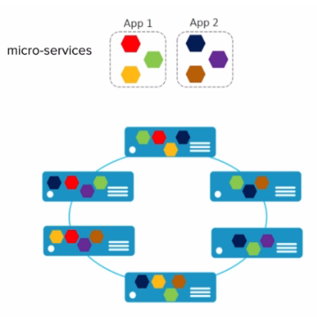
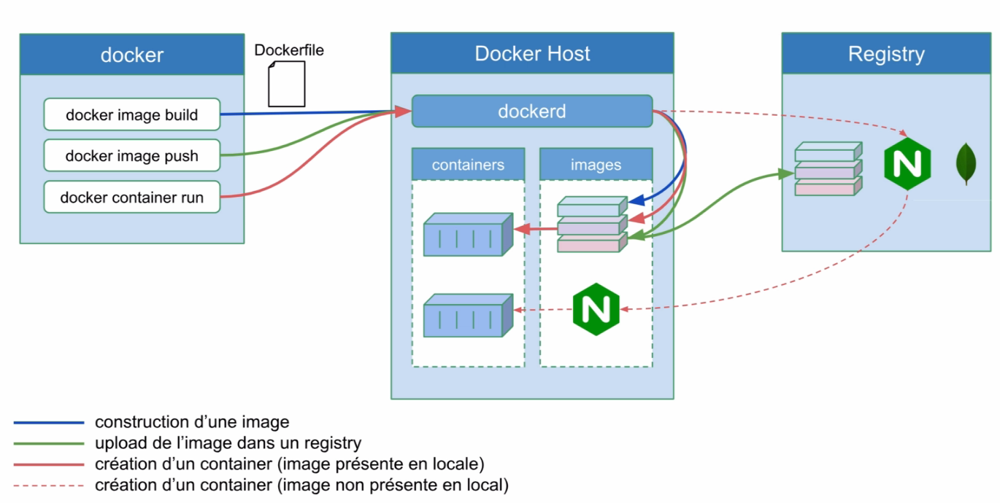

1.0 Introduction
###########################

Ce cours est découpé en différents chapitres et permet un apprentissage progressif des différents concepts Docker et de leur mise en pratique. 
On commencera par donner quelques exemples de ce qu’il est possible de faire avec Docker dans la section **Quick Wins**.
Nous ferons références à des concepts utiles comme les **containers** Linux, les Micro services, le Dev Ops.etc. 

Nous aurons un chapitre sur la **plateforme Docker**, son architecture, son fonctionnement et sa mise en place. 
Nous verrons comment Docker rend très simple la manipulation des **containeurs**. 
Nous parlerons de la notion d’images qui permet de **packager** une application et ses dépendances. 
Dans le chapitre sur le stockage, nous apprendrons à utiliser **Docker** pour que les données puissent persister dans les conteneurs. 

**Thèmes abordé dans ce cours :**

* **Docker Machine** pour créer des hôtes Docker.
*	**Docker compose** qui permet de créer des applications en multi container. 
*	**Docker Swarm**, la solution d’orchestration de **Docker** qui permet de gérer des applications qui tournent dans des containers. 
*	Le **réseau** dans Docker.
*	La **sécurité**. 

.. note::
  **Prérequis :** Installation de **WSL 2** sur **windows 10**.
  Afin de pouvoir utiliser des commandes linux dans une console **POWERSHELL**.
   
    .. code-block:: language

      wsl –install -d ubuntu
      wsl --set-version ubuntu 2

  Dans la console, tapez : ``ubuntu`` pour basculer dans un environnement **Ubuntu**.

1.1 Quick Wins
******************
Très souvent le premier contact que l’on a avec **Docker** s’effectue via le **Docker Hub** accessible sur https://hub.docker.com.

.. image:: img/docker/image64.png
  :alt: Docker Hub

Il s’agit d’un **registre** (ou **registry**) dans lequel nous retrouvons beaucoup d’applications packagées dans des images **Docker**. 
Cette notion d’image est la base de ce qu’apporte **Docker**. 
Voici un exemple de services qui peuvent être contenu dans une image **Docker** :

Par exemple, grâce à **Docker** nous pouvons lancer un interpréteur interactif (**REPL**) pour des langages de programmation comme le **Python**, le **Ruby On Rail** ou le **Javascript**.

.. image:: img/docker/image65.png

Nous avons alors accès à un environnement **Python** en interactif et c’est le flag ``-ti`` qui permet l’interactivité avec le processus du containeur.  

De la même manière, nous pouvons lancer un environnement **NodeJs**, ici contenant le Tag ``8.12-alpine``.
**8.12** est la version de **NodeJs** et **alpine** est le nom de la distribution Linux utilisée dans le container.

Par exemple si nous avons besoin d’une base de données **MongoDB** dans la version 4.0.Nous n’avons qu’à trouver une image disponible dans le **Docker Hub**.

.. image:: img/docker/image68.png

On peut imaginer avoir besoin de lancer plusieurs containers **MongoDB** avec des versions différentes.
Cela peut être utile pour tester une différence de comportement entre deux versions par exemple.

1.2 Des Stacks complètes
***************************

Une application fonctionne rarement seule et est souvent constituée d’un ensemble de services.
Cet ensemble constitue une **Stack applicative**.
Par exemple, prenons le cas de la Stack **Elastic**, qui est souvent utilisée pour la gestion des log. 
Elle est constituée de **BEATS** et **LOGSTASH** qui est là pour l’ingestion des logs, de **ELASTICSEARCH** pour l’analyse et 
le stockage des logs et **KIBANA** qui permet de visualiser tout cela.

.. image:: img/docker/image67.png

Il existe une multitude d’applications prêtent à être utilisée avec Docker, accessible en ligne de commande. 
Nous verrons rapidement comment Docker permet de créer notre propre package d’application pour faciliter : l’installation, l’utilisation et le déploiement.

1.3 Quelques concepts utiles pour les Développeurs
****************************************************

1.3.1 Un container Linux, c’est quoi ?
==========================================

Un **container** est simplement un **processus** particulier qui tourne sur le système. 
Il est isolé des autres **processus**. Il possède sa **propre vision** du système sur lequel il tourne, on appelle cela les **Namespaces**. 
On peut limiter les ressources utilisées par ce processus en utilisant les **Controls Groups** (ou **Cgroups**). 
Le même système peut exécuter plusieurs containers en même temps, c’est d’ailleurs ce qui constitue l’avantage de cette technologie. 
Le noyau Linux de la machine hôte est **partagé** entre tous ses containeurs.

1.3.2 Containers Linux : Les Namespaces 
==========================================

Les **Namespaces** sont des technologies Linux qui servent à isoler un processus. 
Cela permet de limiter ce qu’un processus peut voir. Il existe **6** NameSpaces différents :

#. **Pid** : Permet de donner à un processus la vision de lui-même et de ses processus enfant.
#. **Net** : Permet de donner au processus son propre réseau privé.
#. **Mount** : Permet de donner au processus un système de fichiers privé.
#. **Uts** : Permet la gestion du nom de l’hôte.
#. **Ipc** : Isole les communications inter processus.
#. **User** : permet de faire un mapping entre les utilisateurs de l’hôte et les containeurs.

1.3.2 Containers Linux : Control Groups (cgroups) 
===================================================

Les **cgroups** sont une autre technologie Linux qui va permettre de limiter les ressources qu’un processus va utiliser. 
Par exemple, pour limiter l’utilisation :

* **RAM**
* **CPU**
* des **I/O**(périphériques d’entrées et de sorties)
* du **Réseau**

1.3.3 Containers Linux : VM/Container
===================================================

.. image:: img/docker/image70.png

On compare souvent les containers à des machines virtuelles, car elles permettent d’exécuter des applications de manière isolée.

Mais la virtualisation nécessite un **hyperviseur** qui s’exécute **sur le système d’exploitation de l’hôte** et nécessite également que **haque machine virtuelle** ait son propre système d’exploitation.
Alors que l’approche du container est **beaucoup plus légère** car chacun partage le **Kernel Linux de la machine hôte**.

La machine virtuelle consomme plus de disque mémoire et de ram que les containers. **Cela implique que beaucoup plus de containers peuvent fonctionner sur une même machine hôte.**

1.3.4 Architecture micro-services
===================================================

Depuis quelques années, les applications sont développées autour d’une architecture appelée **micro-services**. 
Alors qu’avant une application était souvent un gros bloc unique **monolithique**.

.. image:: img/docker/image69.png

Aujourd’hui, une application est constituée de **plusieurs petits composants** qui sont des services qui ont leur propre rôle et fonctionnalité. 
Et c’est l’**interconnexion** de l’ensemble de ces services qui permettent de définir l’application globale.

.. image:: img/docker/image73.png

Dans une **application monolithique**, si l’on veut que plusieurs instances de l’application soient déployées il faut créer plusieurs machines virtuelles contenant l’application dans son entièreté.

Alors que dans le contexte d’une application micro-services chaque service peut être déployé indépendamment des autres services, nous avons plusieurs machines virtuelles sur lesquelles les services des différentes applications sont dispatchées.

**Exemple d’architecture micro-services : l’application UBER**

.. image:: img/docker/image72.png

Chaque processus métier est isolé dans un service :

* **Paiement**
* **Notification**
* **Facturation**

*Avantages de l’architecture micro-services* :

* **Découpage** de l’application en **processus** (services) indépendants.
* Chacun a sa propre **responsabilité métier**.
* **Equipe dédiée** pour chaque service.
* Plus de **liberté** de choix de langage.
* **Mise à jour**.
* Containers très adaptés pour les micro-services.

*Inconvénients* :

* Nécessite des interfaces bien définies.
* Focus sur les tests d’intégration.
* Déplace la complexité dans l’orchestration de l’application globale. (Docker SWARM ou Kubernetes).

**APPLICATION CLOUD NATIVE**

On entend de plus en plus parler d’applications **Cloud Native** définies par plusieurs critères :

* Applications qui suivent une architecture **microservices**.
* Utilisant la **technologie des containers**.
* L’orchestration est faite **dynamiquement**.

Il existe une branche de la **Linux Foundation** : la **CNCF** ( **C** loud **N** ative **C** omputing **F** oundation ) qui porte de nombreux projets **Cloud Native** comme :

* **Kubernetes**
* **Prometheus**
* **Fluentd**
  
  `Site de la cncf <www.cncf.io>`_

1.3.5 Questionnaire de synthèse
===================================================

   #. **Quels sont les éléments permettant la création d'un container sous Linux ?**
      
      * Le kernel Linux et le système de fichiers.
      * Les namespaces et les control groups.
      * Les control groups et le système de fichiers.
   
   #. **Les cgroups permettent :**
     
      * De limiter la vision d'un processus
      * De limiter les ressources que peux utiliser un processus
      * D’isoler le système de fichiers d'un processus
      * De faire un chroot

   #. **Un container c'est**
    
      * Une mini machine virtuelle
      * Un répertoire sur le système de fichiers
      * Un processus qui tourne de manière isolée des autres processus
      * Une technologie créée par Docker

2.0 La plateforme Docker
###########################

**Docker** apporte une facilité de développement, de packaging et de déploiement d’applications **quelque soit le langage de programmation**.
Un développeur peut **tester une application** sur sa machine en **imitant** les conditions de l’environnement de **production** tout en nécessitant une **configuration minimale**.
Si l’application est soumise à un **fort stresse**, **Docker** peut orchestrer l’allocation d’autres containers.
La **scalabilité** s’effectue très rapidement car un container peut être lancé en quelques secondes.

.. note::
  Cherchez la définition du terme **scalabilité**.

**Docker** permet également d' **augmenter** le rythme de **mise à jour** des logiciels.

2.1 Le modèle client/serveur
********************************

.. image:: img/docker/image55.png

**Docker** utilise un modèle **client/serveur**.
D’une part nous avons le client **Docker**, un fichier binaire écrit en **GO**. Et d’autre part nous avons le **Docker Daemon** (appelé **dockerd**), écrit aussi en GO, et qui expose une **API REST** consommée par le client.
Le client envoie des commandes au **Docker Daemon** pour gérer les containers, les images entre autres.

2.1.1 Le serveur : Dockerd
==============================

* **Processus** : dockerd
   * Gestion des images, networks, volumes, cluster, …
   * Délègue la gestion des containers à containerd.
* Expose une **API Rest**.
* Ecoute sur le **socket unix** ``/var/run/docker.sock`` par défaut.
* Peut-être configuré pour écouter sur un socket tcp.

2.1.2 Le client : docker
==============================

* Installé en même temps que **dockerd**.
* Communique avec le **daemon local** par défaut via ``/var/run/docker.sock``.
* Peut être configuré pour communiquer avec un **daemon distant**.

2.1.3 Concepts essentiels
==============================

* **Docker** facilite la manipulation des **containers Linux**. Et cache la complexité sous-jacente.
* Introduction de la **notion d'image** : Format d'un package qui contient une application.
* Une image est un **template** qui sert pour la création d’un container.
* Pour créer une image on utilise un **Dockerfile**. Un fichier texte qui contient une liste d’instructions.
* La distribution de ces images se fait par l’intermédiaire d’un **Registry**.
* Docker permet de lancer des containers sur une machine unique ou sur un ensemble d’hôtes regroupées en un **cluster Swarm**.

Voici un schéma qui montre le **fonctionnement global des composants de base de Docker**.

Quand on installe la plateforme Docker nous avons donc : 
un client et un serveur (ou daemon) qui tourne constamment et qui est responsable de la gestion des containers et des images.

2.1.4 Docker Hub
==============================

Par défaut le **daemon Dockerd** communique avec le **Docker Hub**, qui est le **Registry** officiel de Docker disponible à l’adresse : https://hub.docker.com

Il existe bien entendu beaucoup d’autres Registry que l’on peut utiliser si on le souhaite.

**Les images du Docker Hub peuvent être classées en plusieurs catégories.**

* Les images officielles qui sont validées et que l’on peut utiliser avec confiance.
* Les images publiques à utiliser avec précaution.
* Les images privées dédiées qu’aux utilisateurs autorisés ( partage d’images au sein d’une entreprise par exemple).

2.1.4 Cluster Swarm
==============================

Un Cluster Swarm est un ensemble de **Docker Host**, c’est-à-dire un ensemble de machines sur lesquel le **Docker Démon** est installé.

.. image:: img/docker/image58.png

Ses machines vont communiquer entres elles afin d’orchestrer des applications et d’assurer qu’elles fonctionnent de la manière voulue.

2.2 Installation de Docker
********************************
Nous allons voir ici comment installer **Docker** sur votre environnement.

Rendez-vous tout d'abord dans le `Docker hub <https://hub.docker.com>`_ puis sélectionner l'onglet **Explore**:

.. image:: img/docker/image59.png

Sélectionnez ensuite l'onglet **Docker** dans le sous menu:

.. image:: img/docker/image60.png

Sur la gauche vous verrez alors un menu vous permettant de sélectionner différents éléments :

* plateforme
* système d'exploitation
* architecture

Comme nous pouvons le constater, Docker peut être installé sur des systèmes divers: machine de développement, l'infrastructure d'un cloud provider, et même des devices de type Raspberry PI.

Installation pour Windows 10 ou MacOS
***************************************************

Si vous êtes sur **MacOS** ou **Windows 10 (Entreprise ou Pro)** vous pouvez installer **Docker Desktop**, un environnement compatible pour chacune de ces plateformes:
   * `Docker Desktop for Windows <https://hub.docker.com/editions/community/docker-ce-desktop-windows>`_ 
   * `Docker Desktop for Mac <https://hub.docker.com/editions/community/docker-ce-desktop-mac>`_ 

Installation pour Linux
***************************************************

Si vous êtes sur **Linux**, vous pouvez sélectionner la distribution que vous utilisez (**Fedora**, **CentOS**, **Ubuntu**, **Debian**) et vous obtiendrez alors un lien vers la documentation à suivre pour installer **Docker** sur la distribution en question.

Pour aller un peu plus vite, vous pouvez également lancer la commande suivante (compatible avec les principales distribution **Linux**) :

.. code-block:: language

   curl -sSL https://get.docker.com | sh

En quelques dizaines de secondes, cela installera **la plateforme Docker** sur votre distribution.
Il sera ensuite nécessaire d'**ajouter votre utilisateur** dans le **groupe docker** afin de pouvoir intéragir avec le **daemon** sans avoir à utiliser **sudo** (il faudra cependant lancer un nouveau **shell** afin que ce changement de groupe soit pris en compte.)

.. code-block:: language

   sudo usermod -aG docker <UTILISATEUR>

.. note::

  Il est également possible d'installer **Docker** sur d'autres types d'**architecture infrastructure**.

Vérification de l'installation
***************************************************

Une fois installé, lancez la commande suivante afin de vérifier que tout est fonctionnel :

.. code-block:: language

   docker info

.. image:: img/docker/image61.png

3.0 Les containers avec Docker
#################################

Après avoir présenté la plateforme Docker, nous allons voir comment créer des **containers** en ligne de commande pour lancer des services en tâche de fond et/ou pour rendre disponible dans un container des repertoires de la **machine hôte**. 

Nous verrons comment lancer un container dans un mode d’**accès privilégié**, ainsi que les commandes de bases pour la gestion du cycle de vie des containers. 

Avant la 1.13, lancer un **container** s’effectuait avec la commande : ``Docker Run`` sans le mot clé ``container``. 
Il est toujours possible de le faire. 
Mais maintenant les commandes ont été regroupé aux composant auquel elles se rapportent. C’est la raison pour laquelle le mot clé ``container`` a été rajouté pour les commandes relatifs à la gestion des containers. 
``docker container run [OPTIONS] IMAGE [COMMAND] [ARG]``
D’autres groupes de commande existent et nous les étudierons plus tard. 

3.1 Hello World
******************
Lançons notre premier container **Hello-World**.

.. image:: img/docker/image62.png

Ouvrez un **terminal** et tapez :

.. code-block:: language

  docker container run hello-world

.. image:: img/docker/image63.png

Le client demande au **daemon** (processus) de lancer un **container** basé sur l’image **Hello-World** .
Cette image ,n’étant pas disponible en local, est téléchargée et le **processus** présent dans cette image est automatiquement exécuté.

Et dans le cas de notre **Hello-world**, il s’agit seulement d’écrire du texte sur la sortie standard : **Hello from Docker** suivi d’un texte.

Cet exemple est simple mais il met en avant le mécanisme sous-jacent. 
A la fin du texte on nous demande d’essayer un exemple plus ambitieux, c’est ce que nous allons faire par la suite.

Expérimentez la commande : ``docker container run hello-world`` sur votre machine

3.0 Les containers avec Docker
#################################
3.1 Sommaire
**********************************
3.2 [Démos] Création de containers
************************************
3.3 Publication de ports
**********************************
3.4 Bind mount
**********************************
3.5 Limitation des ressources
**********************************
3.6 Les droits dans un container
**********************************
3.7 Des options utiles
**********************************
3.8 Les commandes de base
**********************************
3.9 [Démo] Les commandes de base
**********************************
3.10 [Exercice] Les commandes de bases
****************************************
3.11 Une commande utile
**********************************
Quiz 3 : Les containers avec Docker
*************************************

4.0 Les images Docker
#################################

